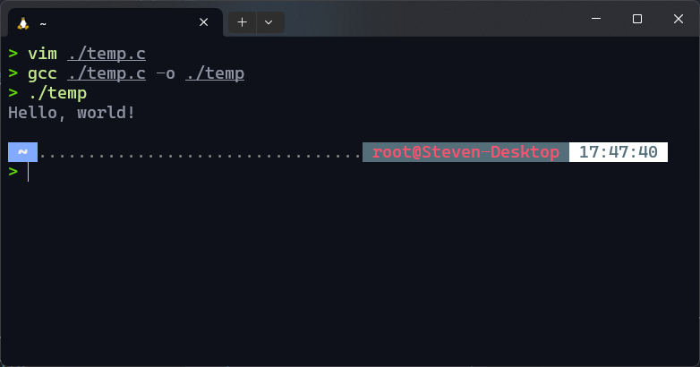
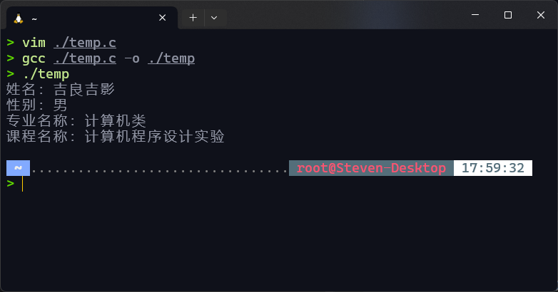
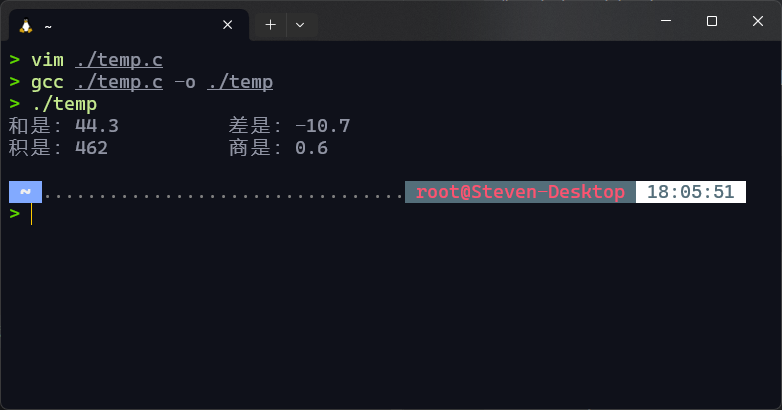

# 实验一：程序设计基础

## 一、实验目的

1. 熟悉C编程环境，掌握IDE的安装和使用方法
2. 掌握简单C程序的编辑、编译和运行方法

## 二、实验内容

1. 熟练掌握安装一个C 语言集成开发环境，并熟悉集成开发环境的基本使用技巧；
2. 练习实例程序“Hello world”。
3. 选做以下练习题：
    1. 编程输出“我的信息”，包括姓名、性别、专业名称和课程名称，格式为：

             姓名：
             性别：
             专业名称：
             课程名称：

    2. 编程计算并输出16.8与27.5两个数的和、差、积、商， 要求输出界面

            和是：                 差是：
            积是：                 商是：

## 三、实验结果（要求粘贴运行界面及输出的运行结果）

1. (略，推荐使用较为流行的IDE/编辑器，Windows上推荐Dev C++、Visual Studio，Mac上推荐Xcode，Linux上推荐Visual Studio Code，或者直接选择跨平台的CLion)

2. 

   ```c
   #include <stdio.h>
   int main()
   {
      printf("Hello, world!\n");
      return 0;
   }
   ```

3. 实验结果及代码如下：
    1. 

       ```c
       #include <stdio.h>
       int main()
       {
           printf("姓名：吉良吉影\n性别：男\n专业名称：计算机类\n课程名称：计算机程序设计实验\n");
           return 0;
       }                                                 }
       ```

    2. 

       ```c
       #include <stdio.h>
       int main()
       {
           float m = 16.8, n = 27.5;
           float a, b, c, d;
           a = m + n;
           b = m - n;
           c = m * n;
           d = m / n;
           printf("和是：%3.1f          差是：%3.1f\n积是：%3.0f           商是：%3.1f\n", a, b, c, d);
           return 0;
       }
       ```

## 四、实验小结（要求列出通过本实验学到的编程经验）

* 变量名最好有意义，方便理解