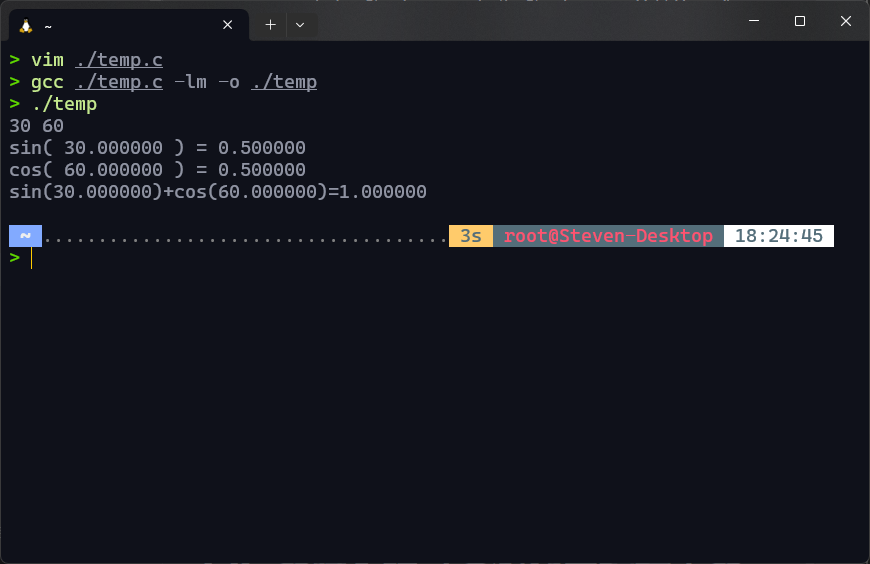
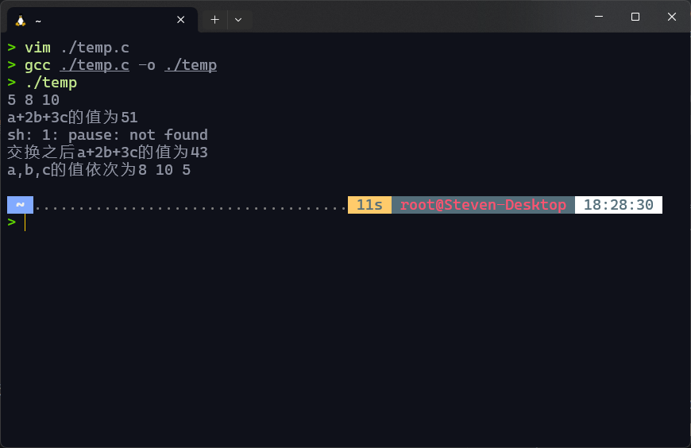
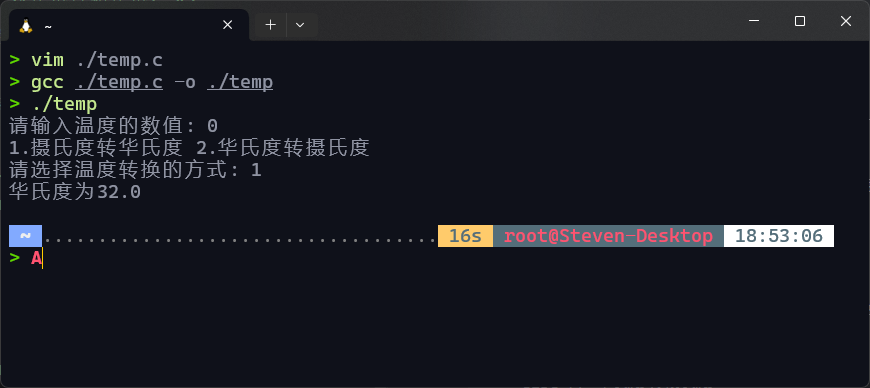
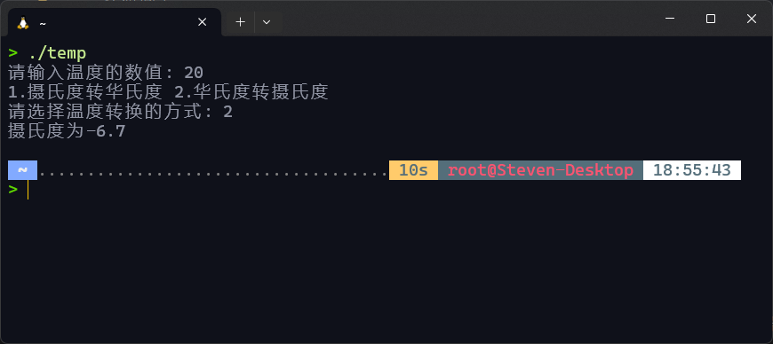

# 实验二：程序的输入输出及其应用

## 一、实验目的

1. 掌握常量和变量的概念以及使用
2. 掌握变量的定义、赋值与引用
3. 掌握顺序结构相关语句的使用
4. 掌握`scanf`和`printf`输入、输出数据的方法

## 二、知识要点

1. 变量与常量概念
2. 数据输入、输出的格式控制
3. 标准库函数与头文件的使用
4. 算术运算与赋值运算
5. 数据类型转换

## 三、实验验证（先尝试直接作答，如无法确定则通过实验验证）

1. 假如要声明两个整型变量`x`和`y`，语句`int x y;`错在哪里？
   > 缺少逗号，应该为`int x, y;`
2. 把`a`的值赋给`b`，其语句是：
   > `b = a;`
3. 如果使用语句`scanf("%d%d",&x,&y);`输入`8`和`9`两个整数，其输入格式应该是：
   > `8 9`
4. 如果使用语句`scanf("%d,%d",&x,&y);`输入`8`和`9`两个整数，其输入格式应该是：
   > `8,9`
5. 程序中如果要用到库函数`sin`，则应包含头文件：
   > `#include <math.h>`
6. 假设`x`是一个实型变量，语句`printf("%d",x);`错在哪里？
   > 输出格式控制符与变量类型不匹配，应该为`%f`
7. 语句`x=10; y=20; printf("y=%d, x= %d",x,y);`能否交换`x`和`y`的值？
   > 不能，因为`printf`只是输出，不会改变变量的值

## 四、实验内容：

1. 输入两个角的度数，求第一角的正弦与第二角的余弦之和。要求显示中间结果。（使用数学函数sin 、cos完成，注意C语言中的三角函数需要输入弧度数）
2. 输入三个整数变量a,b,c, 输出a+2b+3c的值，之后先交换a和b的值后再交换b和c的值，最后输出a+2b+3c的值。输入：5，8，10
3.
    1. 已知摄氏温度（℃）与华氏温度（℉）的转换公式为：**℃=(5/9)(℉-32)**，试用一个简单的程序计算出0摄氏度是多少华氏温度？要求精确至小数点后1位。
    2. 将“摄氏温度（℃）与华氏温度（℉）的转换”程序做改进，使之能根据用户的输入给出相应的结果。（输入为摄氏温度，输出为华氏温度，精确至小数点后1位）
    3. 选做，用户可以输入摄氏或华氏温度，输出对应的华氏或摄氏温度（精确至小数点后1位）

## 五、实验结果（要求粘贴运行界面及输出的运行结果）

1. 

   ```c
   #include <stdio.h>
   #include <math.h>
   int main()
   {
      double pi = 3.1415926535;
      double input1, input2, z, w;
      float sum;
      scanf("%lf%lf", &input1, &input2);
      z = sin(input1 * pi / 180);
      w = cos(input2 * pi / 180);
      sum = z + w;
      printf("sin( %f ) = %f\ncos( %f ) = %f\n", input1, z, input2, w);
      printf("sin(%f)+cos(%f)=%f\n", input1, input2, sum);
      return 0;
   }
   ```

2. 

   ```c
   #include <stdio.h>
   #include <stdlib.h>
   int main()
   {
       int a, b, c, d, sum;
       scanf("%d%d%d", &a, &b, &c);
       sum = a + 2 * b + 3 * c;
       printf("a+2b+3c的值为%d\n", sum);
       system("pause");
       d = a;
       a = b;
       b = d;
       d = c;
       c = b;
       b = d;
       sum = a + 2 * b + 3 * c;
       printf("交换之后a+2b+3c的值为%d\n", sum);
       printf("a,b,c的值依次为%d %d %d\n", a, b, c);
       return 0;
   }
   ```

3. 实验结果及代码如下：
    1. 

       ```c
       #include <stdio.h>
       int main()
       {
           int value;
           int mode = 0;
           float fahrenheit_temperature, celsius_temperature;
           printf("请输入温度的数值: ");
           scanf("%d", &value);
           printf("1.摄氏度转华氏度 2.华氏度转摄氏度\n");
           printf("请选择温度转换的方式: ");
           scanf("%d", &mode);
           if (mode == 1) // 摄氏度转华氏度
           {
               fahrenheit_temperature = value * 9.00 / 5.00 + 32.00;
               printf("华氏度为%.1f\n", fahrenheit_temperature);
           }
           else // 华氏度转摄氏度
           {
               celsius_temperature = 5.00 / 9.00 * (value - 32.00);
               printf("摄氏度为%.1f\n", celsius_temperature);
           };
           return 0;
       }
       ```
    2. 

       代码同上

    3. 

       代码同上

## 六、实验小结（要求列出通过本实验学到的编程经验）

* 使用`if`语句时判断值时候要用`==`
* 使用`scanf`不要忘了取地址符`&`
* `printf`和`scanf`使用Tips：
    1. 在`scanf`的“输入参数”中，变量前面的取地址符`&`不要忘记。
    2. `scanf`中双引号内，除了“输入控制符”外什么都不要写。
    3. “输出控制符”和“输出参数”无论在“顺序上”还是在“个数上”一定要一一对应。
    4. “输入控制符”的类型和变量所定义的类型一定要一致。对于从键盘输入的数据的类型，数据是用户输入的，程序员是无法决定的。
    5. 使用`scanf`之前先用`printf`提示输入。例如：

        ```c
        printf("请输入两个值，中间以空格分隔：");
        scanf("%d%d", &i, &j);
        ```

