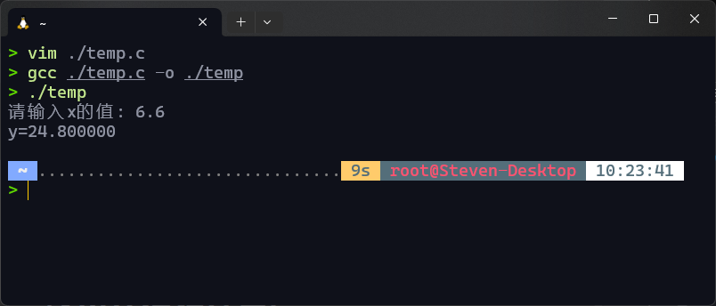
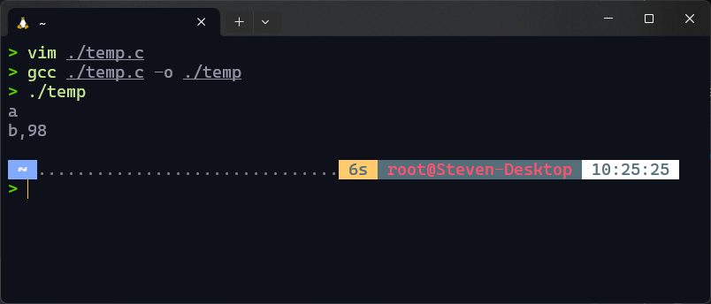
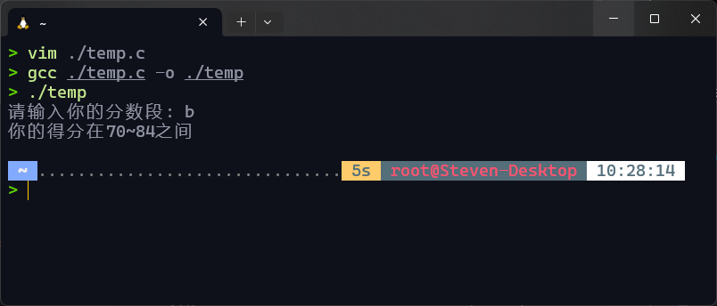
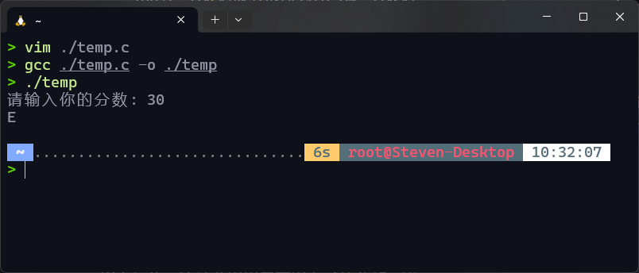
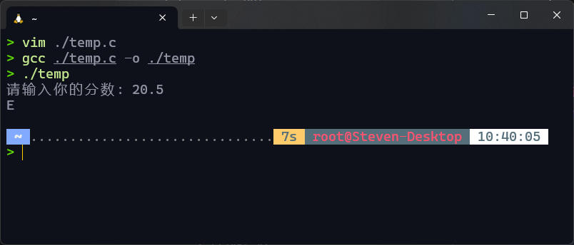
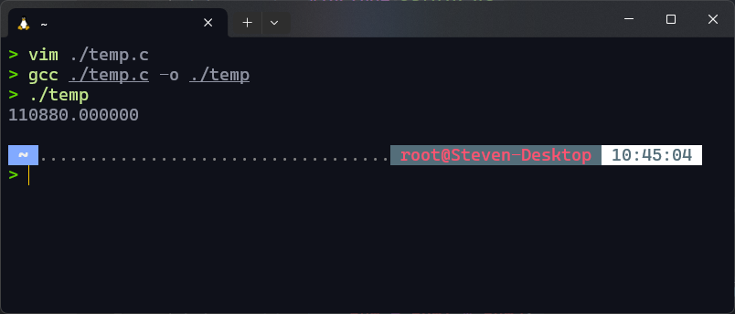
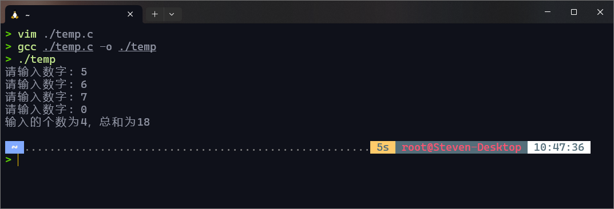
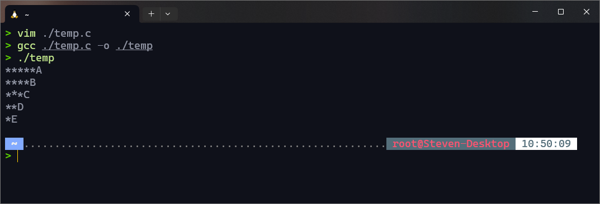
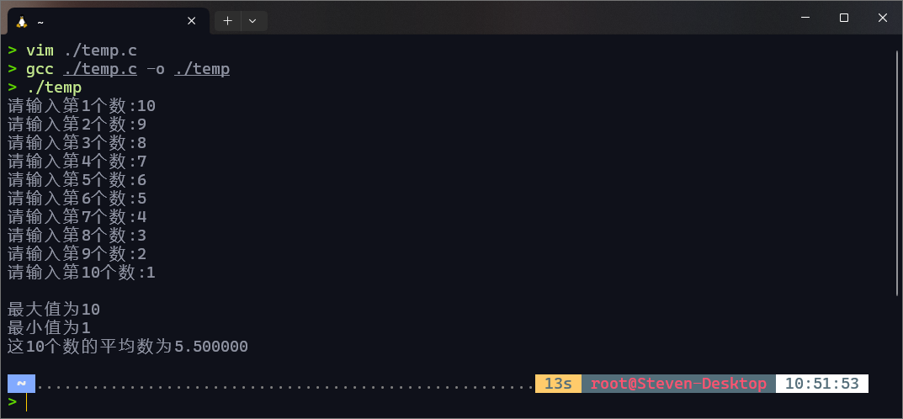
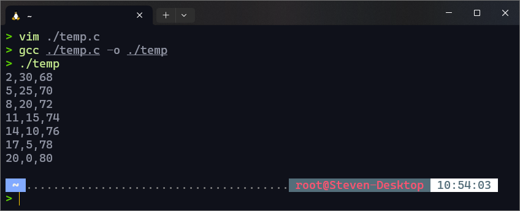

# 实验三：程序的控制流

## 一、实验目的

1. 熟悉控制流，熟练掌握控制流的应用
2. 掌握逻辑表达式、关系表达式的概念并能正确应用
3. 熟练掌握分支结构、循环结构，正确应用三种基本结构，完成程序设计

## 二、知识要点

1. 关系运算及运算符
2. 逻辑运算及运算符
3. 选择结构语句`if`、`if-else`、`if`嵌套、`switch`等的意义、语法格式及使用
4. 关系运算及运算符
5. 循环变量、循环条件、循环体的概念
6. 三种循环语句的一般格式、执行过程
7. 二重循环的执行过程

## 三、实验内容(要求提供：源程序和适当的注释 )

1. 编程序，计算下面分段函数的值（if-else）（20分）

   $$
   y=\begin{cases}
   x + 10 & (x < 0) \\
   3x + 5 & (0 \leq x < 15) \\
   2x - 10 & (x \geq 15) \\
   \end{cases}
   $$

2. 编写程序，输入一个小写英文字母，如果它位于字母表的前半部分，输出它的后一个字母；位于后半部分时输出它的前一个字母（if-else）。（20分）
3.
    1. 输入某学生的考试成绩等级A、B、C、D（或a、b、c、d），要求按照等级输出对应的分数段。A级对应的分数段为85~
       100分；B级对应分数段为70~84；C级对应分数段为60~69；D级对应分数段位60分以下（switch）。
    2. 输入某学生的考试成绩，如果在90分以上，输出“A”；80~89分输出“B”；70~79分输出“C”；60~69分输出“D”；60分以下则输出“E”（if-else
       或switch）。
4. 利用循环计算以下表达式的值： （5＋52）*(4+42)*(3+32)*(2+22)*(1+12)*(1/2+1/3+1/4+1/5)（for循环）
5. 编程，从键盘输入若干个整数，当输入0时，输入停止。统计并输出总共输入了几个数，以及所有输入数的和。（while循环）
6. 使用二重循环编程，绘制如下图形：

   ```
   *****A
   ****B
   ***C
   **D
   *E
   ```

7. 输入10个整数，输出最大值、最小值和平均分。（用循环实现）
8. （选做） 百马百担问题：有100匹马，驮100担货，大马驮3担，中马驮2担，两匹小马驮1担, 问有大、中、小马各多少？

## 四、实验结果（要求粘贴运行界面及输出的运行结果）

1. 

   ```c
   #include <stdio.h>
   int main()
   {
       double x, y;
       printf("请输入x的值: ");
       scanf("%lf", &x);
       if (x < 0)
       {
           y = x + 10;
       }
       else if (x >= 0 && x < 15)
       {
           y = 3 * x + 5;
       }
       else
       {
           y = 2 * x - 10;
       }
       printf("y=%f\n", y);
       return 0;
   }
   ```

2. 

   ```c
   #include <stdio.h>
   int main()
   {
       char ch;
       scanf("%c", &ch);
       if (ch <= 108) // 在电脑中m的ASCII码为108，不过在此处用'm'替换也可以得到同样的结果。
       {
           printf("%c,%d\n", ch + 1, ch + 1); // 分别以字符型和整型输出ch+1的值
       }
       else
       {
           printf("%c,%d\n", ch - 1, ch - 1); // 分别以字符型和整型输出ch-1的值
       }
       return 0;
   }
   ```

3. 实验结果及代码如下：
    1. 

       ```c
       #include <stdio.h>
       int main()
       {
           char grade;
           printf("请输入你的分数段: ");
           scanf("%c", &grade);
           switch (grade)
           {
           case 'A':
           case 'a':
               printf("你的得分在85~100之间\n");
               break;
           case 'B':
           case 'b':
               printf("你的得分在70~84之间\n");
               break;
           case 'C':
           case 'c':
               printf("你的得分在60~69之间\n");
               break;
           case 'D':
           case 'd':
               printf("你的得分在60分以下\n");
               break;
           default:
               printf("输入错误，请重试\n");
               main();
           }
           return 0;
       }
       ```

    2.
        1. `if-else`版本:

           

           ```c
           #include <stdio.h>
           int main()
           {
               int score;
               printf("请输入你的分数: ");
               scanf("%d", &score);
               if (score >= 90)
               {
                   printf("A\n");
               }
               else if (score >= 80)
               {
                   printf("B\n");
               }
               else if (score >= 70)
               {
                   printf("C\n");
               }
               else if (score >= 60)
               {
                   printf("D\n");
               }
               else
               {
                   printf("E\n");
               }
               return 0;
           }
           ```

        2. `switch`版本:

           

           ```c
           #include <stdio.h>
           int main()
           {
               float grade;
               int grade2; // grade2是用来在switch中做判断的数据
               printf("请输入你的分数: ");
               scanf("%f", &grade);
               grade2 = (int)(grade / 10); // 成绩进行除以10并且去掉小数位
               switch (grade2)
               {
               case 10:
               case 9:
                   printf("A\n");
                   break;
               case 8:
                   printf("B\n");
                   break;
               case 7:
                   printf("C\n");
                   break;
               case 6:
                   printf("D\n");
                   break;
               default:
                   printf("E\n");
               }
               return 0;
           }
           ```
4. 

    ```c
    #include <stdio.h>
    int main()
    {
        int i = 1, num1 = 1;
        double num2 = 0, num;
        for (i = 1; i <= 5; i++)
        {
            num1 = num1 * (i + i * i);
            num2 = num2 + 1.0 / (double)i; // num1、num2分别表示前面整数的乘积和后面小数的乘积
        }
        num2--; // 因为在循环体内多加了一个1/1，所以这里要-1
        num = num1 * num2;
        printf("%lf\n", num);
        return 0;
    }
    ```

5. 

    ```c
    #include <stdio.h>
    int main()
    {
        int i = 0, sum = 0, num = 1;
        while (num != 0)
        {
            printf("请输入数字: ");
            scanf("%d", &num);
            sum += num;
            i++;
        }
        printf("输入的个数为%d，总和为%d\n", i, sum);
        return 0;
    }
    ```

6. 

    ```c
    #include <stdio.h>
    int main()
    {
        int r = 1, c = 1, n = 5;
        char ch = 'A';
        for (r = 1; r <= 5; r++)
        {
            for (c = 1; c <= n; c++)
                printf("*");
            printf("%c", ch + r - 1);
            printf("\n");
            n--;
        }
        return 0;
    }
    ```

7. 

    ```c
    #include <stdio.h>
    int main()
    {
        int a[10], i, j, m;
        double sum = 0;
    
        for (i = 0; i <= 9; i++) // 给数组中各项赋值
        {
            printf("请输入第%d个数:", i + 1);
            scanf("%d", &a[i]);
            sum = sum + a[i];
        }
        for (j = 0, i = j + 1; j < 9; j++) // 将这些数进行排序
        {
            for (i = j + 1; i <= 9; i++)
            {
                if (a[j] < a[i])
                {
                    m = a[i]; // 交换二者的值
                    a[i] = a[j];
                    a[j] = m;
                }
            }
        }
        printf("\n最大值为%d\n最小值为%d\n这10个数的平均数为%lf\n", a[0], a[9], sum / 10);
        return 0;
    }
    ```

8. 

    ```c
    #include <stdio.h>
    int main()
    {
        int a, b, c, sum;
        for (a = 0; a <= 33; a++) /*大马不可能超过33，这样可以减少循环次数*/
        {
            for (b = 50; b >= 0; b--) /*中马不可能超过50*/
            {
                c = 100 - a - b;
                sum = 3 * a + 2 * b + c / 2;
                if (c % 2 == 0 && sum == 100) /*保证小马数量为偶数才可实现每两匹马驮一担*/
                    printf("%d,%d,%d\n", a, b, c);
            }
        }
        return 0;
    }
    ```