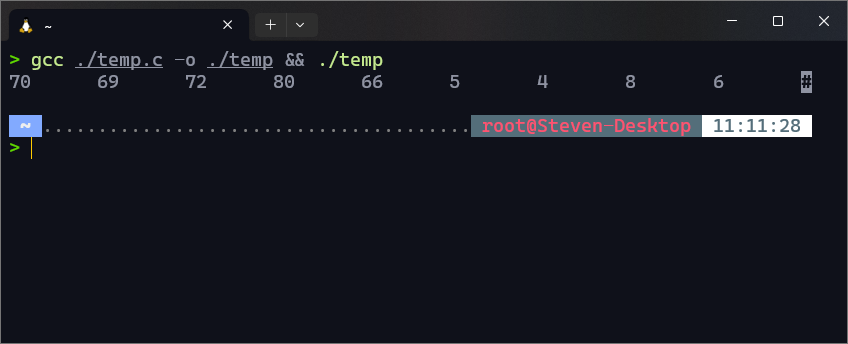
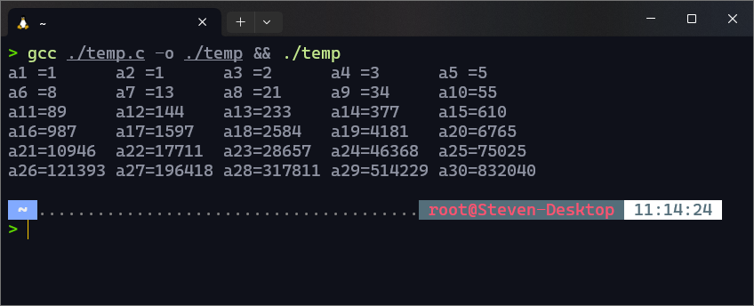
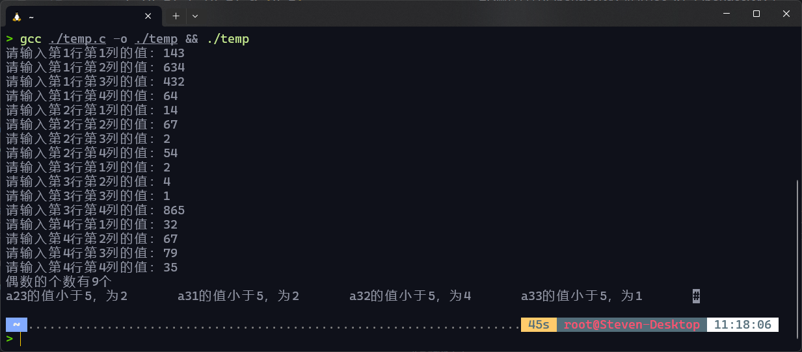
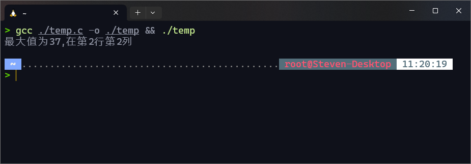
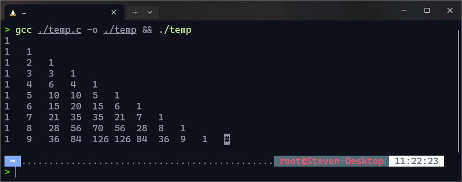

# 实验四：数组及其应用

## 一、实验目的

1. 掌握一、二维数组的定义及初始化
2. 掌握数组元素的输入、输出及引用方法
3. 掌握使用循环对数组元素进行访问
4. 掌握一、二维数组的简单应用

## 二、知识要点

1. 一、二维数组的定义与赋值（初始化、循环键盘输入）
2. 访问数组元素（下标的正确使用）
3. 数组的典型应用（复制、求和、统计某种元素个数、求数组中的最大/最小值、元素的查找与排序）

## 三、实验预习(将答案写在每小题下方)

1. 定义一个有四个元素的float型数组：

   `float arr[4];`

2. 定义一个具有五个元素的整型数组并将其初始化为{1,2,3,4,5}

   `int i=0,a[5] = { 1,2,3,4,5 };`

3. 要用循环从键盘输入整型数组s的元素值（共6个），应该使用语句：

   ```c
   #include <stdio.h>
   int main()
   {
     int s[6],i;
     for (i = 0; i <= 5; i++)
     {
         printf("请输入第%d个值：",i + 1);
         scanf("%d", &s[i]);
     }
     //下面是将输入的值输出
     for (i = 0; i <= 5; i++)
     {
         printf("%d\n",s[i]);
     }
     return 0;
   }
   ```

4. 交换数组元素d[2]和d[4],使用语句：

   ```c
   n = d[2];
   d[2] = d[4];
   d[4] = n;
   ```

5. 语句`for(k=0;k<3;k++)  x[2][k] = 0;`将把哪些元素变为0？

   ```c
   x[2][0];
   x[2][1];
   x[2][2];
   ```

## 四、实验内容(写出源程序)

1. 已知一个数组有10个元素，值分别是3，6，8，4，5，66，80，72，69，70。编程，将数组元素逆置后输出。（提示：第一个与最后一个交换位置，第二个与倒数第二个交换位置，……）（20分）
2. 编程序求Fibonacci数列的前30项，Fibonacci数列的定义为：

   $$
   f_n=\begin{cases}
   1 & (n=1) \\
   1 & (n=2) \\
   f_{n-1}+f_{n-2} & (n>2)
   \end{cases}
   $$

   要求将数列存放在数组中，并按每行5个数的格式输出该数列。

3. 输入一个4行4列的二维数组，统计偶数的个数，并输出所有小于5的数。
4. 已知一个二维数组：`{{14,26,18,17},{24,37,21,8},{19,31,22,16},{7,19,14,26}}`，编程，输出该二维数组的最小元素的行下标与列下标。
5. 生成一个杨辉三角形并用二维数组存储，按下图格式输出前10行。（提示：图中输出了前6行，杨辉三角中每个非1元素等于其左上方和正上方两元素之和）。

         1
         1  1
         1  2  1
         1  3  3  1
         1  4  6  4  1
         1  5  10 10 5  1

## 五、实验结果(要求粘贴运行界面及输出的运行结果)

1. 因为不确定题目意思是只能用一个数组还是可以用两个所以两种都写了。
    1. 

       ```c
       #include <stdio.h>
       int main() // 使用两个数组，反向赋值
       {
           int b[10], i, a[10] = {3, 6, 8, 4, 5, 66, 80, 72, 69, 70};
           for (i = 0; i < 9; i++)
           {
               b[i] = a[9 - i];
               printf("%d\t", b[i]);
           }
           return 0;
       }
       ```

    2. 

       ```c
       #include <stdio.h>
       int main() // 使用一个数组
       {
           int m, i, a[10] = {3, 6, 8, 4, 5, 66, 80, 72, 69, 70};
           for (i = 0; i < 9; i++)
           {
               m = a[i];
               a[i] = a[9 - i];
               a[9 - i] = m;
               printf("%d\t", a[i]);
           }
           return 0;
       }
       ```

2. 

   ```c
   #include <stdio.h>
   int main()
   {
       int m, i, a[30];
       a[0] = 1;
       a[1] = 1;
       printf("a1 =%-6d a2 =%-6d ", a[0], a[1]);
       for (i = 2; i < 30; i++)
       {
           a[i] = a[i - 1] + a[i - 2];
           printf("a%-2d=%-6d ", i + 1, a[i]);
           if ((i + 1) % 5 == 0)
               printf("\n");
       }
       return 0;
   }
   ```

3. 

   ```c
   #include <stdio.h>
   int main()
   {
       int a[4][4], i, j, sum = 0;
       for (i = 0; i < 4; i++)
       {
           for (j = 0; j < 4; j++)
           {
               printf("请输入第%d行第%d列的值：", i + 1, j + 1);
               scanf("%d", &a[i][j]);
               if (a[i][j] % 2 == 0)
                   sum++;
           }
       }
       printf("偶数的个数有%d个\n", sum);
       for (i = 0; i < 4; i++)
       {
           for (j = 0; j < 4; j++)
           {
               if (a[i][j] < 5)
                   printf("a%d%d的值小于5，为%d\t", i + 1, j + 1, a[i][j]);
           }
       }
       return 0;
   }
   ```

4. 

   ```c
   #include <stdio.h>
   int main()
   {
       int i, j, x, y, b = 0;
       int a[4][4] = {{14, 26, 18, 17}, {24, 37, 21, 8}, {19, 31, 22, 16}, {7, 19, 14, 26}};
       for (i = 0; i < 4; i++)
       {
           for (j = 0; j < 4; j++)
           {
               if (b <= a[i][j])
               {
                   b = a[i][j];
                   x = i;
                   y = j;
               }
               else
                   continue;
           }
       }
       printf("最大值为%d,在第%d行第%d列\n", b, x + 1, y + 1);
       return 0;
   }
   ```

5. 

   ```c
   #include <stdio.h>
   int main()
   {
       int a[10][10], i, j;
       for (i = 0; i <= 9; i++)
       {
           for (j = 0; j <= 9; j++)
           {
               if (i == j || j == 0)
                   a[i][j] = 1;
               else if (i < j)
                   a[i][j] = 0;
               else
                   a[i][j] = a[i - 1][j - 1] + a[i - 1][j];
           }
       }
       for (i = 0; i <= 9; i++)
       {
           for (j = 0; j <= 9; j++)
           {
               if (i < j)
               {
                   printf("\n");
                   break;
               }
               else
                   printf("%-4d", a[i][j]);
           }
       }
       return 0;
   }
   ```

## 六、实验小结(要求列出通过本实验学到的编程经验)