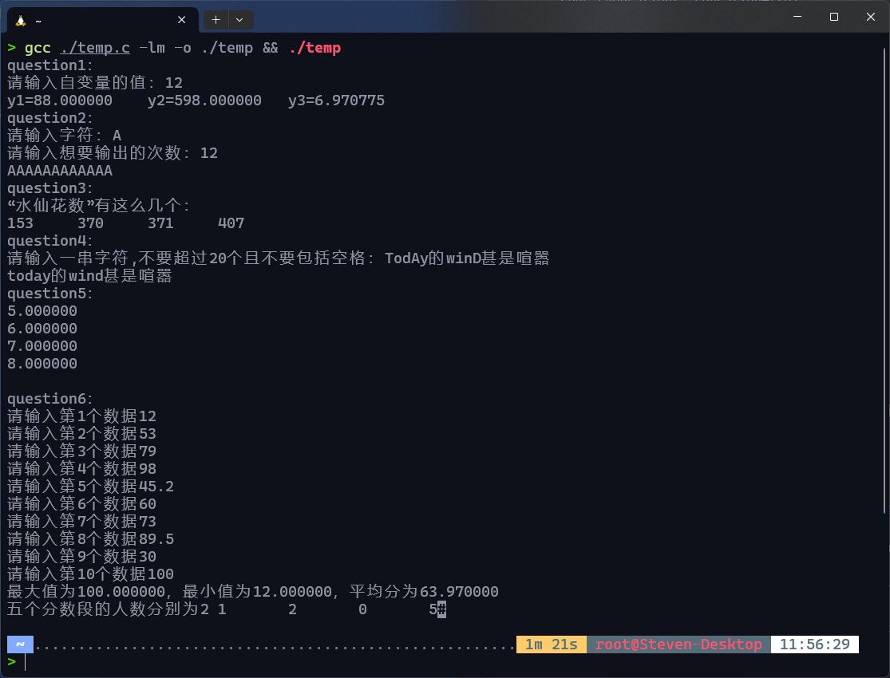

# 实验五：函数及其应用

## 一、实验目的

1. 能根据问题确定函数的类型
2. 掌握求值类函数的编写与调用
3. 掌握判断类函数的编写与调用
4. 掌握操作类函数的编写与调用
5. 掌握数组作为参数的函数编写与调用方法
6. 掌握数组作为参数的特殊性

## 二、知识要点

1. 函数的概念、使用目的以及实现方法
2. 求值类函数的特点：主调函数提供实参值，被调函数计算函数值，通过`return`语句返回函数值。
3. 判断类函数的特点：求值型的一种特例，函数返回值只有两种状态。
4. 操作类函数的特点：完成指定操作，函数类型为`void`。
5. 地址传递的概念及使用
6. 数组元素和数组名作为函数参数的特点与区别
7. 字符串作为参数的特点：`\0`字符的使用

## 三、实验内容(要求提供：源程序和注释)

1. 编写一个函数求$x^2-5x+4$的值，$x$作为形参，用主函数调用此函数求：

   $$y1=a^2-5a+4$$
   $$y2=(a+15)^2-5(a+15)+4$$
   $$y3=\sin^2 a-5\sin a +4$$
   以上各式中，$a$值要求在主函数中从键盘输入。
2. 编写函数，给定一个字符和一个整数，将该字符输出整数次。
3. 编写函数，输出所有的“水仙花”数。(
   所谓“水仙花数”是指一个三位数，其各位数字立方和等于该数本身。例如：153是一个“水仙花数”，因为153=1的三次方＋5的三次方＋3的三次方。)
4. 编写一个函数，其功能是将字符串中的大写字母改为小写字母，其他字符不变。
5. 编写一个函数，求出给定的二维数组中每一行最大的元素，并显示出来。
6. 在主函数中输入N个人的某门课程的成绩，分别用函数求：①平均分、最高分和最低分；②分别统计90～100分的人数、80～89分的人数、70～79分的人数、60～69分的人数及59分以下的人数。结果在主函数中输出。

## 四、实验结果（要求粘贴运行界面及输出的运行结果）

> 鉴于本章开始讲函数，因此本次实验的代码将函数声明和调用分开，函数定义单独放在头文件里。

* 头文件`Solution.h`:

   ```c
   #ifndef __SOLUTION_H__
   #define __SOLUTION_H__
   #include <stdio.h>
   #include <math.h>
   void question1(double x)
   {
       double y1, y2, y3;
       y1 = pow(x, 2) - 5 * x + 4;
       y2 = pow((x + 15), 2) - 5 * (x + 15) + 4;
       y3 = pow(sin(x), 2) - 5 * sin(x) + 4;
       printf("y1=%lf\ty2=%lf\ty3=%lf", y1, y2, y3);
       fflush(stdin);
   }
   
   void question2(char a, int b)
   {
       int i;
       for (i = 0; i < b; i++)
           printf("%c", a);
   
       fflush(stdin);
   }
   
   void question3(int b)
   {
       int a, one, ten, hundred;
       for (a = 100; a <= 999; a++)
       {
           hundred = (int)(a / 100);
           ten = (int)((a - hundred * 100) / 10);
           one = a - hundred * 100 - ten * 10;
           if (a == pow(hundred, 3) + pow(ten, 3) + pow(one, 3))
               printf("%d\t", a);
       }
       fflush(stdin);
   }
   
   char *question4(char cQuestion4[20])
   {
       int i;
       for (i = 0; i < 20; i++)
       {
           if (cQuestion4[i] >= 65 && cQuestion4[i] <= 90)
               cQuestion4[i] = cQuestion4[i] + 32;
       }
       return cQuestion4;
       fflush(stdin);
   }
   
   double question5(double a[4][4], int i)
   {
       double b = 0;
       int j;
       for (j = 0; j < 4; j++)
       {
           if (b <= a[i][j])
               b = a[i][j];
       }
       fflush(stdin);
       return b;
   }
   
   void question6(double qusetion6[10])
   {
       double sum = 0, max = 0, min = 100;
       int i, aQusetion6 = 0, bQusetion6 = 0, c = 0, d = 0, e = 0;
       for (i = 0; i < 10; i++)
       {
           sum += qusetion6[i];
           if (max <= qusetion6[i])
               max = qusetion6[i];
   
           if (min >= qusetion6[i])
               min = qusetion6[i];
   
           if (qusetion6[i] > 90 && qusetion6[i] <= 100)
               aQusetion6++;
           else if (qusetion6[i] > 80 && qusetion6[i] <= 90)
               bQusetion6++;
           else if (qusetion6[i] > 70 && qusetion6[i] <= 80)
               c++;
           else if (qusetion6[i] > 60 && qusetion6[i] <= 70)
               d++;
           else if (qusetion6[i] > 0 && qusetion6[i] <= 60)
               e++;
       }
       printf("最大值为%lf，最小值为%lf，平均分为%lf\n五个分数段的人数分别为%d\t%d\t%d\t%d\t%d", max, min, sum / 10.0, aQusetion6, bQusetion6, c, d, e);
       fflush(stdin);
   }
   #endif
   ```

* 主程序`main.c`:

  

    ```c
    #include <stdio.h>
    #include <stdlib.h>
    #include "Solution.h"
    char cQuestion4[10];
    int main()
    {
        int timeQuestion2, iQuestion5, jQuestion5, iQuestion6;//命名规则是变量名+Question i
        double xQuestion1, aQuestion5[4][4], aQuestion6[10];
        char chQuestion2, cQuestion4[20];
        //此处回答问题1
        printf("question1：\n");
        printf("请输入自变量的值：");
        scanf("%lf", &xQuestion1);
        getchar();
        question1(xQuestion1);
        //此处回答问题2
        printf("\nquestion2：\n");
        printf("请输入字符：");
        scanf("%c", &chQuestion2);
        printf("请输入想要输出的次数：");
        scanf("%d", &timeQuestion2);
        getchar();
        question2(chQuestion2, timeQuestion2);
        //此处回答问题3
        printf("\nquestion3：\n");
        printf("“水仙花数”有这么几个：\n");
        question3(1);
        //此处回答问题4
        printf("\nquestion4：\n");
        printf("请输入一串字符,不要超过20个且不要包括空格：");//目前设的字符串长为20
        scanf("%s", cQuestion4);
        printf("%s",question4(cQuestion4));
        //此处回答问题5
        printf("\nquestion5：\n");
        for (iQuestion5 = 0;iQuestion5 < 4;iQuestion5++)
        {
            for (jQuestion5 = 0;jQuestion5 < 4;jQuestion5++)
            {
                aQuestion5[iQuestion5][jQuestion5] = iQuestion5 + jQuestion5 + 2;//在此处可更改对数组内的各元的赋值规则
            }
            printf("%lf\n",question5(aQuestion5,iQuestion5));
        }
        //此处回答问题6
        printf("\nquestion6：\n");//第6题目前设置的是10个人的数据。
        for (iQuestion6 = 0;iQuestion6 < 10;iQuestion6++)
        {
            printf("请输入第%d个数据",iQuestion6+1);
            scanf("%lf", &aQuestion6[iQuestion6]);
        }
        question6(aQuestion6);
        //
        return 0;
    }
    ```

## 五、实验小结（要求列出通过本实验学到的编程经验）

1. 当使用`scanf`函数接收一个字符的时候可以在后面接一个`getchar()`以消去输入字符时候的回车(`"\n"`)，以解决接收多个参数时意外截断的情况。
2. 用`return`返回数组的时候只需要写数组名即可，因为系统分配给数组的地址就是以数组名命名的。
3. 用`scanf`接收字符串可以用`char`的数组实现，接收的时候可以不写`&`，且不用写数组范围，原因同上。
