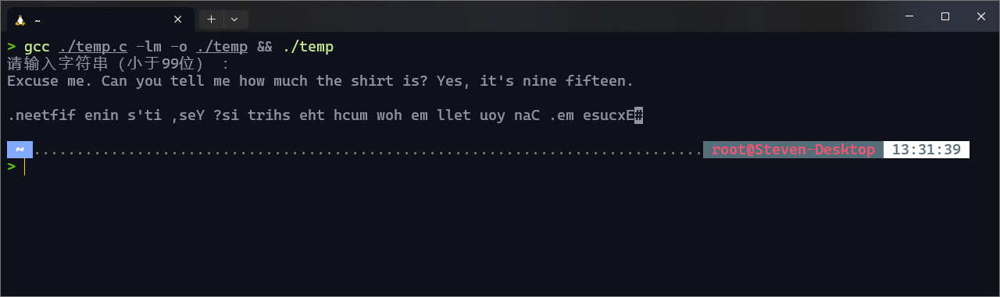
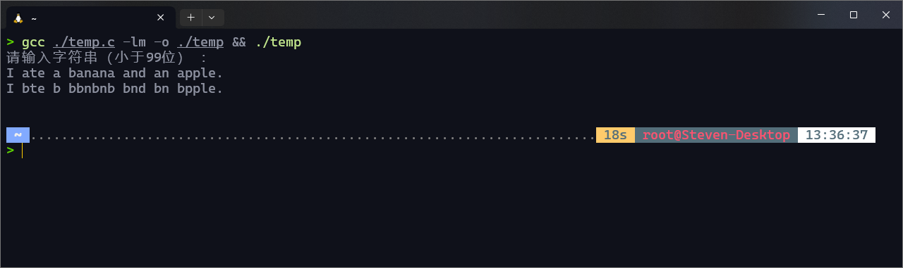
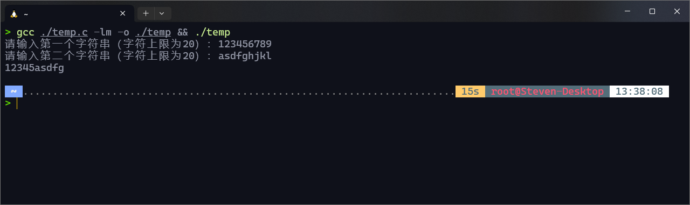
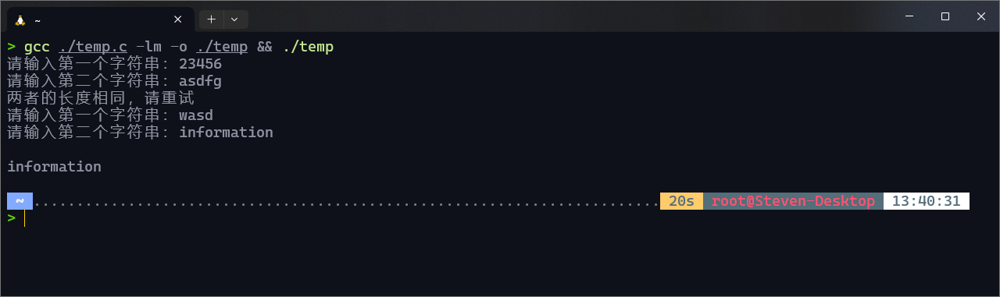
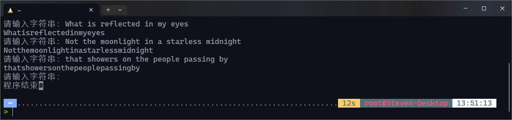
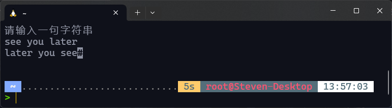

# 实验六：字符串的处理

## 一、实验目的

1. 理解字符串的概念及存储
2. 掌握字符串的输入输出方法
3. 掌握字符串常用库函数的使用方法
4. 对字符串进行基本处理

## 二、知识要点

1. 字符串概念：用双引号界定，以`"\0"`结尾的一串字符
2. 字符串的存储：用字符数组存储
3. 字符串的输入输出：格式符`"%c"`、`"%s"`及库函数`gets()`、`puts()`的使用
4. 字符串库函数的使用
5. 访问字符串中的字符：通过访问字符数组元素的方法实现

## 三、实验内容

1. 编写程序，要求从键盘输入一个字符串，然后将该字符串中的每个字符反向输出。（提示：先求出字符串长度，然后从最后一个字符开始往前逐个输出字符）
2. 输入一个字符串，将该字符串中的所有字母`'a'`变为字母`'b'`，输出新字符串。
3. 输入两个字符串（串长度需大于5），将第一个字符串的前5个字符与第二个字符串的前5个字符组成一个新的字符串，输出这个新的字符串。
4. 利用库函数编程：输入两个字符串`s1`和`s2`，将较大的字符串复制到`s3`中，输出字符串`s3`。
5. 编写一个程序，从键盘循环输入字符串, 程序将删除字符串中的空格并输出, 直到用户输入空行程序结束。
6. 编写一个程序，按照相反的单词顺序显示单词序列。即，如果命令行参数是`see you later`，程序的显示应该为`later you see`（选做）

## 四、实验结果（要求粘贴运行界面及输出的运行结果）

1. 

    ```c
    #include <stdio.h>
    #include <string.h>
    
    int main()
    {
        fflush(stdin);
        int length, i;
        char in[100];
        printf("请输入字符串（小于99位） ：\n");
        fgets(in, 100, stdin); // 根据<https://stackoverflow.com/questions/34031514/implicit-declaration-of-gets>的说法，gets()由于不安全，在C11标准中已经被移除，所以应当尽量避免使用gets()，而使用fgets()代替
        // fgets()的函数原型为char *__cdecl fgets(char *_Buffer, int _MaxCount, FILE *_Stream)，其中_Buffer为存储输入的字符数组，_MaxCount为最大输入字符数，_Stream为输入流
        length = strlen(in);
        for (i = length - 1; i >= 0; i--) // 由于数组从0开始编码，所以总长度-1为最后一个字符的序号
            putchar(in[i]);
        return 0;
    }
    ```

2. 

   ```c
   #include <stdio.h>
   #include <string.h>
   
   int main()
   {
       fflush(stdin);
       int length, i;
       char in[100];
       printf("请输入字符串（小于99位） ：\n");
       fgets(in, 100, stdin);
       length = strlen(in);
   
       for (i = 0; i <= length - 1; i++)
       {
           if (in[i] == 'a')
               in[i] = 'b';
       }
       puts(in);
       return 0;
   }
   ```

3. 

   ```c
   #include <stdio.h>
   #include <string.h>
   
   int main()
   {
       fflush(stdin);
       int i;
       char a[21], b[21], c[11];
       c[10] = '\0'; // 设置好结束符
       printf("请输入第一个字符串（字符上限为20）：");
       fgets(a, 21, stdin);
       printf("请输入第二个字符串（字符上限为20）：");
       fgets(b, 21, stdin);
       for (i = 0; i < 10; i++)
       {
           if (i < 5)
               c[i] = a[i];
           else
               c[i] = b[i - 5];
       }
       puts(c);
       return 0;
   }
   ```

4. 

   ```c
   #include <stdio.h>
   #include <string.h>
   
   int main()
   {
       char s1[21], s2[21], s3[21];
       for (;;)
       {
           printf("请输入第一个字符串：");
           fgets(s1, 21, stdin);
           printf("请输入第二个字符串：");
           fgets(s2, 21, stdin);
           if (strlen(s1) > strlen(s2))
           {
               strcpy(s3, s1);
               break;
           }
           else if (strlen(s2) > strlen(s1))
           {
               strcpy(s3, s2);
               break;
           }
           else
           {
               printf("两者的长度相同，请重试\n");
               continue;
           }
       }
       printf("\n%s", s3);
       return 0;
   }
   ```

5. 

   ```c
   #include <stdio.h>
   #include <string.h>
   
   int main()
   {
       int i;
       char str[80];
       while (1)
       {
           printf("请输入字符串：");
           gets(str);
           if (str[0] == '\0')
           {
               printf("程序结束");
               break;
           }
           else
           {
               for (i = 0; i < strlen(str); i++)
               {
                   if (str[i] != ' ')
                       putchar(str[i]);
               }
               printf("\n");
               continue;
           }
       }
       return 0;
   }
   ```

6. 

   ```c
   #include<stdio.h>
   #include <string.h>
   
   int main()
   {
       void wordReversePrint(char[]);
       char str[50];
       puts("请输入一句字符串");
       gets(str);
       wordReversePrint(str);
   
   }
   void wordReversePrint(char s[])
   {
       int i, len = strlen(s);
       char* start = s;
       s += len - 1;
       for (i = len - 1; i >= 0; i--)
       {
           if (*s == ' ')//碰见空格就输出空格后的剩余字符
           {
               printf("%s ", s + 1);
               *s = '\0';
           }
           if (i == 0)//字符串前可能没有空格
           {
               printf("%s", s);
           }
           s -= 1;//从后往前遍历
       }
   }
   ```

## 六、实验小结(要求列出通过本实验学到的编程经验)