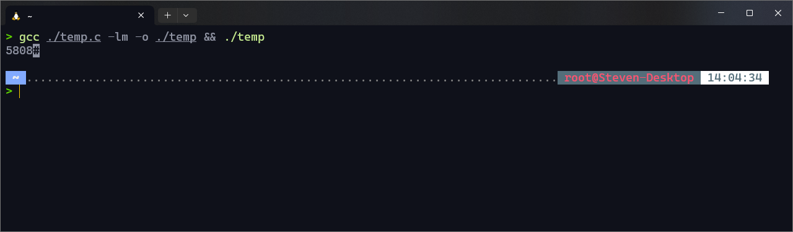
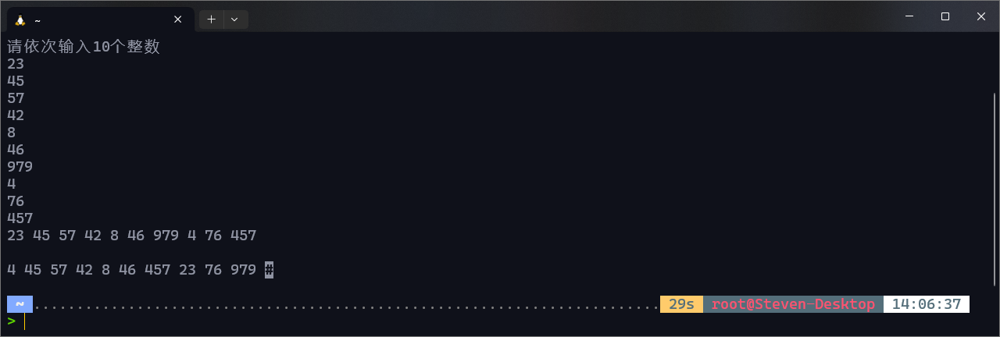
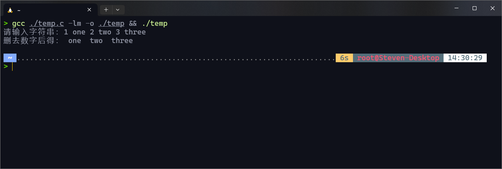
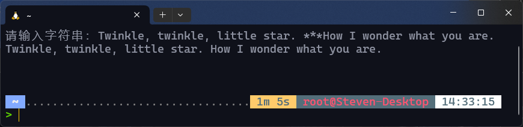
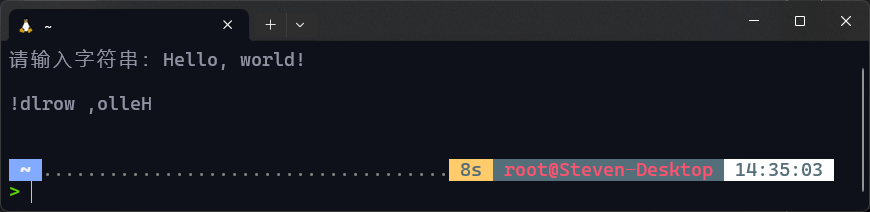
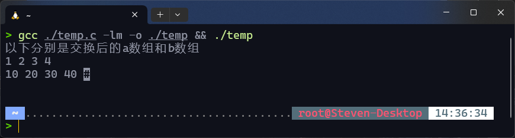
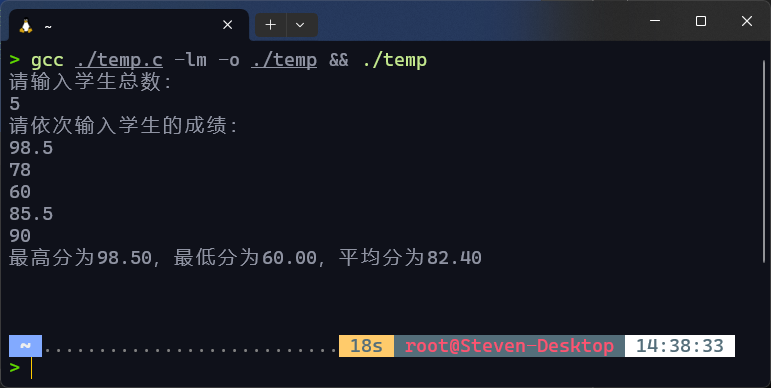

# 实验七：指针的应用

## 一、实验目的

1. 掌握指针的概念
2. 掌握指针变量的定义和基本使用方法
3. 掌握使用指针操作数组元素的方法
4. 掌握使用指针操作字符串的方法

## 二、知识要点

1. 变量的直接访问和间接访问的概念
2. 指针和指针变量的概念
3. 简单变量的指针及指向简单变量的指针变量的定义、赋值及使用
4. 数组的指针及指向数组的指针变量的定义、赋值及使用
5. 字符串的指针及指向字符串的指针变量的定义、赋值及使用

## 三、实验预习

1. 写出一个C语句，使得指针变量u指向变量x：
2. 写出一个C语句，输出“指针变量p指向的整型变量”的值：
3. 把“指针变量u所指向的变量”的值变为40，其语句是：
4. 定义三个变量，其中x1是整型变量；y1、y2是指向整数的指针变量：
5. 若有语句：char t[20]= “abcdefgh”，*p；则使p指向字符串的第一个字符的语句是：

## 四、实验内容(源代码，在可用数组或指针完成的部分尽可能用)

1. 已知一个整数数组`x[4]`，它的各元素值分别为3、11、8和22。使用指针表示法编程序，求该数组各元素之积。
2. 编写程序，输入10个整数至一数组，将其中最小的数与第一个数对调，把最大的数与最后一个数对调。（要求输出对调前后的数组，通过指针操作数组）
3. 编写程序，复制一个字符串到字符数组`x`中，要求在复制时删除其中的数字字符。输出`x`数组。（`x`数组中不能含有数字字符，通过指针操作数组）
4. 编写参数为指针变量的函数`del`，功能是删除字符串中的`*`号。要求在主函数中定义数组`a`，`b`，输入字符串给数组`a`，调用`del`删除`*`号后存放在数组`b`中，输出`b`数组。
5. 编写参数为指针变量的函数，功能是将数组元素按输入顺序逆置存放，要求在主函数中输入数组元素的值，在主函数中输出逆置后的数组。
6. 编写参数为指针变量的函数`fun`，功能是交换两个数组中的对应元素。已知数组`a`元素值分别为10,20,30,40,数组`b`元素值分别为1,2,3,4,要求在主函数中输出交换后的`a`和`b`数组。
7. 利用动态内存分配的方法，输入一个班的学生某门功课的成绩，人数由用户指定，输出全班平均分以及最高分和最低分。

## 五、实验结果(要求粘贴运行界面及输出的运行结果)

1. 

   ```c
   #include <stdio.h>
   
   int main()
   {
       int x[4] = {3, 11, 8, 22};
       int *p = x;
       int i, sum = 1;
       for (i = 0; i < 4; i++)
       {
           sum *= *(p + i);
       }
       printf("The product of the elements of the array is %d.\n", sum);
       return 0;
   }
   ```

2. 

   ```c
   #include <stdio.h>
   
   int main()
   {
       int i, y, *max, *min;
       int x[10];
       int *first = &x[0], *last = &x[9];
       // 获取值
       puts("请依次输入10个整数");
       for (i = 0; i < 10; i++)
           scanf("%d", &x[i]);
       // 找出最大值最小值
       max = &x[0], min = &x[0];
       for (i = 0; i < 10; i++)
       {
           printf("%d ", x[i]);
           if (*max < x[i])
               max = &x[i];
   
           if (*min > x[i])
               min = &x[i];
       }
       puts("\n");
       // 值交换
       y = *first;
       *first = *min;
       *min = y;
       y = *last;
       *last = *max;
       *max = y;
       // 最后输出
       for (i = 0; i < 10; i++)
           printf("%d ", x[i]);
   }
   ```

3. 

   ```c
   #include <stdio.h>
   #include <string.h>
   
   int main()
   {
       int i;
       char str[100];
       char x[100];
       char *p = x;
       printf("请输入字符串：");
       fgets(str, 100, stdin);
       for (i = 0; i < strlen(str); i++)
       {
           if (str[i] < 48 || str[i] > 57)
           {
               *p++ = str[i];
           }
       }
       *p++ = '\0';
       printf("删去数字后得：%s", x);
   }
   ```

4. 

   ```c
   #include <stdio.h>
   #include <string.h>
   
   int main()
   {
       void del(char *);
       int i;
       char a[100];
       printf("请输入字符串：");
       fgets(a, 100, stdin);
       del(a);
   
       return 0;
   }
   
   void del(char *a)
   {
       int i, j;
       char b[100];
       char *p = a;
       for (i = 0, j = 0; i < strlen(a); i++)
       {
           if (*p == '*')
               *p++;
           else
           {
               b[j] = *p;
               j++;
               *p++;
           }
       }
       b[j] = '\0';
       puts(b);
   }
   ```

5. 

   ```c
   #include <stdio.h>
   #include <string.h>
   
   int main()
   {
       void fun(char *);
       char a[100];
       int j;
       printf("请输入字符串：");
       fgets(a, 100, stdin);
       fun(a);
       puts(a);
   
       return 0;
   }
   
   void fun(char *a)
   {
       int i, j, length = strlen(a);
       char b[100];
       char *p = &a[0];
       for (i = length - 1; i >= 0; i--)
       {
           b[i] = *p;
           *p++;
       }
       for (i = length - 1; i >= 0; i--)
           *p--;
   
       for (j = 0; j <= length - 1; j++)
       {
           *p = b[j];
           *p++;
       }
       *p = '\0';
   }
   ```

6. 

   ```c
   #include <stdio.h>
   #include <string.h>
   
   int main()
   {
       void fun(int *, int *);
       int j;
       int a[4] = {10, 20, 30, 40}, b[4] = {1, 2, 3, 4};
       fun(a, b);
       puts("以下分别是交换后的a数组和b数组");
       for (j = 0; j < 4; j++)
           printf("%d ", a[j]);
       printf("\n");
       for (j = 0; j < 4; j++)
           printf("%d ", b[j]);
       return 0;
   }
   
   void fun(int *a, int *b)
   {
       int i;
       int mid[4];
       for (i = 0; i < 4; i++)
       {
           mid[i] = *a;
           *a = *b;
           *b = mid[i];
           *a++;
           *b++;
       }
   }
   ```

7. 

   ```c
   #include <stdio.h>
   #include <stdlib.h>
   
   int main()
   {
       int num, i;
       float sum = 0, max, min;
       double ave;
       float *score = (float *)malloc(num * sizeof(int));
       puts("请输入学生总数：");
       scanf("%d", &num);
       if (score == NULL)
           puts("申请内存空间失败");
       puts("请依次输入学生的成绩：");
       for (i = 0; i < num; i++)
       {
           scanf("%f", &score[i]);
           sum += score[i];
       }
   
       ave = (double)(sum / num);
       max = score[0];
       min = score[0];
       for (i = 0; i < num; i++)
       {
           if (max < score[i])
               max = score[i];
           if (min > score[i])
               min = score[i];
       }
       free(score);
       printf("最高分为%.2f，最低分为%.2f，平均分为%.2lf\n", max, min, ave);
       return 0;
   }
   ```

## 六、实验小结(要求列出通过本实验学到的编程经验)
