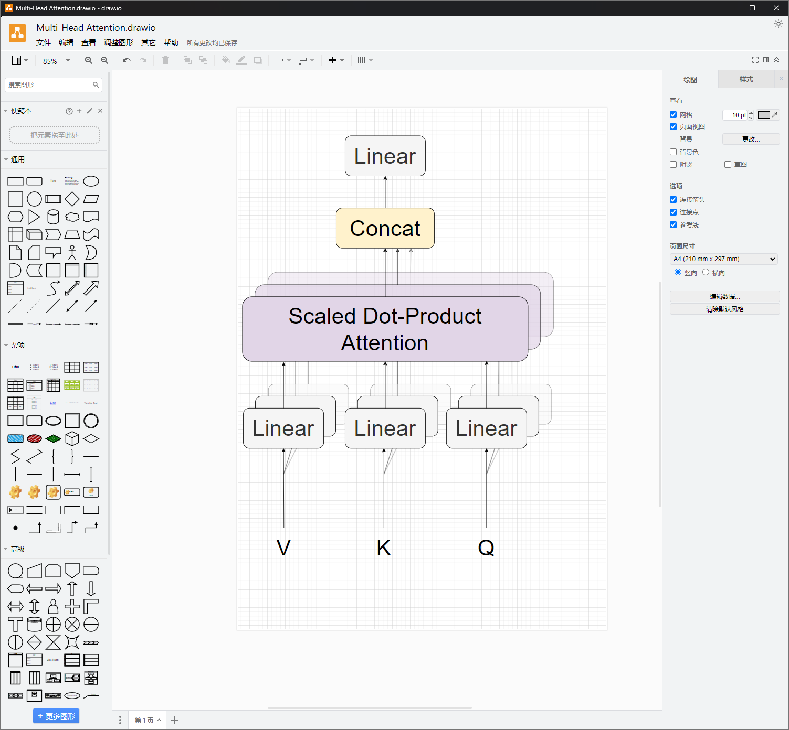
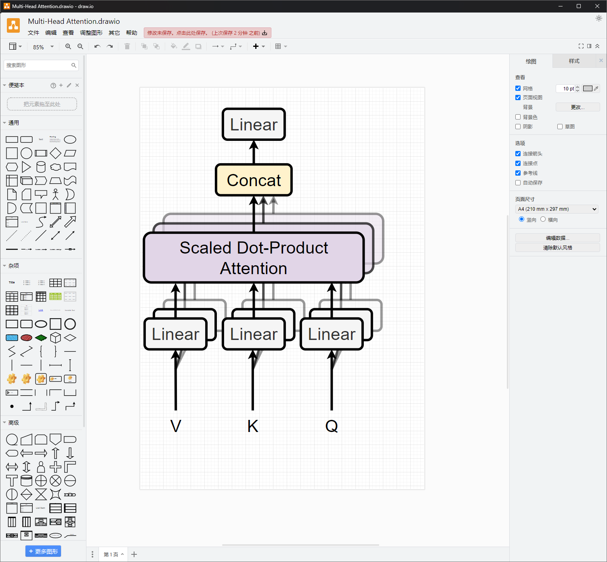
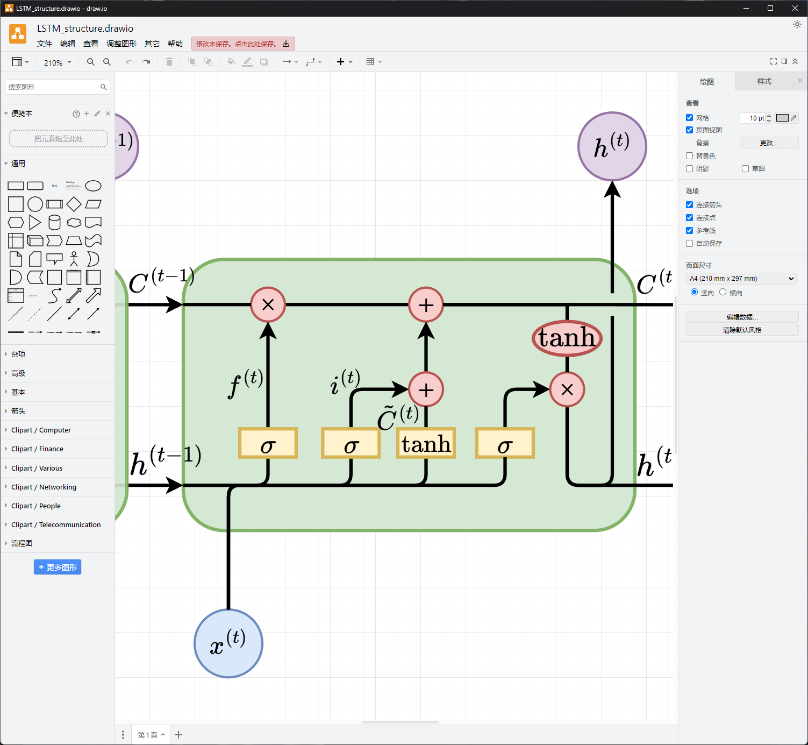
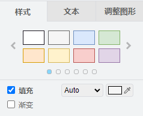
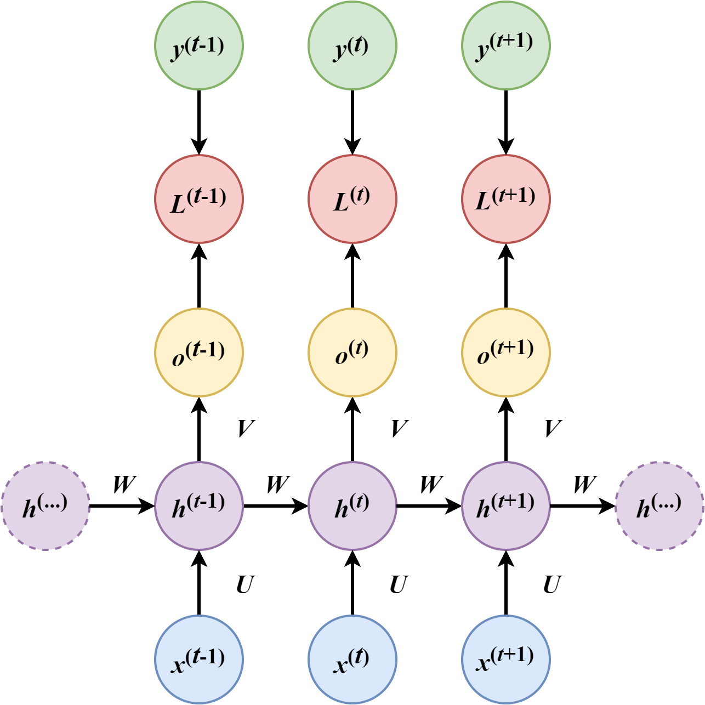
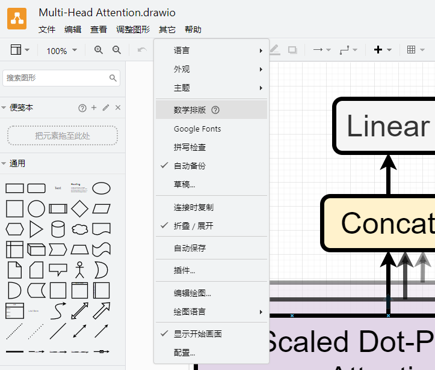

# [毕设版]draw.io的使用方法

> draw.io种的一些用法，主要是面向毕设画图的需求而写的。

## 安装

* 点击  进入drawio-desktop的GitHub仓库，在Release中下载对应平台的安装包并安装即可。

## 技巧汇总

### 1. 适当加粗线宽提升质感

* 这是展示的一张复刻的Multi-Head Attention图，其实还是挺好看的，但是相对于原图还是少了些质感。
* 这时候只要适当的把线宽加粗，质感瞬间就上来了：

* draw.io的默认线宽是1px，如果并没有调整过整体组件大小的话，线宽调整为3px左右就可以了。调整方法为选中组件，然后在右侧**样式-线条**中可以看到线宽的输入框。

### 2. 适当使用圆角

* 如上图所示，这是一个LSTM的图，但是直角的线型看起来有些生硬，这时候可以适当的使用圆角：

* 修改方法为选中箭头后，在右侧**样式-线条**旁边可以看到一个“锐利”的下拉框，点击后可以选择“圆角”。

### 3. 默认配色

* 任意选中一个组件后，在右侧**样式**中即可看到最上面提供了8种颜色。

* 由于我是搞Transformer的嘛，这个配色一眼就能看得出来，和《Attention is All You Need》的配色几乎一样。这套配色就很不错，画出来的图也很好看：

### 4. LaTeX公式渲染

* 如上图所示，点击**其他-数学排版**后，draw.io会将以2对美元符号包裹的内容视为LaTeX公式，并进行渲染。这种渲染的效果会比使用Times New Roman字体模仿的要好，适合熟悉LaTeX的同学。

### 5. 导出时的缩放选项

* 导出时的对话框如上图所示，其中有几个需要注意的地方：
  * 如果并没有调整过整体组件大小的话，**缩放**建议调整到**150%～200%**，如果就按照默认的100%导出的话，图片不太清晰。
  * 边框宽度可以根据需要调整，**10px**就是一个比较合适的值。
