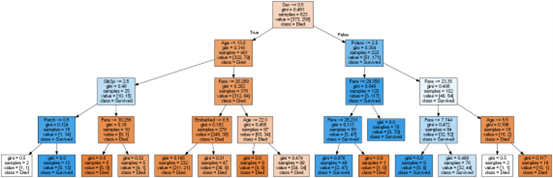
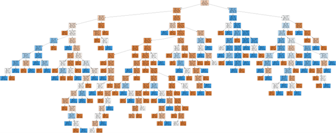
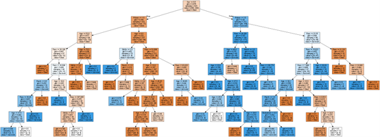
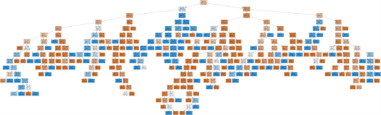
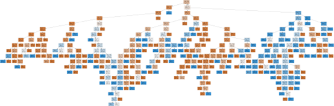

# 实验二：决策树和随机森林

> $author@Steven$

## 目录

* [实验二：决策树和随机森林](#实验二决策树和随机森林)
  * [目录](#目录)
  * [1. 决策树](#1-决策树)
    * [1.1 题目分析](#11-题目分析)
    * [1.2 解题步骤](#12-解题步骤)
    * [1.3 结果分析](#13-结果分析)
  * [2. 随机森林](#2-随机森林)
    * [2.1 题目分析](#21-题目分析)
    * [2.2 解题步骤](#22-解题步骤)
    * [2.3 结果分析](#23-结果分析)

## 1. 决策树

    本任务中你将使用决策树来预测泰坦尼克号的乘客是否能够生存。通过乘客的相关信息来构建合适的决策树，以此判断乘客的生还情况，并尝试不同的决策树参数，观察其对决策树的影响（如节点分裂标准，树的最大深度等），尝试使用网格搜索的方法找到较优的参数，最后将决策树可视化出来。
    文件ex2data.csv包含我们的线性回归问题的数据集。数据参数如下：
    PassengerId（乘客ID），Name（姓名），Ticket（船票信息），Survived （获救情况）其值 为1或0，代表着获救或未获救；Pclass（乘客等级），Sex （性别）值为male或者female，Embarked（登船港口）其值为S, Q, C；Age （年龄），SibSp（堂兄弟妹个数），Parch（父母与小孩的个数）；Fare（票价）是数值型数据；Cabin（船舱）则为文本型数据。决策树相关参数和网格搜索参数代码介绍在demo.py可见。

* 请将70%的数据用作训练集，30%的数据用作测试集，使用留出法对以上模型进行验证。
* 请对生成的决策树进行剪枝，并可视化剪枝前剪枝后的决策树，比较两者区别。

### 1.1 题目分析

* 本题主要是根据数据集中的数据生成决策树，并通过修改不同的决策树的参数来影响决策树的生成。同时，尝试使用网格搜索找到较优的参数以生成决策树。
* 第二问对决策树进行剪枝，但由于并没有提供预剪枝/后剪枝的选项，需要根据该类中已有的参数实现这两种剪枝策略。

### 1.2 解题步骤

1. 第一问需要对某些`DecisionTreeClassifier`的参数进行约束，所以自定了个函数包装了起来，函数内部使用网格搜索确定较优参数，返回决策树对象。使用该函数分别生成无限制的、限制`max_depth`的和限制`min_impurity_decrease`的三个决策树，并分别可视化进行比较。
2. 第二问对决策树进行剪枝，由于`DecisionTreeClassifier`类中没有提供预剪枝/后剪枝的选项，根据这两种剪枝策略的特点，预剪枝通过对`max_depth`和`min_samples_split`参数进行限制，并使用`GridSearchCV`确定最优参数来实现；后剪枝通过评估在不同`ccp_alpha`参数下决策树的泛化性能，找到最优的`ccp_alpha`，并据此构建决策树视为后剪枝决策树。

### 1.3 结果分析

> 图片非原图，仅供预览

* 默认(无限制)决策树:
  * 决策树.png)
* 限制max_depth的决策树:
  * 
* 限制min_samples_split的决策树:
  * 
* 预剪枝决策树:
  * 
* 后剪枝决策树:
  * 
* 各决策树的评估结果:
  * 

## 2. 随机森林

    本任务中你将使用随机森林来预测泰坦尼克号的乘客是否能够生存 。 通过乘客的相关信息来构建合适的随机森林，以此判断乘客的生还情况，并尝试不同的随机森林参数，观察其对随机森林的影响（如森林中的决策树数量，节点分裂标准，树的最大深度等），尝试使用网格搜索的方法找到较优的参数。数据集同上。随机森林相关参数代码介绍在demo. py可见。

### 2.1 题目分析

* 本题与上一题类似，也是调用`sklearn`中对应的库执行随机森林算法，尝试调整约束参数以观察随机森林的状况，并利用网格搜索确定较优的参数。

### 2.2 解题步骤

* 本题仿照第一题的步骤，自定一个函数将`RandomForestClassifier`包装起来，内部使用`GridSearchCV`进行网格交叉搜索以确定最优参数。最后利用`sklearn.export_graphviz`函数导出图片。

### 2.3 结果分析

* 默认(无限制)的随机森林:
  * 的随机森林.png)
* 限制n_estimators的随机森林:
  * 
* 限制max_depth的随机森林:
  * 
* 限制criterion的随机森林:
  * 
* 各随机森林的评估结果:
  * 
