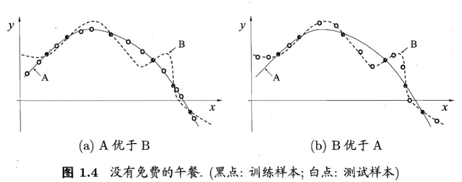
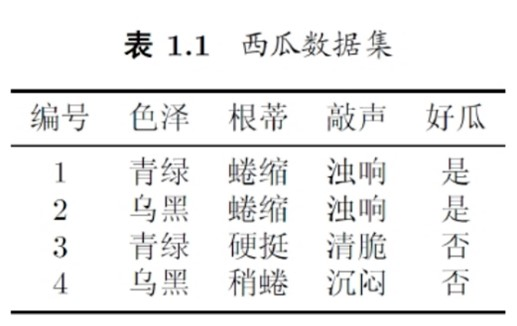
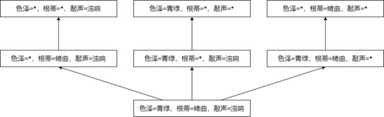

# Part01 绪论

> 本书的绪论不是水字数，而是重点于概念介绍。不过鉴于很多概念经常被提起，大多数同学已经知道其含义了，所以本章的笔记对这种概念不再赘述。如果想详细了解，请去翻书吧。

# 1.0 Pre

## 1.0.1 目录

* [Part01 绪论](#part01-绪论)
* [1.0 Pre](#10-pre)
  * [1.0.1 目录](#101-目录)
* [1.1 引言](#11-引言)
* [1.2 基本术语](#12-基本术语)
  * [1.2.1 问题类型](#121-问题类型)
  * [1.2.2 样本相关](#122-样本相关)
  * [1.2.3 学习方法](#123-学习方法)
* [1.3 假设空间](#13-假设空间)
* [1.4 归纳偏好](#14-归纳偏好)
  * [1.4.1 归纳偏好是什么](#141-归纳偏好是什么)
  * [1.4.2 如何确定一个更好的归纳偏好](#142-如何确定一个更好的归纳偏好)
    * [奥卡姆剃刀原则(Occam's razor)](#奥卡姆剃刀原则occams-razor)
    * [NFL定理](#nfl定理)
* [1.5 发展历程](#15-发展历程)
* [1.6 应用现状](#16-应用现状)
* [1.7 阅读资料](#17-阅读资料)
* [Ques01-例题整理](#ques01-例题整理)
  * [\[概念理解·假设空间和版本空间\]](#概念理解假设空间和版本空间)

# 1.1 引言

> 讲述了一个西瓜的例子，略。

# 1.2 基本术语

> 这章的主要内容其实就是基本概念，所以这一节会尤其的长，而且通常这节是不会有子节的，这里按照概念的所属进行了分类。
>
> 但不管怎么说，绪论应该不太会考，但是这些概念将在后面反复被用到。

## 1.2.1 问题类型

> **分类**：给定一个样本，将其划分到某个类别中。
>> **二分类**：将样本划分到两个类别的一个中，通常是做“是不是”的判断。
>> **多分类**：将样本划分到多个类别的一个中，通常是做“是什么”的判断。
> **回归**：给定一个样本，预测其输出值。

## 1.2.2 样本相关

> **数据集**：一组记录的集合，集合中的每个元素都是对于一个事件或对象的描述，称为一个**样本**(sample)或**示例**(instance)。
>> 似乎数据集总是可以表示为一个标准的二维表，每行表示一个样本，每列表示一个**属性**(attribute)或者说**特征**(feature)。
>
> **属性空间**(attribute space)/**样本空间**(sample space)/**输入空间**：属性张成的空间。
>> 关于这点其实可以参考向量空间的定义。简单来说就是，对于一个三维向量，三个轴分别代表三类属性，某一类的可枚举项越多，这个轴就越长。通过这种方式撑起来的空间就是样本空间。当然，对于维度高于3的就是个高维空间了，但思想仍然是类似的。
>>
>> 可以想象，样本空间涵盖了所有可能的样本点。
>
> **特征向量**：其实也就是一个样本，它也对应样本空间中的一个点。

## 1.2.3 学习方法

> **监督学习**：训练集中的每个样本都有一个对应的输出值，即“标记”(label)，该情况下的学习任务称为监督学习。
>
> **无监督学习**：训练集中的每个样本都没有对应的输出值，该情况下的学习任务称为无监督学习。
>
> **强化学习**：学习算法不需要训练数据集，而是通过与环境的交互来学习。

# 1.3 假设空间

> **归纳**：从特殊到一般的“泛化”过程，即总结经验。
>
> **演绎**：从一般到特殊的“特化”过程，即利用经验解决问题。

* 关于假设空间和版本空间，我觉得书上讲得不好，Reference的这篇博客写的不错，虽然文章中的表格有地方打错了，但结论没错，也十分清晰，易于理解。
* **假设空间**：所有“假设”构成的空间(虽然我觉得叫集合更合适)
  * **假设**：对于一个分类问题，假设就是一个分类条件，符合该条件的判断为正例，否则为反例。
  * 我们应该能发现这是个排列组合问题，我们依次枚举每个属性的所有取值，然后将其组合起来，就得到了所有的假设....吗？
  * 并不是，因为不一定所有属性都影响结果，因此每个属性还要考虑“取什么都行，都不影响判决”的情况，即“通配符”，通常用`*`表示。
  * 对于机器学习来说，假设空间的意义在于给出了机器学习算法的所有可能的输出，即所有可能的假设，而算法只需要在其中确定某个假设即可。
* **版本空间**：与训练集一致的假设集合
  * 假设集合列出了所有可能的假设，而版本空间则是从假设集合中选出符合训练集结果的假设。
  * 换句话说，版本空间是假设空间的一个子集，假设空间只管给出所有可能的假设，不在乎正确性，而版本空间从中筛选出正确的假设。
* Reference：[《机器学习》中的假设空间和版本空间](https://blog.csdn.net/anqijiayou/article/details/79697900)

# 1.4 归纳偏好

## 1.4.1 归纳偏好是什么

> **归纳偏好**：不同学习器的对某种类型假设的偏好。

* 以下图的回归问题为例，给出了六个图中的点为训练集，训练出一个回归模型，相当于找出一条曲线符合这六个点。现在找到了A(实线)、B(虚线)两个模型，都能满足训练集，但他们俩却有明显区别，A模型的曲线更加平滑，而B模型的曲线更加“抖动”，这就是两个模型不同的归纳偏好的体现。
  * 

## 1.4.2 如何确定一个更好的归纳偏好

### 奥卡姆剃刀原则(Occam's razor)

* 奥卡姆剃刀原则通常被表述为：“如无必要，勿增实体”。但在这里表述为“若有多个假设与观测一致，则选择最简单的那个”。那么在这种思想指导下，我们倾向于选A，它的数学表达式确实应该比B要简单不少。
* 不过奥卡姆剃刀也不是万能的，比如这个“简单”就很难被定义，什么样的是简单的？这是个复杂的问题。
* 此外，奥卡姆剃刀原则并非基于测试集的效果做出的判断，因此即使选择了A模型，其泛化能力(性能)也有可能显著弱于B模型。以下是张比较极端情况的图，就是为了说明这一问题。
  * 

### NFL定理

> 定理的公式部分略，反正也不考，理解一下思想就行。
>
> 主要包括以下两点：
>
>1. 如果一个算法A在某些问题上的泛化能力要优于算法B，那么必然存在一些其他问题，算法B要优于算法A。
>2. 若所有类型的问题出现机会相同或同样重要，那么算法A和算法B的性能的期望是相同的。
> 但也不要过度沮丧，我们的模型只是为了解决当前问题而诞生的，并不用考虑其他问题。因此可以说：**脱离具体问题而空泛地谈论“什么学习算法更好”毫无意义。**

# 1.5 发展历程

* 略

# 1.6 应用现状

* 略

# 1.7 阅读资料

* 略

# Ques01-例题整理

## [概念理解·假设空间和版本空间]

> 题目内容

* 若表1.1中只包含编号为1和4的两个样例，试给出相应的假设空间和版本空间。
  * 

> 分析与解答

* 这题其实就是考概念。根据之前给出的[假设空间](#13-假设空间)和[版本空间](#13-假设空间)中的概念，列举即可。
* 首先，若只包括1和4两个样例，则数据集为：
  |编号|色泽|根蒂|敲声|好瓜|
  |:-:|:-:|:-:|:-:|:-:|
  |1|青绿|蜷缩|浊响|是|
  |4|乌黑|稍蜷|沉闷|否|
* 色泽有`(青绿, 乌黑, *)`三种取值；根蒂有`(蜷缩, 稍蜷, *)`三种取值；敲声有`(浊响, 沉闷, *)`三种取值，则共有$3\times3\times3=27$种取值。
* 假设空间就是用树的方式表示出上述的所有取值情况，完整情况有27种，但由于一般画不下，所以通常只把版本空间中的部分画出来即可。
  * 
* 版本空间如下图所示
  * 
* 可以发现，假设空间的根是从上到下，逐渐特化，获得逐步具体的假设；而版本空间的根是从下到上，逐渐泛化，从符合训练集的模式逐渐松弛。
