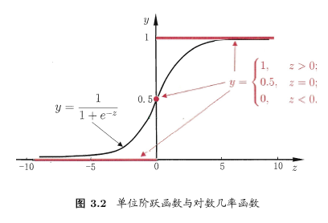
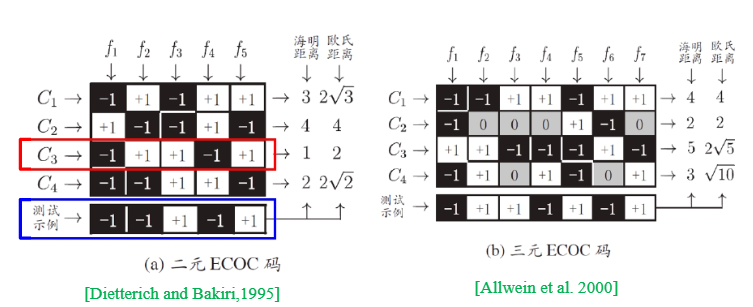
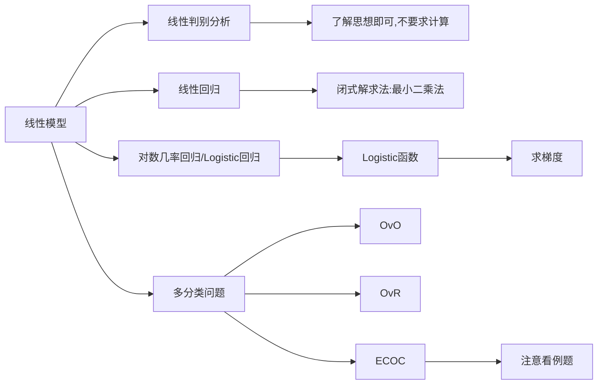

# Part03 线性模型

# 3.0 Pre

## 3.0.1 目录

* [Part03 线性模型](#part03-线性模型)
* [3.0 Pre](#30-pre)
  * [3.0.1 目录](#301-目录)
* [3.1 基本形式](#31-基本形式)
* [3.2 线性回归](#32-线性回归)
  * [3.2.1 最小二乘的参数估计](#321-最小二乘的参数估计)
    * [(1) 问题分析](#1-问题分析)
    * [(2) 解法优化](#2-解法优化)
  * [3.2.2 对数线性回归](#322-对数线性回归)
* [3.3 对数几率回归](#33-对数几率回归)
  * [3.3.1 单位阶跃函数](#331-单位阶跃函数)
  * [3.3.2 Logistic函数](#332-logistic函数)
  * [3.3.3 解法demo](#333-解法demo)
* [3.4 线性判别分析](#34-线性判别分析)
  * [3.4.1 总结](#341-总结)
* [3.5 多分类问题](#35-多分类问题)
  * [3.5.1 OvO](#351-ovo)
    * [(1) OvO的思想](#1-ovo的思想)
    * [(2) OvO的优缺点](#2-ovo的优缺点)
  * [3.5.2 OvR](#352-ovr)
    * [(1) OvR的思想](#1-ovr的思想)
    * [(2) OvR的优缺点](#2-ovr的优缺点)
  * [3.5.3 MvM](#353-mvm)
  * [3.5.4 ECOC](#354-ecoc)
* [3.6 类别不平衡问题](#36-类别不平衡问题)
* [Extra03 知识总结](#extra03-知识总结)
* [Ques03-例题整理](#ques03-例题整理)
  * [\[公式推导·利用逻辑回归求导性质\]](#公式推导利用逻辑回归求导性质)
    * [(1) Logistic函数的导数性质](#1-logistic函数的导数性质)
    * [(2) 计算$\\frac{\\partial J(\\theta)}{\\partial z}$](#2-计算fracpartial-jthetapartial-z)
  * [(3) 计算$\\frac{\\partial J(\\theta)}{\\partial \\theta\_j}$](#3-计算fracpartial-jthetapartial-theta_j)

# 3.1 基本形式

* 线性模型的基本形式为：$f(x)=\omega_1x_1+\omega_2x_2+...+\omega_dx_d+b$
* 用向量表示为：$f(x)=\omega^Tx+b$，其中$\omega=(\omega_1,\omega_2,...,\omega_d)^T$

> 可以看出，当$\omega$和$b$确定后，线性模型就确定了，所以本章接下来的任务就是花式确定$\omega$和$b$。

# 3.2 线性回归

> 均方误差：[戳这里回顾一下](./Part02-模型评估与选择.md#230-均方误差mean-squared-error-mse)

> 在做线性回归之前，我们要先确定一点：什么样的线性函数是好的？
>> 根据我们朴素的想法：如果这条函数直线经过所有点，那它就是好的。确实，但前提是这得是有可能的。
>>
>> 如果不存在经过所有点的直线，那这条直线至少能够尽量接近所有点，即要求“偏差最小”(这个表述有些不严谨)。
>>
>> 如何去衡量这个偏差呢？首先想到的应该是点到直线的欧氏距离。**广义最小二乘法(GLS)**就是以欧氏距离为偏差，最小化偏差的平方和(即均方误差)。不过由于点到直线的距离计算起来比较麻烦，大多数时候我们仅使用输出值$y$这个维度的距离($f(x_i)-y_i$)作为偏差，这就是**普通最小二乘法(OLS)**。
>>
>> 事实上我们本章只需要知道OLS即可，因为平时也只使用OLS，平时说“最小二乘法”也是指的普通最小二乘法。

## 3.2.1 最小二乘的参数估计

> 这其实就是个优化问题，不过存在闭式解，这里介绍闭式解的推导过程。
>
> 闭式解：通过数学推导，得出的解析解，它可以保证计算结果就是最优解(而梯度下降等方式求出的只是逼近最优解的可行解)。

### (1) 问题分析

* 对于线性回归函数$f(x_i)=\omega x_i+b$，我们的目标是求出最优的$\omega$和$b$(记作$\omega^*$和$b^*$)，使得$E_{(\omega,b)}=\sum\limits^m_{i=1}(f(x_i)-y_i)^2$最小。这个过程可以视为对于一个函数$E(\omega,b)$求极值的问题，表示为$(\omega^*,b^*)=arg_{(\omega,b)}min\sum\limits^m_{i=1}(y_i-\omega x_i-b)^2$

>根据高数的老套路，对变量分别求偏导，偏导均为0时，即为极值点。

* 求偏导：
  * $\frac{\partial E_{(\omega,b)}}{\partial \omega}=2(\omega\sum\limits^m_{i=1}x_i^2-\sum\limits^m_{i=1}(y_i-b)x_i)$
  * $\frac{\partial E_{(\omega,b)}}{\partial b}=2(mb-\sum\limits^m_{i=1}(y_i-\omega x_i))$
* 令上式=0，解方程得：
  * $\omega^*=\frac{\sum\limits^m_{i=1}y_i(x_i-\bar{x})}{\sum\limits^m_{i=1}x_i^2-\frac{1}{m}(\sum\limits^m_{i=1}x_i)^2}$
  * $b^*=\frac{1}{m}\sum\limits^m_{i=1}(y_i-\omega x_i)=\bar{y}-\omega\bar{x}$
* 上述结果就是闭式解，这是能正向直接算出来的，而不需要迭代。

### (2) 解法优化

> 其实就是矩阵化，矩阵化之后不仅更美观，而且可以解决多元线性回归

* 上述的解法已经能够解决问题了，$x_i$不仅可以是标量，也可以是向量——理论上这就能解决任何线性回归问题了。
* 但仔细想想，上述解法还不够优雅。既然$x_i$都是向量了，为什么还要将$\omega,b$表示为向量+标量的形式呢？对的，解法优化就是将上述运算矩阵化。
  > 设有$m$组样本$x_i$，每个样本$x_i$都是$d$维。好，接下来推导过程中注意设的新变量。
  * 令$\hat{\omega}=(\omega;b)$，拼成列向量，此时$\hat{\omega}$有$(d+1)$维，$\hat{\omega}=[\omega_1,\omega_2,...\omega_d,n]^T$
  * 令$X$为一个$m\times(d+1)$的矩阵，它是由$x_i$最后增添一个1，然后转置后拼成的。
  $$X=\begin{bmatrix}x_{11} & x_{12} & \dots & x_{1d} & 1 \\x_{21} & x_{22} & \dots & x_{2d} & 1 \\ \vdots & \vdots & \ddots & \vdots & \vdots \\x_{m1} & x_{m2} & \dots & x_{md} & 1 \\ \end{bmatrix}=\begin{bmatrix}x_1^T & 1 \\x_2^T & 1 \\ \vdots & \vdots \\x_m^T & 1 \\ \end{bmatrix}$$
  * 此时$Y$为一个列向量，维度为$m$。
  * 此时该问题表示为$\hat{\omega}^*=arg_{\hat{\omega}}min\sum^m_{i=1}(Y-X\hat{\omega})^T(Y-X\hat{\omega})$
* 对$\hat{\omega}$求导，得：$\frac{\partial E_{(\hat{\omega})}}{\partial \hat{\omega}}=2X^T(X\hat{\omega}-y)$
* 令上式=0，解方程得：$\hat{\omega}^*=(X^TX)^{-1}X^Ty$
* 这就是最小二乘法的矩阵解法，它仍然是闭式解，理论上能计算出最优解。
* 但很明显，它足够优雅，但不够好用。一方面因为$(X^TX)^{-1}$的计算难度挺大，另一方面它要求$X^TX$满秩，不然有可能解出多个$\hat{\omega}^*$。
* 从实用的角度出发，我们需要一个通用、简单的解法，而不一定非得理论上完美，那么这种解法就是迭代类方法，它被广泛用在对数线性回归、逻辑回归等问题中。

## 3.2.2 对数线性回归

> 其实就是$y$与$x$$不为线性关系，而是指数关系。
>
> 这一小节就是为下面的“对数几率回归”做铺垫的

* 若$y\propto e^{\omega^Tx+b}$，则可以等价写成$\ln y=\omega^Tx+b$，这样一个函数就是对数线性回归函数。
* 推广来讲，凡是满足$y=g^{-1}(\omega^Tx+b)$的函数，都可称之为“广义线性函数”，其中函数$g(·)$称为联系函数”。
* 这时候又想起模式识别老师常说的一句话：“广义线性函数是线性函数吗？”答案是否定的；这里也是，对数线性回顾属于广义线性回归，但它不是线性的。

# 3.3 对数几率回归

> 本节我们讨论**线性模型**如何解决**分类问题**
>
> 虽然它叫“对数几率回归”，但实际上它是一个**分类问题**，而非回归问题。从名字上也能见端倪：“几率”嘛，一般是预测类别(分类)时才有的概念，回归问题一般是预测个数值，哪有什么“几率”。

* 对于二分类问题，线性模型只需要回答“是”或“否”的问题，因此我们需要将线性模型的输出值转换为“是”或“否”的布尔值。
  * 由于多分类问题都可以视为二分类问题的组合，因此我们只讨论二分类问题，后面会看到如何组合的。

## 3.3.1 单位阶跃函数

> 这个函数不重要，只是为了引出[$Logistic$函数](#332-logistic函数)

* 关于如何让线性回归模型$z=\omega^Tx+b$输出分类结果，可能最先想到的解决办法是单位阶跃函数：
$$y=\left\{\begin{matrix}1&z>0;\\0.5&z=0;\\0&z<0;\end{matrix}\right.$$
  * 当$z>0$时判断为正例，$z<0$时判断为负例，$z=0$时可任意判别。
  * 但是单位阶跃函数不连续，数学性质不够优秀(比如不可导)，因此不适合用于机器学习。我们期望能找到一个连续可导函数，能将$(-\infty,+\infty)$映射到$(0,1)$，$Logistic$函数就是这样一个函数。

## 3.3.2 Logistic函数

> 也叫“逻辑函数”

* Logistic函数是一个S型函数，它的数学表达式为：
$$\sigma(z)=y=\frac{1}{1+e^{-z}}$$
* 它的图像如下：
  * 
  * 它的优势十分明显：
    * 判别规则十分简单
    * 输出了这一判别的概率
    * 连续可导
* 我们将线性回归函数代入可得$y=\frac{1}{1+e^{-(\omega^Tx+b)}}$，这就是$Logistic$回归模型，同样可见，它也是个[对数线性模型](#322-对数线性回归)。
  * 进行同样的取$\ln$操作，并整理，得到$\ln\frac{y}{1-y}=\omega^Tx+b$。
* 此外，Logistic还有个特殊性质：它的导数可以用它自己表示：$\frac{\partial\sigma(z)}{\partial z}=\sigma(z)\cdot(1-\sigma(z))$，不信可以自己代入算一下。这个性质也是手算Logistic回归的重要工具。

* 题外话：Sigmoid函数是一类函数，即形似S的函数。Logistic函数就是Sigmoid函数的代表。往后如果不说的话，二者都认为是这个表达式。

## 3.3.3 解法demo

> 然后从考试的角度来说，由于公式比较复杂，且十分难算，所以应该不会考这里
>
> 仍然是以0-1二分类问题为例。这里用到了极大似然法，后面会讲到。

* 令$\beta=(\omega;b),\hat{x}=(x;1)$，则$\omega^Tx+b$可简写为$\beta^T\hat{x}$。(这一步的目的是简化表示形式)
* 再令：
$$p_1(\hat{x_i};\beta)=p(y=1|\hat{x};\beta)=\frac{e^{\omega^Tx+b}}{1+e^{\omega^Tx+b}}$$
$$p_0(\hat{x_i};\beta)=p(y=0|\hat{x};\beta)=\frac{1}{1+e^{\omega^Tx+b}};(\text{其实也就是}1-p_1(\hat{x_i};\beta))$$

  * > 其实就是把$\beta^T\hat{x}$代入了$Logistic$函数中，注意到此时表达式形式为条件概率，即在当前$\hat{x},\beta$的条件下，判定$y=1\text{或}y=0$的概率，这正是我们所需的。
* 则似然项可重写为$p(y_i|x_i;\omega_i,b)=y_ip_1(\hat{x_i};\beta)+(1-y_i)p_0(\hat{x};\beta)$
  * > 多观察一下就能发现，此式形式上就是计算期望。因为$y_i$只能取0或1，所以当$y_i=0$时，概率之前取$1-y_i$作为系数。
* 对于上述似然项(期望)，当然是越大说明模型效果越好，所以该问题转化为一个优化问题：$max\ \ell(\omega,b)=\sum\limits^m_{i=1}\ln p(y_i|x_i;\omega,b)$
* 等价于最小化$\ell(\beta)=\sum\limits^m_{i=1}(-y_i\beta^T\hat{x_i}+\ln(1+e^{\beta^T\hat{x_i}}))$，而对于该式，可使用梯度下降法、牛顿法等方法求解最优解。

# 3.4 线性判别分析

> 线性判别分析从功能上可以视作一种降维，其思想和实质都和PCA有些类似。但LDA和PCA的最主要的区别在于：PCA是无监督学习，它要求数据点整体尽可能分开，也就是最大化投影方差；而LDA是有监督学习，它要求投影后类间方差最大，类内方差最小。
>
> 对于本节，考试不要求运算，但是要求理解思想。

* LDA的思想非常朴素：给定训练样例集，设法将样例投影到一条直线上，使得同类样例的投影点尽可能接近、异类样例的投影点尽可能远离。

* 给定数据集:$D=\{(x_i,y_i)\}^m_{i=1}$
  * 第$i$类示例的集合$X_i$
  * 第$i$类示例的均值向量$\mu_i$
  * 第$i$类示例的协方差矩阵$\Sigma_i$
  * 两类样本的中心在直线上的投影:$\omega^T\mu_0$和$\omega^T\mu_1$
* 则LDA的目标为：使得同类样例的投影点尽可能接近、异类样例的投影点尽可能远离,公式可表示为
$$\min \omega^T\Sigma_0\omega+\omega^T\Sigma_1\omega$$
$$\max ||\omega^T\mu_0-\omega^T\mu_1||_2^2$$
* 把这两个结合起来可以得到优化的总目标:
$$\max J=\frac{||\omega^T\mu_0-\omega^T\mu_1||_2^2}{\omega^T\Sigma_0\omega+\omega^T\Sigma_1\omega}=\frac{\omega^T(\mu_0-\mu_1)(\mu_0-\mu_1)^T\omega}{\omega^T(\Sigma_0+\Sigma_1)\omega}$$
* 然后咱们首先引入两个矩阵:
  * 类内散度矩阵:$S_\omega=\Sigma_0+\Sigma_1$
  * 类间散度矩阵:$S_b=(\mu_0-\mu_1)(\mu_0-\mu_1)^T$
* 优化目标可化为:$J=\frac{\omega^TS_b\omega}{\omega^TS_\omega\omega}$,这个又叫做**广义瑞利商**

## 3.4.1 总结

* OK我们总结一下:
  * LDA的核心思想是:将样例投影到一条直线上，使得**同类样例的投影点尽可能接近**、**异类样例的投影点尽可能远离**。
  * 优化目标是最大化**广义瑞利商**,通常优化方法为**拉格朗日乘子法**

# 3.5 多分类问题

> 前面说过，多分类问题都可以视为二分类问题的组合(或者说多分类问题可以拆解为若干个二分类问题)，这节就正是做这个事的。
>
> 本节的3种拆分策略：“一对一”(One vs. One, OvO)、“一对其余”(One vs. Rest, OvR)、“多对多”(Many vs. Many, MvM)。

* 本节假定：数据集$D=\{(x_1,y_1),(x_2,y_2),\cdots,(x_m,y_m)\},y_i\in\{C_1,C_2,\cdots,C_N\}$，即数据集包括了$m$组数据，共有$N$个类别。

## 3.5.1 OvO

### (1) OvO的思想

* 将$N$个类别两两组合(握手问题)，组合出共$\frac{N(N-1)}{2}$个二分类器$f_k$。
* 训练时将$C_i$和$C_j$类数据用以训练分类这两类的分类器。
* 测试时将某样本同时提交给所有分类器，最后根据这$\frac{N(N-1)}{2}$个结果，按照投票数最多的类别作为最终判别结果。

### (2) OvO的优缺点

* 优点：训练时间短(每个分类器都是二分类问题，并且只需要和该分类器相关的数据即可)
* 缺点：存储开销和测试时间大($\frac{N(N-1)}{2}$个分类器，且每次测试都要执行这么多次分类)

## 3.5.2 OvR

### (1) OvR的思想

* 设计$N$个分类器，每个分类器$f_i$都只做一个问题：当前样本$x_j$是属于$C_i$类还是其他类。
* 测试时将样本提交给每个分类器。
  * 若只有一个分类器预测为正例，则该样本属于该分类器对应的类别。
  * 若有多个分类器预测为正例，则通常考虑各分类器的预测置信度，选择置信度最高的类别作为最终判别结果。

### (2) OvR的优缺点

* 优点：相较于OvO，只训练N个分类器，存储和测试开销小。
* 缺点：训练时间长(训练时要用到全部训练数据)

## 3.5.3 MvM

* 那么很明显了，MvM就是每个分类器将判断若干个类作为正类，其余作为负类，但是它的正反类必须有特殊的设计，不能随意选取。这里介绍一下最常用的MvM技术：**输出纠错码**(Error Correcting Output Codes, ECOC)。

## 3.5.4 ECOC

> ECOC的主要步骤为**编码**和**解码**。其过程需要结合MvM的具体过程解释。

* 编码：$M$个分类器，每个分类器都将若干个类作为正类，其余作为负类，这$M$个分类器的判定结果组合起来就是该样本的ECOC码。
* 解码：$M$个分类器分别对测试样本进行预测，每个分类器都会返回一个预测标记，共返回$M$个标记，这$M$个标记就是该样本的ECOC码，通常将其中距离最小的类别作为最终判别结果。
  * **二元ECOC码**:预测标记是+1或-1;
  * **三元ECOC码**:预测标记为+1、-1、0;
  * 此外距离也可以用欧氏距离或海明距离等来衡量。
* 我知道这么说有点懵,那么看看下面的例子：
  * 
  * 以图(a)为例，有5个分类器，前4行表示这5个分类器$f_i$分别对4个类$C_j$的预测标记.我们能看出,每个分类器$f_i$对不同的类$C_1-C_4$只能返回2种判断结果,即正例or负例.
  * 第5行，对于一个测试用例，这些分类器分别返回相应的预测标记,构成测试用例的ECOC码。然后拿这个码与前面各类的码进行比较，距离最近的类就是最终判别结果。
  * 图(a)中直接给出了测试示例与各类的距离。按照海明距离和欧氏距离，最近的都是$C_3$，所以最终判别结果为$C_3$。而对于(b)来说，海明距离和欧氏距离最近的都是$C_2$，所以最终判别结果为$C_2$。
* ECOC编码的好处在于它对于单个分类器的错误有一定的容忍能力，它的思想有些类似于Boosting,也是训练若干个弱分类器,然后用类似投票的方式实现判决。

# 3.6 类别不平衡问题

> 咕咕咕

# Extra03 知识总结

* 本章的知识脉络如下

# Ques03-例题整理

## [公式推导·利用逻辑回归求导性质]

> 题目内容

* 对于逻辑回归模型:
$$h_\theta(x)=\frac{1}{1+e^{-\theta^Tx}}$$
* 其损失函数为:
$$J(\theta)=-\frac{1}{m}\sum\limits^m_{i=1}[y^{(i)}\log(h_\theta(x^{(i)}))+(1-y^{(i)})\log(1-h_\theta(x^{(i)}))]$$
* 其中$m$为样本总数，$y_i$表示第$i$个样本的标签，$x_i$表示第$i$个样本的特征向量，$\theta$为模型参数，$\theta$与$x_i$均为$k$维向量。对于损失函数梯度，我们有
$$\nabla J(\theta)=\begin{bmatrix}
\frac{\partial J(\theta)}{\partial \theta_1}\\
\frac{\partial J(\theta)}{\partial \theta_2}\\
\vdots\\
\frac{\partial J(\theta)}{\partial \theta_k}
\end{bmatrix}$$
* 请计算$\frac{\partial J(\theta)}{\partial \theta_j}$并给出详细推导过程。

> 分析与解答

* 这一题要使用Logistic函数的求导性质.

### (1) [Logistic函数的导数性质](#332-logistic函数)

* 设中间变量$z=\theta^Tx$,则
  * $$h_\theta(x)=\frac{1}{1+e^{-z}}$$
  * $$\frac{\partial h_\theta(x)}{\partial z}=\frac{\partial}{\partial z}\left[\frac{1}{1+e^{-z}}\right]=\frac{e^{-z}}{(1+e^{-z})^2}=\frac{1}{1+e^{-z}}\cdot\frac{e^{-z}}{1+e^{-z}}\ =h_\theta\left(x\right)\left(1-h_\theta\left(x\right)\right)$$

>这个式子稍后会用.

* 然后我们按照$\frac{\partial J(\theta)}{\partial \theta_j}=\frac{\partial J(\theta)}{\partial z}\cdot\frac{\partial z}{\partial \theta_j}$的两部分来计算
* $\frac{\partial z}{\partial \theta_j}$好算,因为$z=\theta^Tx$,所以$\frac{\partial z}{\partial \theta_j}=x_j$

### (2) 计算$\frac{\partial J(\theta)}{\partial z}$

* $$\frac{\partial J\left(\theta\right)}{\partial z}=\frac{\partial}{\partial z}\left[-\frac{1}{m}\sum_{i=1}^{m}\left[y^{\left(i\right)}log\left(h_\theta\left(x^{\left(i\right)}\right)\right)+\left(1-y^{\left(i\right)}\right)log\left(1-h_\theta\left(x^{\left(i\right)}\right)\right)\right]\right]$$
* $$=-\frac{1}{m}\sum_{i=1}^{m}\left[y^{\left(i\right)}\frac{1}{h_\theta\left(x^{\left(i\right)}\right)}\frac{\partial h_\theta\left(x^{\left(i\right)}\right)}{\partial z}-\left(1-y^{\left(i\right)}\right)\frac{1}{1-h_\theta\left(x\left(i\right)\right)}\frac{\partial h_\theta\left(x^{\left(i\right)}\right)}{\partial z}\right]$$
  > 将$\sigma$和常数项提出来,然后内部计算了一个$\log$求导.以$\frac{\partial \log(h_\theta(x^{(i)}))}{\partial z}$为例,这个式子可以写成$\frac{\partial\log(h_\theta(x^{(i)}))}{\partial h_\theta(x^{(i)})}\cdot\frac{\partial h_\theta(x^{(i)})}{\partial z}$,前者即为$\frac{1}{h_\theta(x^{(i)})}$($y=log(x)$求导嘛)
* $$=-\frac{1}{m}\sum_{i=1}^{m}\left[y^{\left(i\right)}\left(1-h_\theta\left(x^{\left(i\right)}\right)\right)-\left(1-y^{\left(i\right)}\right)h_\theta\left(x^{\left(i\right)}\right)\right]$$
  > 这一步就是将Logistic函数的导数性质代入了,不多赘述
* $$=\frac{1}{m}\sum_{i=1}^{m}\left(h_\theta\left(x^{\left(i\right)}\right)-y^{\left(i\right)}\right)$$
  > 简单合并同类项

## (3) 计算$\frac{\partial J(\theta)}{\partial \theta_j}$

* $$\frac{\partial J\left(\theta\right)}{\partial\theta_j}=\frac{\partial J\left(\theta\right)}{\partial z}\frac{\partial z}{\partial\theta_j}\ =\left[\frac{1}{m}\sum_{i=1}^{m}\left(h_\theta\left(x^{\left(i\right)}\right)-y^{\left(i\right)}\right)\right]x_j\ =\frac{1}{m}\sum_{i=1}^{m}{\left(h_\theta\left(x^{\left(i\right)}\right)-y^{\left(i\right)}\right)x_j^{\left(i\right)}}$$

> 不过说真的.如果真的考场上推个这玩意,那我觉得有点太爆炸了;考场上顶多现场推个Logistic函数求导的性质.
