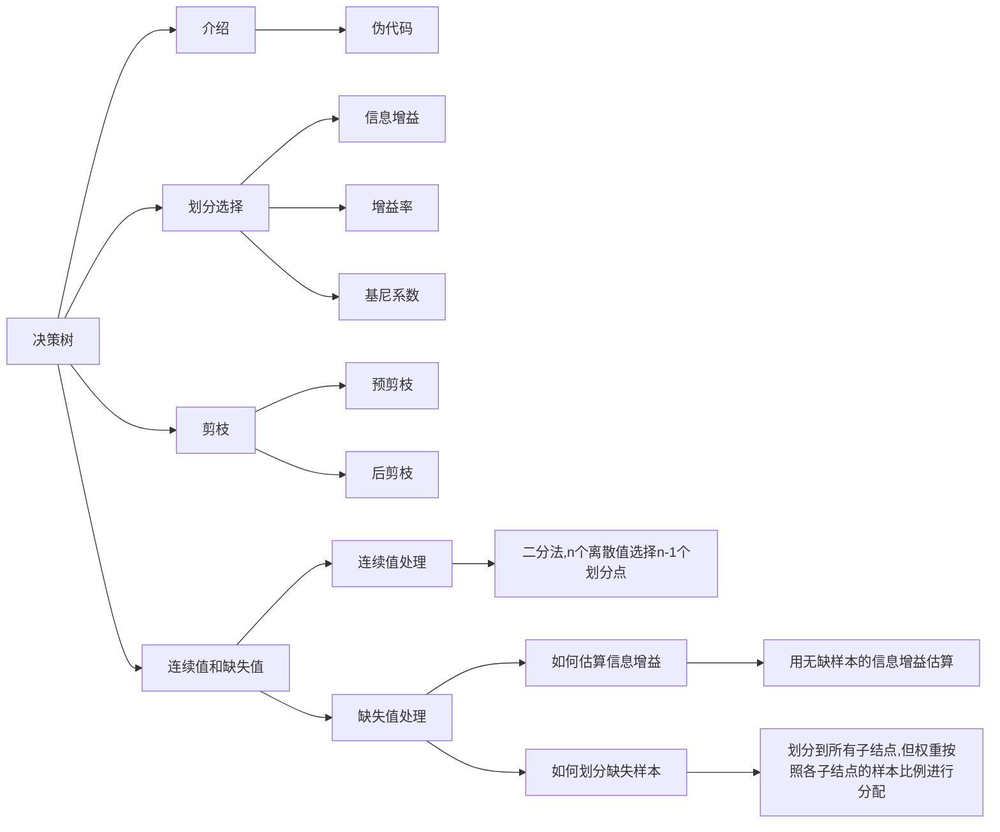
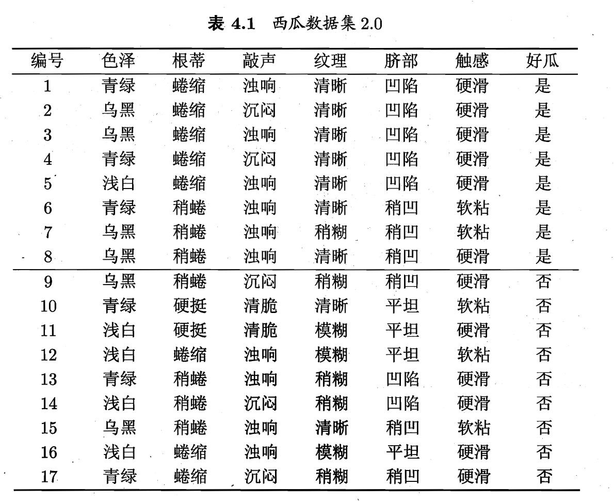
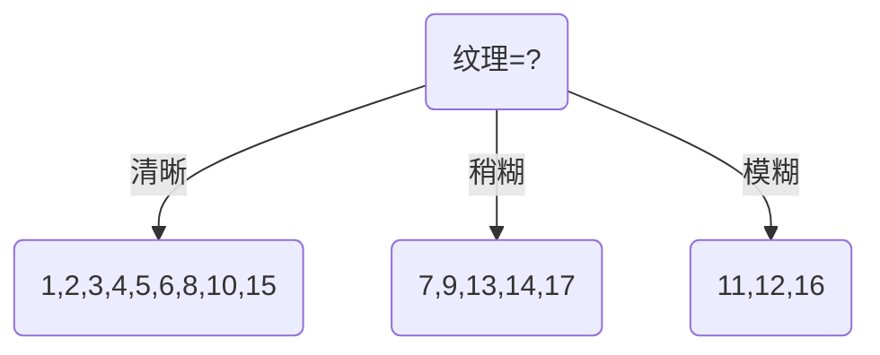

# Part04 决策树

> 决策树：是一种分类问题中常用的算法。它是按照一定的顺序选择属性组进行判别，并根据标签值$y_i$逐步学习判别规则的一种方法，这种判别规则就是决策树模型。
>
# 4.0 Pre

# 4.0.1 目录

* [Part04 决策树](#part04-决策树)
* [4.0 Pre](#40-pre)
* [4.0.1 目录](#401-目录)
* [4.1 基本流程](#41-基本流程)
  * [4.1.1 介绍](#411-介绍)
  * [4.1.2 伪代码](#412-伪代码)
* [4.2 划分选择](#42-划分选择)
  * [4.2.0 信息熵](#420-信息熵)
  * [4.2.1 信息增益](#421-信息增益)
  * [4.2.2 增益率](#422-增益率)
  * [4.2.3 基尼系数](#423-基尼系数)
* [4.3 剪枝处理](#43-剪枝处理)
  * [4.3.1 预剪枝](#431-预剪枝)
  * [4.3.2 后剪枝](#432-后剪枝)
* [4.4 连续值和缺失值](#44-连续值和缺失值)
  * [4.4.1 连续值处理](#441-连续值处理)
  * [4.4.2 缺失值处理](#442-缺失值处理)
    * [(1) 估算信息增益](#1-估算信息增益)
    * [(2) 缺失样本划分](#2-缺失样本划分)
* [Extra04-整理](#extra04-整理)
* [Ques04-例题整理](#ques04-例题整理)
  * [\[计算题·使用信息增益划分决策属性\]](#计算题使用信息增益划分决策属性)
    * [(1) 计算$Ent(D)$](#1-计算entd)
    * [(2) 对6个特征，分别计算划分后的平均信息熵和信息增益](#2-对6个特征分别计算划分后的平均信息熵和信息增益)
* [Reference](#reference)

# 4.1 基本流程

## 4.1.1 介绍

* 策略：分而治之
* 停止条件：
  * 当前结点包含的样本全属于同一类别，无需再分(已经学到某类样本的全部特征了)
  * 当前属性集为空，或是所有样本在所有属性上取值相同，无法划分
  * 当前结点包含的样本集合为空(是个无用的叶结点)

> 若停止后，某个叶节点的样本类型还不唯一，则把该叶节点样本中占比最多的类别认为是该节点的类别(判决结果)。

## 4.1.2 伪代码

* **输入**：训练数据集$D={(x_1,y_1),(x_2,y_2),...,(x_N,y_N)}$，特征集$A={a_1,a_2,...,a_d}$
* **过程**：`function TreeGenerate(D,A)`

1. 生成结点`node`
2. `if` $D$中样本全属于同一类别$C$ `then`
3. 1. 将`node`标记为$C$类叶结点，`return`
4. `end if`
5. `if` $A=\emptyset$ 或 $D$中样本在$A$上取值相同 `then`
6. 1. 将`node`标记为叶结点，其类别标记为$D$中样本数最多的类，`return`
7. `end if`
8. 从$A$中选择最优划分属性$a_*$，对应于$D$中样本数最多的属性
9. `for` $a_*$的每一个值$a_*^v$ `do`
10. * 为`node`生成一个分支，令$D_v$表示$D$中在$a_*$上取值为$a_*^v$的样本子集
11. * `if` $D_v$为空 `then`
12. * 1. 将分支结点标记为叶结点，其类别标记为$D$中样本最多的类，`return`
13. * `else`
14. * 1. 以`TreeGenerate(D_v,A\{`$a_*$`})`为分支结点
15. * `end if`
16. `end for`

* 看这一段很容易懵，别担心，待会看个例题就好了

# 4.2 划分选择

> 决策树是一个迭代的、从上往下的“逐渐划分”的过程，决策树越短，迭代次数越少，效率越高。
>
> 那么如何让决策过程尽量短呢？从贪心的角度来说，应该优先选择“最能够分开不同类的”特征；从信息论的角度来说，这个应该叫做“信息增益”。

## 4.2.0 信息熵

* 信息熵：度量样本集合“纯度”的一种指标(这和中学物理中熵的概念也类似)
* 假定当前样本集合$D$中第$k$类样本所占的比例为$p_k$，则$D$的信息熵定义为：
  $$Ent(D)=-\sum\limits^{|\gamma|}_{k=1}p_k\log_2 p_k$$
  * $Ent(D)$的值越小，则$D$的纯度越高
* 可见随着决策树的逐渐划分，信息熵会逐渐降低，直到为0或不可再分

> 关于该公式的解释：对于一个信息源，它产生的每个事件都有一定的概率和不确定性，我们可以用$-\log_2p(x)$来衡量一个事件的不确定性(这个函数和$p(x)$呈反比，概率越低不确定性越高，合理)，然后用所有事件的概率加权平均得到整个信息源的平均不确定性(整体不确定性的期望)，也就是信息熵。

## 4.2.1 信息增益

> 基于上一节的信息熵来定义信息增益。本节将展示如何计算信息增益，以及如何选择最优划分属性。

* 假定属性$a$有$V$个可能的取值$\left\{a^1,a^2,\cdots,a^v\right\}$
* 那么按照$a$的取值可分出$V$个样本子集(分别记作$D^1,D^2,\cdots,D^v$，空集也算)
* 信息增益实质上就是“按照属性$a$划分后，信息熵的降低量”，但是原本的信息熵$Ent(D)$好算，划分后的$V$个子集的信息熵$Ent(D^v)$怎么算呢？
  * 其实和信息熵的思想类似：计算期望，也就是加权平均。计算每个子集$D^i$的信息熵，然后按照每个子集的样本数比例$\frac{|D^v|}{|D|}$作为权重计算划分后的平均信息熵。
  * 公式表示为：
  $$Gain(D,a)=Ent(D)-\sum\limits^V_{v=1}\frac{|D^v|}{|D|}Ent(D^v)$$
* 可见，信息增益越大，说明划分后的平均信息熵越小，这正是我们想要的。因此，我们应该优先选择信息增益最大的属性来划分。

* 接下来我们看一个信息增益的例题，也就是课本P75～P77的西瓜数据集2.0例题：[信息增益例题](#计算题使用信息增益划分决策属性)

## 4.2.2 增益率

* 信息增益准则对可取值数目较多的属性有所偏好，为了减少这种偏好可能带来的不利影响，提出了增益率准则。
* 增益率定义为：
  $$Gain\_ratio(D,a)=\frac{Gain(D,a)}{\text{IV}(a)}$$
* 其中
  $$\text{IV}(a)=-\sum\limits^V_{v=1}\frac{|D^v|}{|D|}\log_2\frac{|D^v|}{|D|}$$
* 通常随着$V$越大，$\text{IV}(a)$的值越大，则增益率将响应减小。这个部分可以看作平衡因子，用以平衡信息增益对可取值数目的偏好。(但增益率准则因此对可取数目较少的属性有所偏好....)

## 4.2.3 基尼系数

* 基尼系数公式：
  $$Gini(D)=\sum\limits^{|\gamma|}*{k=1}\sum\limits*{k'\not={k}}p_k p_{k'}=1-\sum\limits^{|\gamma|}_{k=1}p_k^2$$
  * 假定数据集$D$中包含$\gamma$类(西瓜数据集只有2类，好瓜or坏瓜)
    * 首先计算各类别的概率$p_k$
    * 然后计算各类别两两之间的概率乘积和(不完全握手问题，共有$\gamma(\gamma-1)$个求和项，会同时出现$p_ip_j$和$p_jp_i$两项)
  * 直观来说，$Gini(D)$反映了从数据集$D$中随机抽取两个样本，其类别标记不一致的概率。因此，$Gini(D)$越小，则数据集$D$的纯度越高。
* 与信息熵类似，属性$a$划分后的平均基尼系数为
  $$Gini\_index(D,a)=\sum\limits^V_{v=1}\frac{|D^v|}{|D|}Gini(D^v)$$
* 所以在使用基尼系数构建决策树时，我们应该优先选择基尼系数降低量最大的属性，也就是平均基尼系数最小的属性$a_*=\arg\min\limits_{a\in A} Gini\_index(D,a)$。

# 4.3 剪枝处理

> 鉴于上课时没强调剪枝的事(虽然这个挺重要的其实)，那这里就先不详细讲了，只简单说说大致流程和思想。挖个坑 TODO
>
> 上述4.2的选择准则对决策树的尺寸影响较大(模型收敛速度)，但对于泛化性能影响很小(模型的效果)。相比之下，剪枝对泛化性能的影响更大。
>
> 剪枝是手动去掉一些分支，用以降低**过拟合**的风险，提高模型的泛化能力。决策树中的过拟合就是分支过多，误将一些训练集中某些数据的特征当作整个类的整体特征。

* 剪枝方式
  1. 预剪枝：决策树生成过程中，对每个结点在划分前进行估计，若当前结点的划分**不能**带来决策树泛化性能提升，则停止划分，将当前结点标记为叶结点。
  2. 后剪枝：从训练集生成一棵完整的决策树，然后自底向上地对非叶结点进行考察，若将该结点对应的**子树替换为叶结点**能带来决策树**泛化性能提升**，则将该子树替换为叶结点。

## 4.3.1 预剪枝

* 基本思想：
  * 数据集需要预先划分训练集和测试集，测试集用来计算划分前后的精度。
  * 仍然是按照信息增益来选择要划分的属性；但在划分之前，先计算一下当前根结点的测试集精度$Acc(D)$；
  * 然后根据该属性划分子结点$\{D_1,D_2,....D_\gamma\}$，各个节点使用投票法决定该结点的判断结果。
  * 此时可以计算根节点划分后的总精度(根据$D_1,D_2,....D_v$及其判断结果)，如果相较于$Acc(D)$升高了，则该属性划分有效，否则撤销该划分。
  * 此时任一叶结点($D_i$)都可视为一个新的根节点，重复上述过程。

## 4.3.2 后剪枝

* 基本思想
  * 同样需要测试集和训练集。后剪枝在构建决策树的过程中不考虑剪枝。
  * 等决策树构建完成后，后剪枝逐渐从叶结点向上考查，若将该结点对应的子树替换为叶结点能带来决策树泛化性能提升，则将该子树替换为叶结点。

# 4.4 连续值和缺失值

## 4.4.1 连续值处理

> 例如西瓜数据集中，其实包含了密度和含糖率这两个连续值特征。此时我们的策略是**连续值离散化**，本节介绍一个最典型的：二分法。

* 对于某个连续属性$a$，我们首先按照$a$进行排序，然后取连续两个值的中点($\frac{a_i+a_{i+1}}{2}$)作为划分点$t$，不大于$t$的算负类$D_t^-$，大于的算正类$D_t^+$
* 对于$n$个样本，我们就可以得到$n-1$个候选划分点，这就相当于属性$a$有$n-1$个离散值，然后再分别按照二分后的信息增益构建决策树。

## 4.4.2 缺失值处理

> 对于缺失值，我们要做的主要是：
>
> 1. 存在缺失值的情况下如何计算信息增益，以选择构建决策树的属性
> 2. 结点划分样本时，如果一个样本在这个结点属性上缺失，它该如何划分？
> 在本节中提出了3个新的变量，并借助这三者解决以上两个问题。

* 此时每个样本都应当有一个权重$w_x$(预先给定，如果没给的话默认为$\frac{1}{n}$)
* 原始数据集为$D$，则设$\tilde{D}$为在属性$a$上没有缺失值的样本子集。
* 然后我们定义以下3个变量：
$$\rho=\frac{\sum_{x\in\tilde{D}}w_x}{\sum_{x\in D}w_x}$$
$$\tilde{p_k}=\frac{\sum_{x\in\tilde{D_k}}w_x}{\sum_{x\in \tilde{D}}w_x}$$
$$\tilde{r_v}=\frac{\sum_{x\in\tilde{D^v}}w_x}{\sum_{x\in \tilde{D}}w_x}$$
* 可以看出，这三者分别是用权重$w_x$衡量的**无缺样本比例**、**无缺样本中第$k$类样本比例**和**无缺样本中第$v$个属性值的样本比例**。

### (1) 估算信息增益

* 推广后的信息增益：
$$Gain(D,a)=\rho\times Gain(\tilde{D},a)=\rho \times\left(Ent(\tilde{D})-\sum\limits^V_{v=1}\tilde{r_v}Ent(\tilde{D^v})\right)$$
其中$Ent(\tilde{D})=-\sum\limits^{|\gamma|}_{k=1}\tilde{p_k}\log_2\tilde{p_k}$
* 也就是说，先计算无缺信息熵$Ent(\tilde{D})$和各子集信息熵$Ent(\tilde{D^v})$
* 然后仿照信息增益，计算无缺信息增益$Gain(\tilde{D},a)$；在信息增益中的样本量之比$\frac{|D^v|}{|D|}$用$\tilde{r_v}$代替。
* 最后无缺信息增益乘以无缺比例$\rho$，估计出原本的信息增益。并根据这个估算的信息增益选择决策树的划分属性。

### (2) 缺失样本划分

* 缺失样本划分的策略是：**将缺失样本同时划分到所有子结点**，但是权重按照各子结点的样本比例进行分配。
* 比如样本$x$的属性$a$的值丢失；而属性$a$有$V$个取值，那么样本$x$就会被划分到$V$个子结点中，但各自的权重$w_x$分别调整为$\tilde{r_1}w_x,\tilde{r_2}w_x,\cdots,\tilde{r_V}w_x$
  * 这能维持样本$x$的$v$个“分身”的权重之和仍然是$w_x$，但不太清楚这样做的目的是什么....

# Extra04-整理

* 本章的知识脉络如下

* 其中，划分选择是本章的大重点，需要会计算信息熵、信息增益、信息增益率、基尼系数，并据此选择构建决策树的划分属性。
* 连续值和缺失值的处理是小重点，要能够理解二分法和缺失样本划分的策略，公式最好也在理解的基础上记住(不如说公式能够辅助理解)。
* 剪枝策略要知道两种策略的思想，可能会出个简答题吧，但实操起来还是比较麻烦的....

# Ques04-例题整理

## [计算题·使用信息增益划分决策属性]

> 题目内容

* 假定当前结点的数据如图所示，请计算每个属性的信息增益，然后选择信息增益最大的属性作为划分属性。

> 分析与解答

* 只要是涉及了决策树的计算，那运算量通常不会小....
* 首先明确，西瓜数据集只是个二分类问题，所以只有$p_1$(正例)和$p_2$(负例)

### (1) 计算$Ent(D)$

* 很容易看出正例8个，负例9个，所以$p_1=\frac{8}{17},p_2=\frac{9}{17}$
* 然后计算初始信息熵：
$$Ent(D)=-\sum\limits^{|\gamma|}_{k=1}p_k\log_2 p_k=-\frac{8}{17}\log_2 \frac{8}{17}-\frac{9}{17}\log_2\frac{9}{17}=0.998$$

### (2) 对6个特征，分别计算划分后的平均信息熵和信息增益

> 由于对各个特征计算信息增益时被减数($Ent(D)$)相同，所以“选择信息增益最大的”等价于“选择划分后平均信息熵最小的”

* 色泽：`青绿={+:3,-:3}=6;乌黑={+:4,-:2}=6;浅白={+:1,-:4}=5`
  * $Ent(D^{青绿})=-\frac{3}{6}\log_2\frac{3}{6}-\frac{3}{6}\log_2\frac{3}{6}=1$
  * $Ent(D^{乌黑})=-\frac{4}{6}\log_2\frac{4}{6}-\frac{2}{6}\log_2\frac{2}{6}=0.918$
  * $Ent(D^{浅白})=-\frac{1}{5}\log_2\frac{1}{5}-\frac{4}{5}\log_2\frac{4}{5}=0.722$
  * 平均信息熵为：$\sum\limits^V_{v=1}\frac{|D^v|}{|D|}Ent(D^v)=\frac{6}{17}\times1+\frac{6}{17}\times0.918+\frac{5}{17}\times0.722=0.889$
  * 信息增益为$Gain(D,色泽)=Ent(D)-\sum\limits^V_{v=1}\frac{|D^v|}{|D|}Ent(D^v)=0.109$
* 根蒂
  * ......
  * 信息增益为$Gain(D,根蒂)=Ent(D)-\sum\limits^V_{v=1}\frac{|D^v|}{|D|}Ent(D^v)=0.143$
* 敲声
  * ......
  * 信息增益为$Gain(D,敲声)=Ent(D)-\sum\limits^V_{v=1}\frac{|D^v|}{|D|}Ent(D^v)=0.141$
* 纹理：`清晰={+:7,-:2}=9;稍糊={+:1,-:4}=5;模糊={+:0,-:3}=3`
  * $Ent(D^{清晰})=-\frac{7}{9}\log_2\frac{7}{9}-\frac{2}{9}\log_2\frac{2}{9}=0.764$
  * $Ent(D^{稍糊})=-\frac{1}{5}\log_2\frac{1}{5}-\frac{4}{5}\log_2\frac{4}{5}=0.722$
  * $Ent(D^{模糊})=0$
  * 平均信息熵为：$\sum\limits^V_{v=1}\frac{|D^v|}{|D|}Ent(D^v)=\frac{9}{17}\times0.764+\frac{5}{17}\times0.722+\frac{3}{17}\times0=0.617$
  * 信息增益为$Gain(D,纹理)=Ent(D)-\sum\limits^V_{v=1}\frac{|D^v|}{|D|}Ent(D^v)=0.381$
* 脐部
  * ......
  * 信息增益为$Gain(D,脐部)=Ent(D)-\sum\limits^V_{v=1}\frac{|D^v|}{|D|}Ent(D^v)=0.289$
* 触感
  * ......
  * 信息增益为$Gain(D,触感)=Ent(D)-\sum\limits^V_{v=1}\frac{|D^v|}{|D|}Ent(D^v)=0.006$
* 因为纹理的信息增益最大，所以选择纹理作为划分属性

* 至此完成了一次迭代，然后分别对上图所示的3个结点重复上述操作。注意此时根节点是上述你选择叶结点；也就是说如果从上述“清晰”结点开始，$D=\left\{1,2,3,4,5,6,8,10,15\right\}$，而非先前的17个

# Reference

* [决策树：什么是基尼系数（“杂质 增益 指数 系数”辨析）_决策树基尼系数_loopy_的博客-CSDN博客](https://blog.csdn.net/loopy_/article/details/89813207)
