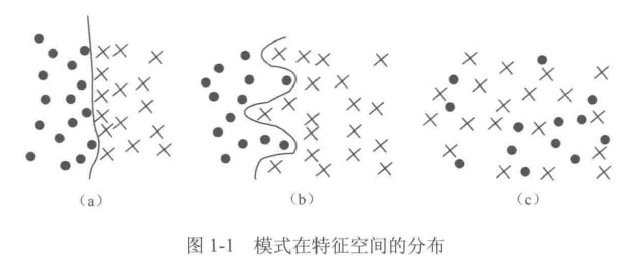
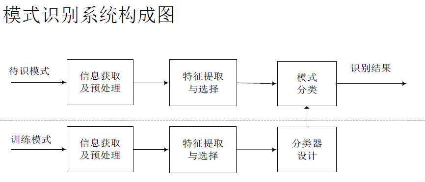
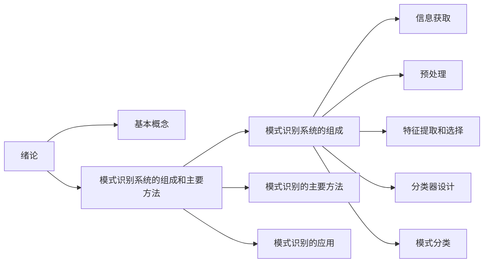

# Part01-绪论

> 没想到的是，绪论也不算完全的水....
>
> 我现在感觉，模式识别做的事其实就是传统机器学习的分类任务。

# 1.0 Pre

## 1.0.1 目录

* [Part01-绪论](#part01-绪论)
* [1.0 Pre](#10-pre)
  * [1.0.1 目录](#101-目录)
* [1.1 模式识别的基本概念](#11-模式识别的基本概念)
* [1.2 模式识别系统的组成和主要方法](#12-模式识别系统的组成和主要方法)
  * [1.2.1 模式识别系统的组成(重点)](#121-模式识别系统的组成重点)
  * [1.2.2 模式识别的主要方法](#122-模式识别的主要方法)
* [1.3 模式识别的应用](#13-模式识别的应用)
* [Extra01-总结](#extra01-总结)
* [Ques01-例题整理](#ques01-例题整理)

# 1.1 模式识别的基本概念

> 这节可能会出名词解释，但不太死记硬背，着重理解加粗的部分

* 模式识别(Pattern Recognition)：**识别一个模式**。
  * 模式：从具体事物中抽象出来、用于识别事物类别的**特征信息**。
  * 识别：对已经具有一定**先验知识**的事物，判断它是什么。
* 模式识别的两大任务：
  * 学习(训练)：从大量的样本中发现属于同一类别的事物的**共同特征**，建立**类别判定的特征标准**的过程。
  * 分类(测试)：依据特征对待识别的事物进行**归类**，从而**确定该事物的类别属性**。
  > 这其实就是监督学习的过程。
* 学习的类别：
  * **(有)监督学习**：数据集分为**训练集**和**测试集**，都带有标签。训练集用于训练模型，测试集用于测试模型的性能。
  * **无监督学习**：不区分训练集和测试集，只有待分析的数据集本身，所有样本均没有类别标号。
* 模式的紧致性：一种衡量样本在特征空间中的分布方式的性质(似乎和类内类间散度矩阵描述的是同一个东西)。如下图，a、b、c的紧致性依次减小，c这种分布几乎无法设计分类器将2类样本分开。
  
* 相似性判断：相似性可用来衡量两个模式之间的相似程度。同类样本应具有较大的相似性，不同类别样本的相似性较小。

# 1.2 模式识别系统的组成和主要方法

> 已经有例题考过这里了，算是这章的重点

### 1.2.1 模式识别系统的组成(重点)

1. **信息获取**
   * 目的：为了使计算机能够**对所研究对象进行分类识别**，必须将研究对象表示为**计算机所能够接受的形式**(主要有三种：①二维图像；②一维波形；③物理参量和逻辑值（零维）)
   * 手段：通过测量、采样、量化，可以实现信息获取。
     * 用**矩阵**表示二维图像
     * **向量**表示一维波形
     * **标量**表示零维的物理参量和逻辑值
2. **预处理**
   * 目的：“**去伪存真**”，去除噪声的同时保留有用信息，对缺失数据进行补充，去除明显错误的数据，对数据进行规范等。
    > 这几条通常不用全答，看需求回答，意思对即可
3. **特征提取和选择**
   * 目的：原始数据量一般很大，通常需要对原始数据特征进行**选择或变换**，**降低数据量**的同时得到**最能反映分类本质的特征**。
4. **分类器设计**
   * 目的：把待识别的模式划归到所属类别中去，需要制定相应的判别准则，即分类器设计。
5. **模式分类**
   * 目的：根据判别准则（设计好的分类器）把待识模式划归到某一类别，即输出分类结果。

* 
  * 这张图....虽然不知道怎么用，但蛮好的一张图，贴这吧

### 1.2.2 模式识别的主要方法

* 模板匹配
* 统计模式识别
* 聚类分析
* 模糊模式识别
* 神经网络模式识别
* 支持向量机
* 结构模式识别

# 1.3 模式识别的应用

> 这节就是纯水了，随便过一遍，知道几种即可

* 文字识别
* 语音识别
* 指纹识别
* 遥感图像识别
* 医学诊断

# Extra01-总结

* 本章的知识脉络如下:

* **基本概念**算是小重点，要求能够说出来相关概念的大致含义，但不要求死记硬背。
* **模式识别系统的组成**算是大重点，这里可能会出包括具体情境的简答题，一般是选择或判断情境中属于哪个部分，并介绍。所以对于这5个部分要熟悉。

# Ques01-例题整理

> 没想到啊，绪论还有个题，但今天晚上时间来不及了，之后再抽空整理吧
