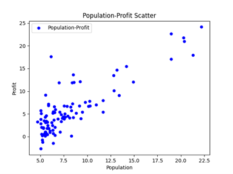
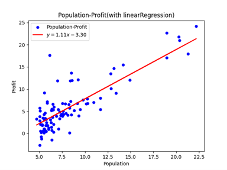
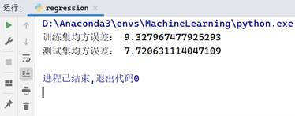

# 实验一：线性模型

> $author@Steven$

## 目录

* [实验一：线性模型](#实验一线性模型)
  * [目录](#目录)
  * [1. 线性回归模型](#1-线性回归模型)
    * [1.1 题目分析](#11-题目分析)
    * [1.2 解题步骤](#12-解题步骤)
    * [1.3 结果分析](#13-结果分析)
  * [2. 逻辑回归模型](#2-逻辑回归模型)
    * [2.1 题目分析](#21-题目分析)
    * [2.2 解题步骤](#22-解题步骤)
    * [2.3 结果分析](#23-结果分析)

## 1. 线性回归模型

    本任务中你将使用一元线性回归来预测食厅的利润。假设你是一家特许餐厅的首席执行官，正在考虑在不同的城市开设一家新的分店。该连锁店已经在不同的城市有分店，你有这些城市的利润和人口数据。你希望使用这些数据来帮助您选择下一个要扩展到的城市。
    文件 ex1data.csv 包含我们的线性回归问题的数据集。Population 代表一个城市的人口，profit 代表此个城市的餐厅利润。利润的负值表示亏损。

* 请将70%的数据用作训练集，30%的数据用作测试集，使用留出法对以上模型进行验证。

### 1.1 题目分析

* 本题是一个较为简单的一元线性回归问题，课本P54已推导出了该问题最优解参数的求解公式：
  * $\omega=\frac{\sum_{i=1}^{m}{y_i\left(x_i-\bar{x}\right)}}{\sum_{i=1}^{m}x_i^2-\frac{1}{m}\left(\sum_{i=1}^{m}x_i\right)^2},\ \ (1.1)$
  * $b=\frac{1}{m}\sum_{i=1}^{m}\left(y_i-\omega x_i\right),\ \ \left(1.2\right)$
* 于是本题的求解过程便简单许多，只需要使用上述公式计算参数即可得到线性回归模型。

### 1.2 解题步骤

1. 读取数据，绘制散点图。
2. 使用留出法划分训练集和测试集。
3. 使用上述公式计算参数值。
4. 绘制散点图和线性回归方程。
5. 评估模型，性能度量使用均方误差。

### 1.3 结果分析

> 图片非原图，仅供预览

* 原始数据散点图:
  * 
* 原始数据和线性回归模型图:
  * 
* 线性回归模型在训练集和测试集上的均方误差:
  * 

## 2. 逻辑回归模型

    本任务中你将建立一个逻辑回归模型来预测一个学生是否被大学录取。假设你是一所大学系的管理员，你想根据两次考试的成绩来决定每个申请人的录取机会。你有以前申请者的历史数据，可以用作逻辑回归的训练集。对于每个培训示例，你都有申请人在两次考试中的分数和录取决定。你的任务是建立一个分类模型，根据这两次考试的分数来估计申请人的录取概率。
    文件 ex1data2.csv 包含我们的逻辑回归问题的数据集,学生的两门成绩 Exam1，Exam2 和是否被录取 Accepted(1 为录取，0 为未录取)，请利用逻辑回归知识根据学生成绩判断学生是否会被录取，并将结果可视化。 

### 2.1 题目分析

* 本题是一个逻辑回归问题，属二分类问题。根据课本P59以及课本7.2的极大似然法思想，可知该类问题最优解等价于最小化以下问题：
  * $\ell\left(\beta\right)=\sum_{i=1}^{m}\left(-y_i\beta^T\widehat{x_i}+ln\left(1+e^{\beta^T\widehat{x_i}}\right)\right),\ \ (2.1)$
* 其中$\beta=\left(\omega;b\right)$，该问题可以通过梯度下降法进行求解。

### 2.2 解题步骤

1. 读取数据。
2. 使用梯度下降法求解上述等价问题（使用sklearn.LogisticRegression()完成求解）。
3. 执行五折交叉验证(使用sklearn.cross_val_score()完成求解)，性能度量为查准率(precision)和查全率(recall)。

### 2.3 结果分析

* 数据散点与逻辑回归模型图(三维)
  * .png)
* 五折交叉验证的查准率和查全率
  * 
