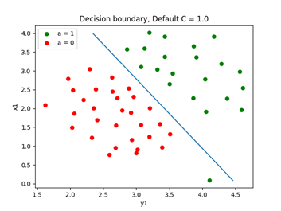
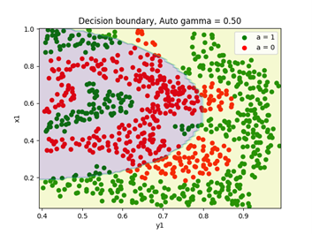
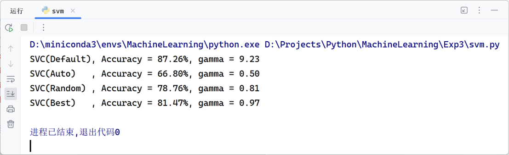

# 实验三：支持向量机

> $author@Steven$

## 目录

* [实验三：支持向量机](#实验三支持向量机)
  * [目录](#目录)
  * [1. 线性可分类问题](#1-线性可分类问题)
    * [1.1 题目分析](#11-题目分析)
    * [1.2 解题步骤](#12-解题步骤)
    * [1.3 结果分析](#13-结果分析)
  * [2. 线性不可分问题](#2-线性不可分问题)
    * [2.1 题目分析](#21-题目分析)
    * [2.2 解题步骤](#22-解题步骤)
    * [2.3 结果分析](#23-结果分析)

## 1. 线性可分类问题

    本任务中你将使用机器学习库sklearn中的支持向量机的线性核函数来进行线性可分类数据的决策边界的构建，将结果可视化，并尝试不同的惩罚系数C观察其对结果的影响并分析。
    文件ex3data1.csv包含我们的线性可分类问题的数据集。 x1，y1分别代表纵横坐标，a代表标签。

* 请将70%的数据用作训练集，30%的数据用作测试集，使用留出法对以上模型进行验证。

### 1.1 题目分析

* 本题是一个相对简单的二分类问题，并且由于是线性可分类问题，且特征只有2维，所以只需要拟合出一个二维直线方程即可。

### 1.2 解题步骤

* 使用支持向量机进行分类任务时，使用的主要函数是`sklearn.svm.SVC()`。本题为一个线性可分问题，使用`sklearn.svm.SVC()`时`kernel`参数指定为`'linear'`。
* 本题中可调整参数为惩罚参数`C`。在本题中分别使用默认值(`1.0`)、随机值(使用`numpy.random.uniform()`生成)以及使用网格搜索得到的最优值。
最后可视化的时候，注意到“x1，y1分别代表纵横坐标”，这与通常的绘图习惯相反，但是支持向量机计算的参数仍然是按照$y1=b+\omega x1$给出的，所以只需要在绘图的时候调换`x1`、`y1`的坐标即可。

### 1.3 结果分析

> 图片非原图，仅供预览

* 默认C=1.0时支持向量机决策结果:
  * 
* 随机C=0.304时支持向量机决策结果:
  * 
* 最优C=0.03时支持向量机决策结果:
  * 
* 各支持向量机分类器的评估结果:
  * 

> 上述图片中的散点是全部共51个数据点(训练集&测试集)，而命令行中Accuracy的计算结果则仅是在测试集上计算的。

* 综合上述结果可以得知：
  1. 留出法有较强的随机性，测试集不能代表整个数据集。前两个模型在测试集上完全分类正确，但由图可见对于整个数据集不一定能够完全正确。
  2. 网格搜索的最优参数是根据训练集计算出的，在测试集上不一定是最优参数。

## 2. 线性不可分问题

    本任务中你将使用机器学习库sklearn中支持向量机的高斯核函数来进行非线性数据的支持向量的构建，将结果可视化，尝试不同的核函数系数gamma，观察其对结果的影响并分析。
    文件ex3data2.csv包含我们的线性不可分问题的数据集。x1，y1分别代表纵横坐标，a代表标签。

* 请将70%的数据用作训练集，30%的数据用作测试集，使用留出法对以上模型进行验证。

### 2.1 题目分析

* 本题与上一题类似，也是调用`sklearn.svm.SVC()`构建支持向量机分类器进行分类。

### 2.2 解题步骤

* 本题使用`sklearn.svm.SVC()`时`kernel`参数指定为`'rbf'`，即高斯核。
* 本题中可调整参数为高斯核函数系数`gamma`。`gamma`可使用的参数为`'scale'`、`'auto'`或一个浮点数。
* 根据[官方文档](https://scikit-learn.org/stable/modules/generated/sklearn.svm.SVC.html)中关于`gamma`参数的解释：

    > ### gamma{‘scale’, ‘auto’} or float, default=’scale’
    >
    > Kernel coefficient for ‘rbf’, ‘poly’ and ‘sigmoid’.
    >
    > * if `gamma='scale'` (default) is passed then it uses 1 / (n_features * X.var()) as value of gamma,
    > * if `'auto'`, uses 1 / n_features
    > * if float, must be non-negative.

  * 当`gamma='scale'`时，实际值是特征维度数*X方差的倒数；当`gamma='auto'`时，实际值是特征维度数的倒数。
* 在本题中分别使用默认值(`'scale'`)、`'auto'`、随机值(使用`numpy.random.uniform()`生成)以及使用网格搜索得到的最优值。
* 最后可视化的时候，同样需要在绘图的时候调换`x1`、`y1`的坐标。

### 2.3 结果分析

* `default` `gamma=9.23`时支持向量机决策边界:
  * 
* `auto` `gamma=0.5`时支持向量机决策边界:
  * 
* `random` `gamma=0.81`时支持向量机决策边界:
  * 
* `best` `gamma=0.97`时支持向量机决策边界:
  * 
* 各支持向量机的评估结果:
  * 

* 结论与[第一题](#13-结果分析)大致相同
