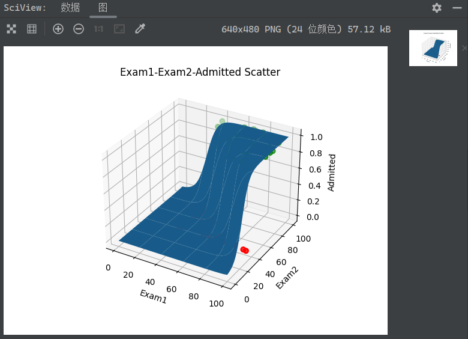
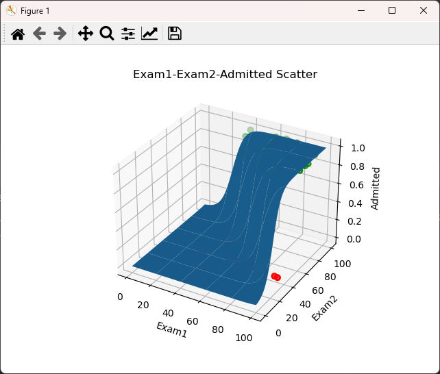

# 《机器学习》实验中的一些问题与技巧

> 这些问题和技巧主要与Python语言的特性相关。

## Matplotlib

### 1. `MatplotlibDeprecationWarning`

> 2023-03-10 记录

* 提示内容：
  * `MatplotlibDeprecationWarning: Support for FigureCanvases without a required_interactive_framework attribute was deprecated in Matplotlib 3.6 and will be removed two minor releases later.`
* 原因：
  * 较为新版的`matplotlib`支持并建议使用交互式绘图（类似于Matlab中，生成一个可交互的窗口Figure用于展示图片/模型并交互）
  * 此外，上文还提到将在Matplotlib 3.6的两个小版本更新后移除对于非交互式绘图的支持。
  * 但是，目前在网上找到的大多数教程都忽略了这一点，仍然抱着“能用就行，Warning无用”的态度因循守旧，这是非常偷懒的一种行为。
* 解决方法：
  * 启用交互式绘图只需要给matplotlib指定绘图后端即可，如下所示：

    ```python
    import matplotlib
    matplotlib.use('TkAgg')
    # 'TkAgg'使用的是Tkinter，Python自带GUI，免安装。也可以使用'Qt5Agg'，但是需要当前环境中已经安装PyQt5
    ```

* 效果展示
  * 非交互式绘图
    * 
  * TkAgg交互式绘图
    * 
  * PyQt5交互式绘图
    * 
  * 二者没有太大区别，但理论上PyQt5的性能应当优于Tkinter。
