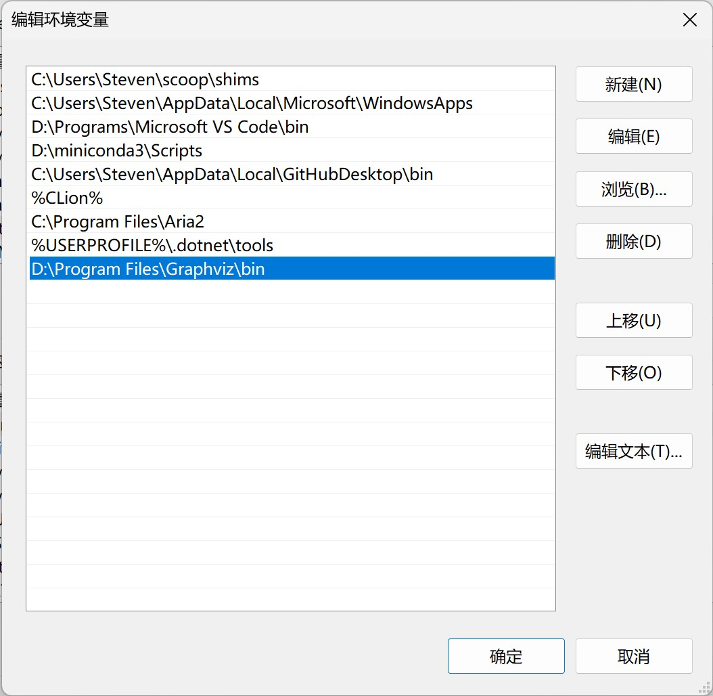

# 《机器学习》实验中的一些问题与技巧

> 这些问题和技巧主要与Python的特性相关。

## Matplotlib

### 1. `MatplotlibDeprecationWarning`

> 2023-03-10 记录

* 提示内容：
  * `MatplotlibDeprecationWarning: Support for FigureCanvases without a required_interactive_framework attribute was deprecated in Matplotlib 3.6 and will be removed two minor releases later.`
* 原因：
  * 较为新版的`matplotlib`支持并建议使用交互式绘图（类似于Matlab中，生成一个可交互的窗口Figure用于展示图片/模型并交互）
  * 此外，上文还提到将在Matplotlib 3.6的两个小版本更新后移除对于非交互式绘图的支持。
  * 但是，目前在网上找到的大多数教程都忽略了这一点，仍然抱着“能用就行，Warning无用”的态度因循守旧，这是非常偷懒的一种行为。
* 解决方法：
  * 启用交互式绘图只需要给matplotlib指定绘图后端即可，如下所示：

    ```python
    import matplotlib
    matplotlib.use('TkAgg')
    # 'TkAgg'使用的是Tkinter，Python自带GUI，免安装。也可以使用'Qt5Agg'，但是需要当前环境中已经安装PyQt5
    ```

* 效果展示
  * 非交互式绘图
    * 
  * TkAgg交互式绘图
    * 
  * PyQt5交互式绘图
    * 
  * 二者没有太大区别，但理论上PyQt5的性能应当优于Tkinter。

## graphviz

> graphviz是一个相较于Matplotlib性能更高的绘图工具(似乎叫引擎更合适)，唯一不好的一点是需要安装。

### 1. `graphviz.backend.ExecutableNotFound`

> 2023-03-27 记录

* 提示内容：
  * `graphviz.backend.ExecutableNotFound: failed to execute ['dot', '-Tsvg'], make sure the Graphviz executables are on your systems' PATH`
* 原因：
  * 这是graphviz的唯一一个缺点：它需要安装，并且需要手动配置环境变量。
* 解决方法：
  * 去它的[官网下载链接](https://graphviz.org/download/)下载Windows安装包(如果你用的是Windows系统)并安装。
    * > 安装包使用的是GBK编码，在已经改为UTF-8编码的系统中会出现乱码，但不影响用。
  * 在Python环境中用`pip install graphviz`安装graphviz。
  * 将graphviz的bin文件夹的路径添加至系统变量`PATH`中，如下图。
  * 
