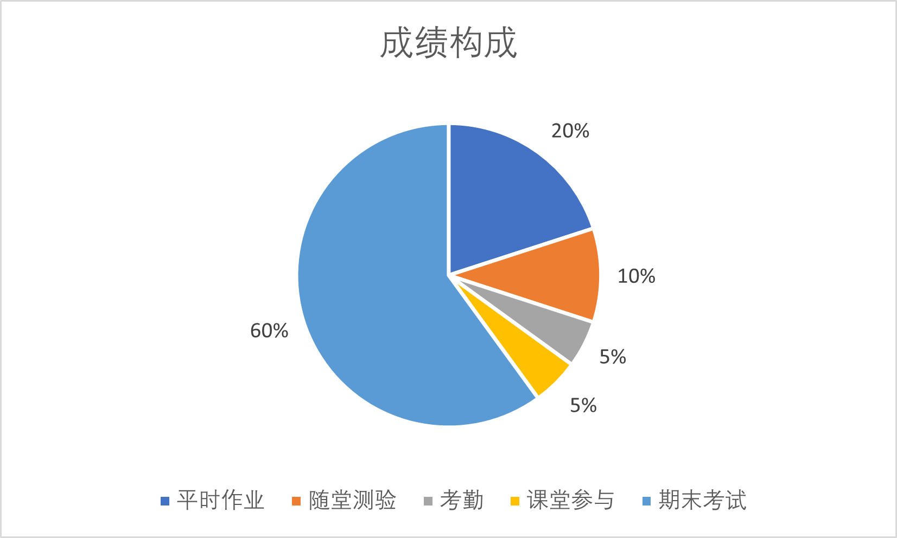
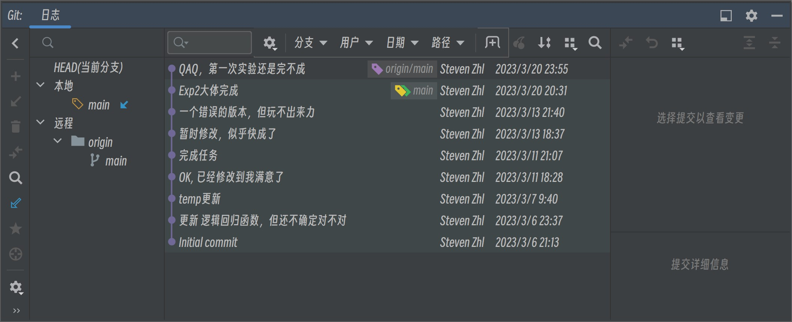

# 机器学习

> “智能科学与技术”专业的核心课程，请好好学

## 使用环境

* Windows 11
* Python 3.10 (Based on Anaconda3)
  * numpy 1.23.5
  * matplotlib 3.7.1
  * pandas 1.5.3
  * scikit-learn 1.2.1
* PyCharm Professional 2022.1
* Draw.io

## 成绩构成

### 理论课

* 平时作业20%
* 随堂测验10%
* 考勤5%
* 课堂参与(回答问题)5%
* 期末考试60%
* 

### 实验课

* 6次平时实验($6\times 10\%$)
  * > 代码实现5%、报告撰写4%、考勤和课堂参与1%
  * 线性模型
  * 决策树与集成学习
  * SVM
  * 神经网络
  * 深度学习
  * 聚类算法
* 期末大作业
  * > 选题5%、报告10%、Presentation5%
  * 自主选题，独立完成

## 课程

> PPT通过腾讯文档分享，且并未提供下载

* [1. 绪论](https://docs.qq.com/slide/DSktGTExXQWdvSHND)
* [2. 模型评估与选择](https://docs.qq.com/slide/DSk1DQ3dEVHp2a3BL)
* [3. 线性模型](https://docs.qq.com/slide/DSk5aeFRRYmJPU1J4)
* [4. 决策树](https://docs.qq.com/slide/DSkdBcnJZWVBkdENw)
* [5. 集成学习](https://docs.qq.com/slide/DSnZDZktQTFlnS0J3)
* [6. 支持向量机](https://docs.qq.com/pdf/DSmJmeXRQckVMckpC)

## 教材

* [《机器学习》周志华，清华大学出版社](https://book.douban.com/subject/26708119/)
  * 通常称其为“西瓜书”
  * 

## 目录

### [作业](./Homework)

* [作业1](./Homework/Hwk1)
  * 作业报告:[作业1.docx](./Homework/Hwk1/作业1.docx)
  * 题1绘图:[题1绘图.drawio](./Homework/Hwk1/题1绘图.drawio)
  * References
    * [机器学习（周志华）课后作业/习题答案_机器学习周志华答案_Mr-Cat伍可猫的博客-CSDN博客](https://blog.csdn.net/Mr_Cat123/article/details/86614696)
      * > 但不可尽信，其中有部分是有误的
    * [《机器学习》中的假设空间和版本空间_一只程序喵的博客-CSDN博客](https://blog.csdn.net/anqijiayou/article/details/79697900)
    * [机器学习 (Machine Learning) 在自动驾驶中的应用 - 知乎](https://zhuanlan.zhihu.com/p/550635742)
* [作业2](./Homework/Hwk2)
  * 作业报告:[作业2.docx](./Homework/Hwk2/作业2.docx)
  * 题3伪代码:[demo.py](./Homework/Hwk2/demo.py)
  * References
    * [决策树DecisionTree（附代码实现） - 知乎](https://zhuanlan.zhihu.com/p/149510491)
    * [New Bing](https://www.bing.com/search?q=Bing+AI&showconv=1&FORM=hpcodx)

### [实验](./Experiment)

* [实验杂记](./Experiments/Jottings/Jottings.md)：一些问题和技巧，当你的实验出现Warning或Error时，可以来这里翻翻
* [实验1：线性模型](./Experiments/Exp1：线性模型)
  * [源文件](./Experiments/Exp1：线性模型/Code)
    * [regression_Vol1.0.py](./Experiments/Exp1：线性模型/Code/regression_Vol1.0.py)：最早的版本，盲目封装导致可读性非常差
    * [regression_Vol1.1.py](./Experiments/Exp1：线性模型/Code/regression_Vol1.1.py)：大幅降低封装度，提高可读性，但方法与Vol1.0完全相同
    * [regression_Vol2.0.py](./Experiments/Exp1：线性模型/Code/regression_Vol2.0.py)：采用手动梯度下降替换`sklearn.LogisticRegression`，但效果不太好
  * 数据集
    * 题1数据集:[ex1data1.csv](./Experiments/Exp1：线性模型/Code/ex1data1.csv)
    * 题2数据集:[ex1data2.csv](./Experiments/Exp1：线性模型/Code/ex1data2.csv)
  * 实验报告
    * [Report.md](./Experiments/Exp1：线性模型/Report.md)：对应Vol1.0和Vol1.1，但使用了`sklearn.LogisticRegression`，不符合要求。
  * References
    * `numpy.ndarray`相关操作
      * [ndarray的拼接方法,np.stack和np.vstack,np.hstack,np.concatenate_ndarray拼接_敲来敲去CC的博客-CSDN博客](https://blog.csdn.net/yuzhihuan1224/article/details/100977580)
    * `sklearn.LogisticRegression`的用法
      * [LogisticRegression回归算法 Sklearn 参数详解 - 静悟生慧 - 博客园](https://www.cnblogs.com/Allen-rg/p/12573149.html)
    * 逻辑回归的求解思路
      * [吴恩达机器学习课程-作业2-逻辑回归（python实现）_生榨的椰汁的博客-CSDN博客](https://blog.csdn.net/weixin_44027820/article/details/104540762)
      * [machine-learning-Andrew/logistic_regression.py at 60bc802dc1b496f8ee2c2a2fd2cf92e41a6013e4 · WinterPan2017/machine-learning-Andrew](https://github.com/WinterPan2017/machine-learning-Andrew/blob/60bc802dc1b496f8ee2c2a2fd2cf92e41a6013e4/ex2_logistic_regression/logistic_regression.py#L90)
  * 后记
    * > 这次手写梯度下降真的快把我逼疯了
    * 
* [实验2：决策树](./Experiments/Exp2：决策树)
  * [源文件](./Experiments/Exp2：决策树/Code)
    * [decision.py](./Experiments/Exp2：决策树/Code/decision.py)
  * 数据集
    * 本次数据集:[ex2data.csv](./Experiments/Exp2：决策树/Code/ex2data.csv)
  * 实验报告
    * [Report.md](./Experiments/Exp2：决策树/Report.md)
  * References
    * [New Bing](https://www.bing.com/search?q=Bing+AI&showconv=1&FORM=hpcodx)
    * [demo.py](./Experiments/Exp2：决策树/Code/demo.py)
* [实验3：支持向量机](./Experiments/Exp3：支持向量机)
  * [源文件](./Experiments/Exp3：支持向量机/Code)
    * [svm.py](./Experiments/Exp3：支持向量机/Code/svm.py)
  * 数据集
    * 线性可分数据集:[ex3data1.csv](./Experiments/Exp3：支持向量机/Code/ex3data1.csv)
    * 线性不可分数据集:[ex3data2.csv](./Experiments/Exp3：支持向量机/Code/ex3data2.csv)
  * 实验报告
    * [Report.md](./Experiments/Exp3：支持向量机/Report.md)
  * References
    * [sklearn.svm.SVC — scikit-learn 1.2.2 documentation](https://scikit-learn.org/stable/modules/generated/sklearn.svm.SVC.html)
    * [【python】numpy的array与pandas的DataFrame转换_array转化为dataframe_Xhfei1224的博客-CSDN博客](https://blog.csdn.net/weixin_41990278/article/details/96284805)
    * [python - UserWarning: X does not have valid feature names, but DecisionTreeClassifier was fitted with feature names - Stack Overflow](https://stackoverflow.com/questions/73914558/userwarning-x-does-not-have-valid-feature-names-but-decisiontreeclassifier-was)

### [笔记](./Notes)

* [Part01 绪论](./Notes/Part01-绪论.md)
* [Part02 模型评估与选择](./Notes/Part02-模型评估与选择.md)
* [Part03 线性模型](./Notes/Part03-线性模型.md) 