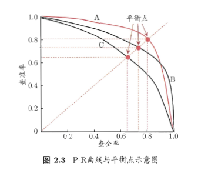
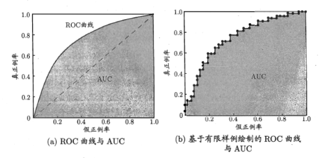
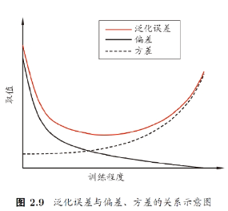
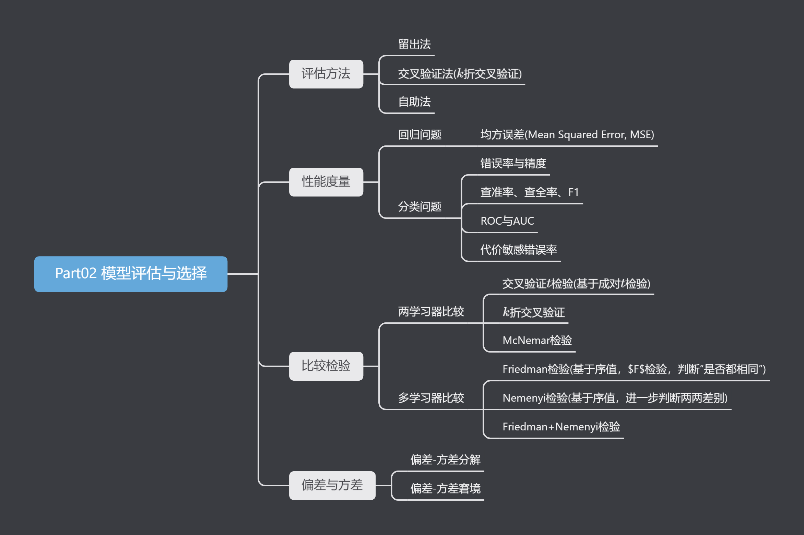

# Part02-模型评估与选择

> 本章遵循一个完整的机器学习流程，介绍了三个主要步骤。

# 2.0 Pre

## 2.0.1 目录

* [Part02-模型评估与选择](#part02-模型评估与选择)
* [2.0 Pre](#20-pre)
  * [2.0.1 目录](#201-目录)
  * [2.0.2 概念汇总](#202-概念汇总)
* [2.1 经验误差与过拟合](#21-经验误差与过拟合)
* [2.2 评估方法](#22-评估方法)
  * [2.2.1 留出法(hold-out)](#221-留出法hold-out)
  * [2.2.2 交叉验证法(cross validation)](#222-交叉验证法cross-validation)
  * [2.2.3 自助法(bootstrap)](#223-自助法bootstrap)
* [2.3 性能度量](#23-性能度量)
  * [2.3.0 均方误差(Mean Squared Error, MSE)](#230-均方误差mean-squared-error-mse)
  * [2.3.1 错误率与精度](#231-错误率与精度)
  * [2.3.2 查准率、查全率与F1](#232-查准率查全率与f1)
    * [(1) 查准率与查全率](#1-查准率与查全率)
    * [(2) P-R曲线图](#2-p-r曲线图)
    * [(3) 平衡点](#3-平衡点)
    * [(4) F1度量](#4-f1度量)
  * [2.3.3 ROC与AUC](#233-roc与auc)
  * [2.3.4 代价敏感错误率与代价曲线](#234-代价敏感错误率与代价曲线)
* [2.4 比较检验](#24-比较检验)
  * [2.4.1 两学习器比较](#241-两学习器比较)
  * [2.4.2 多学习器比较](#242-多学习器比较)
* [2.5 偏差与方差](#25-偏差与方差)
  * [2.5.1 偏差-方差分解](#251-偏差-方差分解)
  * [2.5.2 偏差-方差窘境](#252-偏差-方差窘境)
  * [2.6 总结](#26-总结)

## 2.0.2 概念汇总

* 评估方法
  * [留出法](#221-留出法hold-out)
  * [交叉验证法/k折交叉检验](#222-交叉验证法cross-validation)
  * [自助法](#223-自助法bootstrap)
* 性能度量
  * [均方误差](#230-均方误差mean-squared-error-mse)
  * 错误率与精度
    * [错误率](#231-错误率与精度)
    * [精度](#231-错误率与精度)
  * 查准率、查全率与F1
    * [查准率](#1-查准率与查全率)
    * [查全率](#1-查准率与查全率)
    * [P-R曲线](#2-p-r曲线图)
    * [平衡点](#3-平衡点)
    * [F1与$F_\beta$](#4-f1度量)
  * ROC与AUC
    * [ROC](#233-roc与auc)
    * [AUC](#233-roc与auc)
  * [代价敏感错误率](#234-代价敏感错误率与代价曲线)

# 2.1 经验误差与过拟合

> 本节似乎没讲啥

# 2.2 评估方法

> 评估模型的性能的方法

## 2.2.1 留出法(hold-out)

* 数据集$D$划分为互斥的两个集合，一个训练集$S$，另一个测试集$T$，$D=S\cup T, S\cap T=\emptyset$
  > 训练集数量远大于测试集数量
* 训练集和测试集都要分层采样，例如对于二分类问题，训练集和测试集中正负样本的比例要与原始数据集中的比例一致，即保持**数据分布的一致性**。
* 此外，留出法需要随机采样，且通常需要多次重复，取平均值作为最终结果

## 2.2.2 交叉验证法(cross validation)

* 也称“k折交叉验证”，将数据集$D$划分为$k$个大小相似的互斥子集，且每个子集$D_i$都尽可能保持数据分布的一致性。
* 每次用$k-1$个子集的并集作为训练集，剩下的那个子集作为测试集，重复$k$次，最终结果为$k$次测试结果的平均值。

## 2.2.3 自助法(bootstrap)

> 自助法相对来说使用的较少，暂时先不写了，等笔记整体进度赶上了再补这一块。——2023.3.14

# 2.3 性能度量

> 对于一个学习器，我们关注其泛化能力。而衡量泛化能力的强弱需要一个指标，我们称其为性能度量。
>
> 性能度量有很多，没有好坏之分，只有适不适合。

## 2.3.0 均方误差(Mean Squared Error, MSE)

> 均方误差是回归问题中最常用的性能度量

* 离散情况(如分类问题)下：$E(f;D)=\frac{1}{m}\sum_{i=1}^m(f(x_i)-y_i)^2$
  * > 误差就是预测值$f(x_i)$与真实值$y_i$之间的差值，平方可以使得误差的正负不影响MSE的大小，最后再求平均以消除样本数量的影响。
* 倘若知道的是样本的取值及其概率密度函数(即样本遵从某种分布)，那么均方误差即为“误差的期望”，即：$E(f;D)=\int_{x\in D}(f(x)-y(x))^2p(x)dx$
  * > 其中，$D$是输入空间，$Y$是输出空间，$p(x)$是输入空间中每个点的概率密度函数，$y(x)$是输入$x$对应的真实输出。

## 2.3.1 错误率与精度

> 错误率：**分类错误**的样本数占**样本总数**的比例
>
> 精度：**分类正确**的样本数占**样本总数**的比例
>
> 这两种性能度量仅适用于分类问题

* 错误率和精度是一对互补的概念，两者满足：**精度+错误率=1**
* 错误率：$E(f;D)=\frac{1}{m}\sum\limits_{i=1}\limits^{m}Ⅱ(f(x_i)\not ={y_i})$
* 精度：$acc(f;D)=\frac{1}{m}\sum\limits_{i=1}^mⅡ(f(x_i)\not ={y_i})=1-E(f;D)$
* 若已知样本的数据分布$D$和概率密度函数$p(·)$，
  * 错误率为：$E(f;D)=\int_{x\in D}Ⅱ(f(x)\not ={y})p(x)dx$
  * 精度为：$acc(f;D)=\int_{x\in D}Ⅱ(f(x)=y)p(x)dx=1-E(f;D)$

## 2.3.2 查准率、查全率与F1

> 一个有意思的点是，查准率、查全率直译分别是精确率、召回率。在英语中precision和accuracy是两个不同的词汇所以区分得开，中文中“精确率”和“精度”则难以区分，所以中文中往往用“查准率”而非“精确率”。
>
> 查准率：**分类正确**的正样本数占**预测为正样本**的样本数的比例
>
> 查全率：**分类正确**的正样本数占**真实为正样本**的样本数的比例
>
### (1) 查准率与查全率

* 首先定义一下关于预测结果的四种情况：
  * 真实值为正，预测值为正：真正例TP(True Positive)
  * 真实值为正，预测值为负：假负例FN(False Negative)
  * 真实值为负，预测值为正：假正例FP(False Positive)
  * 真实值为负，预测值为负：真负例TN(True Negative)
  * 总结：第2个字母表示预测值，第1个字母表示预测是否正确。

    |真实情况\预测结果|正例|负例|
    |:---:|:---:|:---:|
    |**正例**|$TP$|$FN$|
    |**负例**|$FP$|$TN$|
* 查准率(Precision)：$P=\frac{TP}{TP+FP}$
* 查全率(Recall)：$R=\frac{TP}{TP+FN}$
* 通常来说，查准率和查全率是一组相互矛盾的指标，通常来讲，在效果没有显著提升的情况下，一者偏高时另一者将会偏低。可通过计算证明，查准率和查全率大致呈反比例关系。

### (2) P-R曲线图

> 本小节主要讨论如何根据P-R曲线图比较两组分类器的效果

* 

* 如图中所示的A和B，由于相互交叉，无法直接说“A比B好”或“B比A好”
* 但由于A和B都完全包含了C，所以可以说“A或B都强于C”。
* 如果非要比较A和B，可以通过计算A和B的P-R曲线下的面积，面积越大，说明A和B的效果越好，当然这不太好算，此时有两个选择：平衡点和F1度量。

### (3) 平衡点

* 平衡点(Break-Event Point,BEP)：当$P=R$时，此时的$P$和$R$的取值称为平衡点。
* 如图中，A的平衡点为$BEP_A=0.8$，B的平衡点为$BEP_B=0.72$，所以A的效果更好。

### (4) F1度量

* $F1=\frac{2\times P\times R}{P+R}=\frac{2\times TP}{样例总数+TP-TN}$
  * 这个形式看不太出来什么意思，但其实这个式子是由调和平均数$\frac{1}{F1}=\frac{1}{2}(\frac{1}{P}+\frac{1}{R})$得到的。
  * > 调和平均数对较小的值给予更大的权重，因此，如果精确率和召回率中的任何一个值较低，F1度量也会较低。这意味着，F1度量强调了精确率和召回率之间的平衡，相比于强行指定$P=R$的平衡点，F1度量更加容易计算(优雅)。

* $F_{\beta}=\frac{(1+\beta^2)\times P\times B}{(\beta^2\times P)+R}$
  * 这个公式是基于$F1$公式的加权推广形式，$\beta>1$时查全率的权重更大，$\beta<1$时查准率的权重更大。

## 2.3.3 ROC与AUC

> 这俩指标是从心理学、医学领域被引入的

* ROC(Receiver Operating Characteristic)
  * ROC曲线：以$FPR$为横坐标，以$TPR$为纵坐标，绘制出的曲线，如下图所示。
  * 纵轴：真正例**率**：$TPR=\frac{TP}{TP+FN}$，即“真正例”在所有正例中所占的比例
  * 横轴：假正例**率**：$FPR=\frac{FP}{TN+FP}$，即“假正例”在所有负例中所占的比例
  * > 可见，这又是一对相互矛盾的指标。
  * 

* AUC(Area Under Curve)
  * AUC：ROC曲线下的面积，AUC越大，说明分类器的效果越好。
  * 对于图(a)中连续情况，请用积分解。
  * 对于图(b)中离散情况，$AUC =\frac{1}{2}\sum\limits_{i=1}^{m-1}(x_{i+1}-x_i)(y_i+y_{i+1})$
    * > 也就是将每个矩形都视为直角梯形，然后求面积和，公式就是 $\sum\text{直角梯形面积}$ 的形式嘛。

## 2.3.4 代价敏感错误率与代价曲线

> 实际情况中，犯不同的错误往往会造成不同的损失，此时需要考虑“非均等代价”，其实也就是在[错误率](#231-错误率与精度)的基础上，加上了不同权重。

* 比较一下公式：
  * 错误率：$E(f;D)=\frac{1}{m}\sum\limits_{i=1}\limits^{m}Ⅱ(f(x_i)\not ={y_i})$
  * 代价敏感(cost-sensitive)错误率：$E(f;D;cost)=\frac{1}{m}(\sum\limits_{x\in D^{(0)}}Ⅱ(f(x_i)\not ={y_i})\times cost_{01}+\sum\limits_{x\in D^{(1)}}Ⅱ(f(x_i)\not ={y_i})\times cost_{10})$
    * 
    * > $D^{(0)}$表示第0类样本集合，$D^{(1)}$表示第1类集合，$cost_{01}$表示将第0类样本误判为第1类样本的代价，$cost_{10}$表示将第1类样本误判为第0类样本的代价。它和一般错误率的区别只不过是给每种分错的情况乘了一个权重罢了。

# 2.4 比较检验

> 不能只根据性能度量的结果来判断分类器的优劣，还需要进行比较检验。
>
> 统计假设检验(hypothesis test)为学习器性能比较提供了重要依据

## 2.4.1 两学习器比较

* 交叉验证$t$检验(基于成对$t$检验)
* $k$折交叉验证
* McNemar检验

## 2.4.2 多学习器比较

* Friedman检验(基于序值，$F$检验，判断“是否都相同”)
* Nemenyi检验(基于序值，进一步判断两两差别)
* Friedman+Nemenyi检验

# 2.5 偏差与方差

> 本节讨论泛化误差由哪些部分组成(产生)？

## 2.5.1 偏差-方差分解

* 符号约束：
  * $D$：训练集
  * $\bar{f}(x)$：学习器的期望输出
  * $f(x;D)$：根据训练集$D$训练的学习器的输出
  * $\mathbb{E}_D$：求期望

* 对回归任务，泛化误差可通过“偏差-方差分解”拆解为：
* $E(f;D)=bias^2(x)+var(x)+\epsilon^2$
  * $bias^2(x)=(\bar{f}(x)-y)^2$：期望输出与真实输出的差别
  * $var(x)=\mathbb{E}_D[(f(x;D)-\bar{f}(x))^2]$：使用不同样本数的训练集产生的方差
  * $\epsilon^2=\mathbb{E}_D[(y_D-y)^2]$：噪声，进一步深究则是训练样本的标记与真实标记的差别。
    * 这是训练集上的问题了，不是优化算法能解决的，所以$\epsilon^2$也就是任何学习算法所能达到的期望泛化误差下界
    * 即不管换用什么算法，泛化误差$E(f;D)\geq\epsilon^2$。

## 2.5.2 偏差-方差窘境

* 
  * 训练不足时，学习器拟合能力不强，偏差主导
  * 随着训练程度加深，学习器拟合能力逐渐增强，方差逐渐主导
  * 训练充足后，学习器拟合能力很强，方差主导

## 2.6 总结

* 
