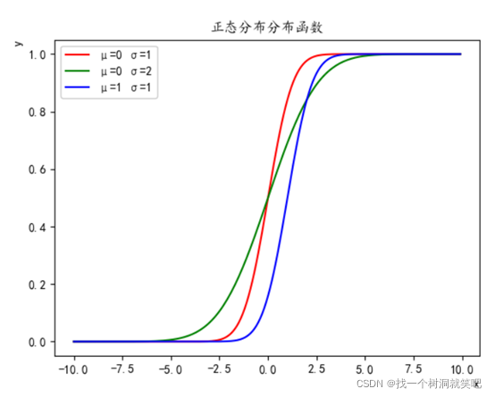
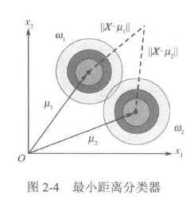

# Part02-贝叶斯决策理论

> 贝叶斯决策理论的思想是：对给定的某种特征向量$X$，计算它属于各个类别的概率，并认为它属于概率最大的类别。
>
> 这么一看，其实也不算多难

# 2.0 Pre

## 2.0.1 目录

* [Part02-贝叶斯决策理论](#part02-贝叶斯决策理论)
* [2.0 Pre](#20-pre)
  * [2.0.1 目录](#201-目录)
  * [2.0.2 概念汇总](#202-概念汇总)
  * [2.0.3 重点](#203-重点)
  * [2.0.4 基础知识](#204-基础知识)
    * [概率论相关基本概念](#概率论相关基本概念)
* [2.1 几个重要的概念](#21-几个重要的概念)
  * [2.1.1 先验概率](#211-先验概率)
  * [2.1.2 类(条件)概率密度](#212-类条件概率密度)
  * [2.1.3 后验概率](#213-后验概率)
    * [**贝叶斯公式**](#贝叶斯公式)
* [2.2 几种常用的决策规则](#22-几种常用的决策规则)
  * [2.2.1 基于最小错误率的贝叶斯决策](#221-基于最小错误率的贝叶斯决策)
  * [2.2.2 基于最小风险的贝叶斯决策](#222-基于最小风险的贝叶斯决策)
  * [2.2.3 最大似然比判别规则](#223-最大似然比判别规则)
    * [由最小错误率判别引出最大似然比判别规则](#由最小错误率判别引出最大似然比判别规则)
    * [由最小风险判别引出最大似然比判别规则](#由最小风险判别引出最大似然比判别规则)
    * [后记](#后记)
  * [2.2.4 Neyman-Pearson判别规则](#224-neyman-pearson判别规则)
* [2.3 正态分布中的贝叶斯分类方法](#23-正态分布中的贝叶斯分类方法)
  * [本节的一些基础知识](#本节的一些基础知识)
  * [2.3.1 正态分布的判别函数推导](#231-正态分布的判别函数推导)
    * [正态分布判别函数](#正态分布判别函数)
    * [正态分布决策面方程](#正态分布决策面方程)
  * [2.3.2 正态分布的不同特殊情况下的判别函数](#232-正态分布的不同特殊情况下的判别函数)
    * [(1) $\Sigma_i=\sigma^2I$](#1-sigma_isigma2i)
      * [① **$c$个类的先验概率相等**](#①-c个类的先验概率相等)
      * [② **$c$个类的先验概率不相等**](#②-c个类的先验概率不相等)
      * [③ **$\Sigma_i=\sigma^2I$情况的总结**](#③-sigma_isigma2i情况的总结)
    * [(2) $\Sigma_i=\Sigma$](#2-sigma_isigma)
      * [④ **$c$个类的先验概率相等**](#④-c个类的先验概率相等)
      * [⑤ **$c$个类的先验概率不相等**](#⑤-c个类的先验概率不相等)
      * [⑥ **$\Sigma_i=\Sigma$情况的总结**](#⑥-sigma_isigma情况的总结)
* [Ques02-例题整理](#ques02-例题整理)
  * [\[计算题·最小错误率的贝叶斯决策\]](#计算题最小错误率的贝叶斯决策)
  * [\[计算题·最小风险的贝叶斯决策\]](#计算题最小风险的贝叶斯决策)

## 2.0.2 概念汇总

* [概率分布函数](#概率论中的相关基本概念)

## 2.0.3 重点

## 2.0.4 基础知识

### 概率论相关基本概念

> 概率分布函数：概率分布函数是概率密度函数在某段区间中的积分值，即$P(a\leq X\leq b)=\int^b_a p(x)dx$，其中，$p(x)$是概率密度函数，$a$和$b$是区间的上下限，它的值表示随机变量X分布在区间$[a,b]$内的概率。
>
> 概率密度函数：概率密度函数可以说是为了方便地理解、表示概率而抽象出的一个概念，单纯的概率密度函数没有意义，它只是概率分布图中的那条曲线的函数。

* 以经典的正态分布为例：
  * 概率密度函数：$p(x)=\frac{1}{\sqrt{2\pi}\sigma}e^{-\frac{(x-\mu)^2}{2\sigma^2}}, -\infty<x<+\infty$
    * 
  * 概率分布函数：$P(x)=\frac{1}{\sqrt{2\pi}\sigma}\int^x_{-\infty}e^{-\frac{(x-\mu)^2}{2\sigma^2}}dx,-\infty<x<+\infty$
    * 
  * 观察上面第二幅图的趋势也能发现，概率分布其实就是概率密度积分。
  * Reference：[正态分布的分布函数和概率密度](https://blog.csdn.net/yyyyypppppzzzzz/article/details/121952196)
* **注意**：通常概率值用$P$表示，概率密度用$p$表示，概率分布函数用$F$表示。

# 2.1 几个重要的概念

> 先验概率、后验概率是意义上的定义，在一个给定的问题中是有明确含义的。
>
> 条件概率/概率密度是形式上的定义，符合$P(B|A)$的形式的就是概率密度，它没有特定的含义。后验概率在形式上就是一种条件概率。
>
> 类比一下，先验/后验概率相当于“库仑力/万有引力”，它有实际含义：两个真空、静止点电荷间的因电荷产生的引力/两个物体间因质量产生的引力；而条件概率/概率密度相当于“大统一场理论”，它尝试从形式上整合包括上述两种力的基本力（虽然还没实现）。

## 2.1.1 先验概率

> 先验概率：在完全不知道其他信息的情况下，通过以往经验知道的概率。
>> 先验概率可以通过抽样、统计甚至是专家经验得到，但通常来说，在一个问题中，先验概率是那些**“我就是知道”的概率**。

## 2.1.2 类(条件)概率密度

> 条件概率密度：在某种确定类别条件下，模式样本X出现的概率密度分布函数。

* 符号表示
  * 概率密度函数：$p(X|\omega_i)(i\in 1,2,...,c)$
  * 条件概率：$P(X|\omega_i)(i\in 1,2,...,c)$，表示在$\omega_i$已经发生的情况下，$X$发生的概率。
  * 在模式识别中，$X$通常指的是样本条件，$\omega_i$指的是某种模式。至于这些指的是什么呢，以后的题目中会慢慢明确的。

## 2.1.3 后验概率

> 后验概率：在某个具体的模式样本X条件下，某种类别出现的概率。
>
> 通常决策时使用的是后验概率。

* 通常描述为“在某个具体的样本$X$条件下，某种类别出现的概率”。
* 后验概率可以用以下[贝叶斯公式](#贝叶斯公式)计算出来：

### **贝叶斯公式**

> 说白了贝叶斯公式就是一个条件概率之间的转换公式，我在上概率论的时候就发现这个了，没什么难的。

* $P(\omega_i | X)=\frac{p(X|\omega_i)P(\omega_i)}{p(X)}$
  * 其中，$p(X)=\sum^c_{i=1}p(X|\omega_i)P(\omega_i)=\sum^c_{i=1}p(X\omega_i)$，$X$发生的概率等于$X$与任一$\omega_i$同时发生的概率之和，这是符合直觉的。
* 或者我们可以用概率论中的公式，会更熟悉一点：$P(A|B)=P(B|A)\times \frac{P(A)}{P(B)}$
* 可以发现贝叶斯公式就是条件概率的转换公式，这两个公式都是这样。

# 2.2 几种常用的决策规则

> **基于最小错误率的贝叶斯决策**和**基于最小风险的贝叶斯决策**

* **先验/后验概率**都是概率值（算出来一个确定的值才能比较大小嘛）
* **类条件概率**既可能是概率值，也可能是概率密度。
* 明确符号：

  |符号|含义|备注|
  |:-:|:-:|:-:|
  |$X$|观测到的样本|或者说“给定的模式”，总之就是要你去判别的东西|
  |$\omega_i$|第$i$个类(模式)|你应当将$X$判别到某一个$\omega_i$中去|
  |$P(\omega_i)$|先验概率|已经知道的一些关于模式的信息|
  |$P(X\|\omega_i)$|类条件概率||
  |$p(X\|\omega_i)$|类条件概率密度|这个是概率密度，不是概率|
  |$P(\omega_i\|X)$|后验概率|你要计算的东西(这个公式的意思就是：已观测到$X$，这个$X$属于$\omega_i$的概率)|
  |$a_i$|判决类别|表示你将$X$判别到$\omega_i$中去|
  |$L(a_i\|\omega_j)$|风险矩阵|表示你将一个$X\in \omega_j$的样本错判到$\omega_i$中所付出的代价，注意，$i=j$时$L(a_i\|\omega_j)$也不一定为0|
  |$R(a_i\|\omega_j)$|条件平均损失|你将一个样本$X$判决到$\omega_i$中，其代价的期望|

## 2.2.1 基于最小错误率的贝叶斯决策
>
> 也称“最大后验概率决策”
>
> 思想：根据贝叶斯公式(倒腾条件概率的公式)、先验概率$P(\omega_i)$和类条件概率$p(X|\omega_i)$,计算后验概率$P(\omega_i|X)$，然后选择后验概率最大的类别作为决策结果。

* 包括二分类和多分类两种情况
  * 二分类：

    $$
    \left\{
    \begin{aligned}
    \text{若}P(\omega_1|X) > P(\omega_2|X), & \text{则} & X\in\omega_1\text{类} \\
    \text{若}P(\omega_2|X) > P(\omega_1|X), & \text{则} & X\in\omega_2\text{类}
    \end{aligned}
    \right.
    $$

  * 多分类：
    * $\text{若}P(\omega_i|X)=max\{P(\omega_j|X)\},j=1,2,3,...,n, \text{则}X\in\omega_i\text{类}$
* 也就是说，需要计算在已知$X$的情况下，每个类别出现的概率，然后选择概率最大的类别作为决策结果。
  * 这是一种很简单，也很符合直觉的决策规则，但它足够好吗？也不一定。
  * 有的时候，决策正确的收益和决策错误的损失不在一个数量级上（比如炒股），这时候就需要结合决策的风险综合考虑了。也就是下一节的[基于最小风险的贝叶斯决策](#222-基于最小风险的贝叶斯决策)

## 2.2.2 基于最小风险的贝叶斯决策

> 它相当于是最小错误率决策的推广，主要改进在于额外考虑了决策错误的损失，我们称之为“风险矩阵”。
>
> 我们处理的思想是这样的：已知观测结果$X$，对于每种判决$a_i$计算其对应的条件平均损失$R(a_i\|X)$，然后选择条件平均损失最小的判决作为决策结果。
>
> 具体计算步骤如下：

* 已知先验概率$P(\omega_i)$和类条件概率$P(X|\omega_i)$，计算后验概率$P(\omega_i|X)$
* 对于每种判决$a_i$，计算其对应的条件平均损失$R(a_i|X)$
  * $R(a_i|X)=\sum_{j=1}^nL(a_i|\omega_j)·P(\omega_j|X)$
    * 也就是：考虑$X$属于每种类别的概率，然后计算每种类别下，将$X$判决到$a_i$类别所付出的代价。
    * 这一步的计算需要知道“风险矩阵”$L(a_i|\omega_j)$，题中也许会给，也许需要自己计算。
  * 计算出所有判决$a_i$的条件平均损失后，选择条件平均损失最小的判决作为决策结果。即认为$X\in \omega_i,R(a_i|X)=min(R(a_j|X))$

* 可以注意到，当风险为0-1损失函数时，最小风险决策就是最小错误率决策。所以可以认为最小风险决策是最小错误率决策的推广。

## 2.2.3 最大似然比判别规则

> **似然函数**：似然是一种表示观测数据($X$)在不同参数下($\omega_i$)的可能性的函数，通常表示为$L(\omega|data)=P(data|\omega)=\Pi^N_{i=1}p(x_i|\omega)$。
>
>* $N$是观测数据的个数
>* $data=(x_1,x_2,...x_n)$，是一个包括所有观测数据的向量
>* $x_i$表示一系列独立同分布的观测数据
>* $p(x_i|\omega)$是第$i$个观测数据$x_i$在参数$\omega$下的概率密度函数。
>
> 公式中类条件概率的累乘，我们可以这么理解：似然是用于指导选择参数的。当这组观测数据在某个参数$\omega$的条件下概率最大时，我们就认为这个参数$\omega$最符合观测结果，也就是最适合的。
>
> 但是在这本书中，目前来说每次决策都只是针对一个观测值$X$的，也就是$data=X$，是一个标量，因此公式中的累乘此时退化为单个类条件概率$p(X|\omega)$。只在这种特殊情况下，类条件概率密度函数$p(X|\omega_i)$就是似然函数。
>
> **似然比函数**：两个似然函数的比值：$l_{ij}(x)=\frac{p(X|\omega_i)}{p(X|\omega_j)},i,j=1,2,...c,且i\not ={j}$
>
> **最大似然比判别规则**：如果有一个似然函数$p(X|\omega_i)$，它与其他所有似然函数$p(X|\omega_j)$的似然比$l_{ij}$都大于门限$\theta_{ij}$，则认为$X\in\omega_i$。
>> 我们接下来会发现一个很有意思的事情：前面学的最小错误率决策和最小风险决策，都可以看作是最大似然比判别规则的特例，它们只是$\theta_{ij}$的定义不同。

### 由最小错误率判别引出最大似然比判别规则

> 以[最小错误率的二分类公式](#221-基于最小错误率的贝叶斯决策)为例

1. 假设有$P(\omega_1|X)>P(\omega_2|X)$，则我们认为$X\in\omega_1$
2. 根据贝叶斯公式，上述不等式可化为$\frac{p(X|\omega_1)P(\omega_1)}{P(X)}> \frac{p(X|\omega_2)P(\omega_2)}{P(X)}$
3. 分母消去，得到$p(X|\omega_1)P(\omega_1)>p(X|\omega_2)P(\omega_2)$
4. 此时我们能发现似然比函数的雏形了，两边同时除以$p(X|\omega_2)P(\omega_1)$，得到$l_{12}(X)=\frac{p(X|\omega_1)}{p(X|\omega_2)}>\frac{P(\omega_2)}{P(\omega_1)}$
5. 因此总结出判别门限$\theta_{12}=\frac{P(\omega_2)}{P(\omega_1)}$
6. 也就是说：

   $$
   \left\{
   \begin{aligned}
   l_{12}(X)>\theta_{12}, & X\in\omega_1\\
   l_{12}(X)<\theta_{12}, & X\in\omega_2\\
   l_{12}(X)=\theta_{12}, & X\in\omega_1 & \text{或}X\in\omega_2\text{(随你喜好)}\\
   \end{aligned}
   \right.
   $$

### 由最小风险判别引出最大似然比判别规则

> 同样以二分类为例

1. 假设有$R(a_1=\omega_1|X)<R(a_2=\omega_2|X)$，则我们认为$X\in\omega_1$
2. 在二分类问题中，$R(a_i|X)=\sum_{j=1}^2L(a_i|\omega_j)·P(\omega_j|X)$，所以上式可化为：$[L(a_2|\omega_1)-L(a_1|\omega_1)]P(\omega_1|X)>[L(a_1|\omega_2)-L(a_2|\omega_2)]P(\omega_2|X)$（就是乘开、移项、合并同类项）。
3. 再将上式转化为分式，得：$\frac{P(\omega_1|X)}{P(\omega_2|X)}>\frac{L(a_1|\omega_2)-L(a_2|\omega_2)}{L(a_2|\omega_1)-L(a_1|\omega_1)}$
4. 再结合贝叶斯公式，得到似然比函数：$l_{12}(X)=\frac{P(X|\omega_1)}{P(X|\omega_2)}>\frac{L(a_1|\omega_2)-L(a_2|\omega_2)}{L(a_2|\omega_1)-L(a_1|\omega_1)}·\frac{P(\omega_2)}{P(\omega_1)}$
5. 所以总结出，判别门限$\theta_{12}=\frac{L(a_1|\omega_2)-L(a_2|\omega_2)}{L(a_2|\omega_1)-L(a_1|\omega_1)}·\frac{P(\omega_2)}{P(\omega_1)}$

### 后记

* 那么问题来了，最大似然比判别规则有什么用呢？
  * 至少在做题方面，似乎没什么用，因为这个方法明显不比直接使用那两种方法来的简单。
  * 也许统一起前两个方法就是它的意义吧。

## 2.2.4 Neyman-Pearson判别规则

* (本节为非考核内容)

> 那既然这样，就先跳过吧，以后也许有兴趣了或者回顾的时候会补上的。——2023.3.14

# 2.3 正态分布中的贝叶斯分类方法

> 方法其实还是那些，不过这节重点是上一节的方法在正态分布中的特点，属于方法总结。
>
> 本节仍然主要讨论二分类问题，即只有$\omega_1$和$\omega_2$。
>
> 此外，由于本节主要笔墨是推导公式，计算较复杂，所以本节主要题型为选择填空。

## 本节的一些基础知识

> **观测值**：$X$，没什么好说的。只不过它：
>
> 1. 符合正态分布
> 2. 是一个$n$维向量。
>
> **判别函数**：$g_i(X)=p(X|\omega_i)·P(\omega_i)$（这是[最小错误率判决准则](#221-基于最小错误率的贝叶斯决策)的推导，与后验概率成正比），结果为一标量，用来判断样本$X$属于哪个类别，该值越大，就越可能属于类别$\omega_i$。
>
> **决策面方程**：$g_i(X)=g_j(X)$，即判别函数$g_i(X)$与判别函数$g_j(X)$相等的样本，可以看到，这是一个特殊的向量，也即是一种“临界情况”。
>
> **正态分布概率密度函数**：$p(x)=\frac{1}{\sqrt{2\pi}\sigma}e^{-\frac{(x-\mu)^2}{2\sigma^2}}$，本公式针对$x$为一维的情况。
>
> * $x$：观测变量，一维
> * $\mu$：均值
> * $\sigma$：标准差
>
> **多元正态分布概率密度函数**：$p(X)=\frac{1}{(2\pi)^{n/2}|\Sigma_i|^{1/2}}e^{-\frac{1}{2}[(X-\mu_i)^T\Sigma_i^{-1}(X-\mu_i)]}$
>
> * $X$：观测变量，$n$维
> * $\mu_i$：均值向量，同样$n$维
> * $\Sigma_i$：协方差矩阵，$n\times n$的矩阵

## 2.3.1 正态分布的判别函数推导

> 记住一点：判别函数的判别作用是依赖大小关系的，所以所有类的判别函数同时扩大/缩小若干正数倍或加减若干常数，不会影响判别结果。

* 判别函数为：$g_i(X)=p(X|\omega_i)·P(\omega_i)$，将其中的类条件概率密度用正态分布的概率密度函数代替，得到：$g_i(X)=\frac{P(\omega_i)}{(2\pi)^{n/2}|\Sigma_i|^{1/2}}e^{-\frac{1}{2}[(X-\mu_i)^T\Sigma_i^{-1}(X-\mu_i)]}$
* 为便于计算，对判别函数取对数，并且删除常数$\frac{n}{2}ln2\pi$，得到：

### 正态分布判别函数

* $g_i(X)=-\frac{1}{2}(X-\mu_i)^T\Sigma_i^{-1}(X-\mu_i)-\frac{1}{2}ln|\Sigma_i|+lnP(\omega_i)$
* 这个公式之后会在本节中反复被引用....

### 正态分布决策面方程

* 将上式代入决策面方程$g_i(X)=g_j(X)$，可得到：
* $-\frac{1}{2}(ln|\Sigma_i|-ln|\Sigma_j|)-\frac{1}{2}[(X-\mu_i)^T\Sigma_i^{-1}(X-\mu_i)-(X-\mu_j)^T\Sigma_j^{-1}(X-\mu_j)]+\frac{P(\omega_i)}{P(\omega_j)}=0$

> 其中：$\Sigma_i$和$\Sigma_j$是协方差矩阵，$|\Sigma_i|$为$\Sigma_i$的行列式，$\mu_i$和$\mu_j$是均值向量，$P(\omega_i)$和$P(\omega_j)$是先验概率。
>
> 那么此时就把正态分布下的判别函数及决策面方程都求出来了，理论上需要进行判决时套公式计算“就行了”。但我的评价是....这玩意确实很难记也很难算，而且重点相对来说应该在判别函数上。

## 2.3.2 正态分布的不同特殊情况下的判别函数

> 好了，接下来我们讨论一些特殊情况下，上面两式的简化形式。

### (1) $\Sigma_i=\sigma^2I$

* 

> $\Sigma_i=\sigma^2I$，各类的协方差矩阵都相同。（$\sigma$表示标准差）
>
>> 协方差矩阵中，对角线上元素代表第$i$维的方差，其他元素$i_{i,j}$代表第$i$维与第$j$维的协方差。
>
> 对角阵说明任意两维之间的协方差为0，即各维相互独立。对角线都为$\sigma^2$，说明各维内部的方差都相等。
>
> 这是一种非常理想的情况。

* 将$\Sigma_i=\sigma^2I$代入[判别函数](#正态分布判别函数)，得到$g_i(X)=-\frac{1}{2}(X-\mu_i)^T\Sigma_i^{-1}(X-\mu_i)-\frac{1}{2}ln2\pi\sigma^2+lnP(\omega_i)$
* 注意到$\Sigma_i=\sigma^2I$、$\Sigma_i^{-1}=\frac{I}{\sigma^2}$、$|\Sigma_i|=\sigma^{2n}$、$\frac{n}{2}ln2\pi$都与类别无关，所以都移除化简，得到：
* $g_i(X)=-\frac{||X-\mu_i||^2}{2\sigma^2}+lnP(\omega_i)$。
  * 其中$||X-\mu_i||^2=(X-\mu_i)^T(X-\mu_i)$，即欧氏距离平方。
* 接下来在此基础上再分两种情况讨论

#### ① **$c$个类的先验概率相等**

> 也就是说：$P(\omega_i)=P(\omega_j)=\frac{1}{c}$

* 此时[判别函数](#正态分布判别函数)$g_i(X)$的公式中，$lnP(\omega_i)$同样不影响比较，可以删去，得到：
  * $g_i(X)=-\frac{||X-\mu_i||^2}{2\sigma^2}$
* 这个形式挺有意思的，发现分子就是点$X$关于均值向量$\mu_i$的欧氏距离，分母与类别无关。加了负号使得距离越小整个式子值越大，即这种情况下将样本点$X$判定给距离最小的类别。
* 所以此时该分类器就叫做“最小距离分类器”（Minimum Distance Classifier，MDC）。

#### ② **$c$个类的先验概率不相等**

> $lnP(\omega_i)$得留着

* $||X-\mu_i||=(X-\mu_i)^T(X-\mu_i)=X^TX-2\mu_iX+\mu_i^T\mu_i$，其中的$X^TX$与类别无关，可以删去，得到：
  * $g_i(X)=-\frac{1}{2\sigma^2}(-2\mu_i^{-1}X+\mu_i^{-1}\mu_i)+lnP(\omega_i)$
* 这个形式也挺有意思，它可以视为关于$X$的一个线性函数，即$g_i(X)=w_i^TX+w_{i0}$，其中$w_i=\frac{1}{\sigma^2}\mu_i,w_{i0}=-\frac{1}{2\sigma^2}\mu_i^T\mu_i+lnP(\omega_i)$。
* 再代入[决策面方程](#正态分布决策面方程)，得到：
  * $W^T(X-X_0)=0$
    * $W=\mu_i-\mu_j$
    * $X_0=\frac{1}{2}(\mu_i+\mu_j)-\frac{\sigma^2(\mu_i-\mu_j)}{||\mu_i-\mu_j||^2}ln\frac{P(\omega_i)}{P(\omega_j)}$
    * $X_0$又是一个虚拟的点

#### ③ **$\Sigma_i=\sigma^2I$情况的总结**

* 因为$\Sigma_i=\sigma^2I$，协方差为0，所以等概率面为一圆形/球面/超球面
* 因为$W$与$(X-X_0)$的点积为0，所以$W$与$(X-X_0)$垂直，也即分界面$H$与$W$垂直。又因为$W=\mu_i-\mu_j$，所以$H$与$(\mu_i-\mu_j)$垂直。(我也没看懂这里的因为所以)
* 对二分类问题，当$P(\omega_1)=P(\omega_2)$时，分界面$H$通过$\mu_1$和$\mu_2$的中点；当$P(\omega_1)\neq P(\omega_2)$时，分界面$H$远离先验概率大的均值点。
* 对$c$类问题，分界面为各类均值连线的垂线。
* 
* 

### (2) $\Sigma_i=\Sigma$

* 由于$\Sigma_i$都相等，所以[判别函数](#正态分布判别函数)$g_i(X)$可简化为：
  * $g_i(X)=-\frac{1}{2}(X-\mu_i)^T\Sigma^{-1}(X-\mu_i)+lnP(\omega_i)$
* 同样，该公式也将分两种情况讨论

#### ④ **$c$个类的先验概率相等**

> 同样，$lnP(\omega_i)$可以被优化掉

* $g_i(X)=-\frac{1}{2}(X-\mu_i)^T\Sigma^{-1}(X-\mu_i)=\gamma^2$
  * $\gamma$：马氏距离（Mahalanobis Distance）
  * 此时和最小距离分类器极其相似，只是这里的距离是马氏距离，而不是欧氏距离

#### ⑤ **$c$个类的先验概率不相等**

> $(X-\mu_i)^T\Sigma^{-1}(X-\mu_i)$展开项中的$X^T\Sigma^{-1}X$与类别无关，可以删去，所以判别函数又变成了另一个线性函数

* $g_i(X)=W_i^TX+w_{i0}$
  * $W_i=\Sigma^{-1}\mu_i$
  * $w_{i0}=-\frac{1}{2}\mu_i^T\Sigma^{-1}\mu_i+lnP(\omega_i)$

#### ⑥ **$\Sigma_i=\Sigma$情况的总结**

* 因为$\Sigma_i=\Sigma$，所以等概率面为椭圆，长轴由$\Sigma$的本征值(特征值)决定。
* 因为$W$与$(X-X_0)$点乘为0，则$W$与$(X-X_0)$垂直，分界面$H$过$X_0$。
* 因为$W=\Sigma^{-1}(\mu_i-\mu_j)$，所以$W$与$(\mu_i-\mu_j)$不同向，分界面$H$与$\mu_i$和$\mu_j$的连线不垂直。
* 对二分类问题，当$P(\omega_1)=P(\omega_2)$时，分界面$H$过$\mu_1$和$\mu_2$的中点；当$P(\omega_1)\neq P(\omega_2)$时，分界面$H$远离先验概率大的均值点。
* 

# Ques02-例题整理

## [计算题·最小错误率的贝叶斯决策]

> 题目内容

* 地震预报是比较困难的一个课题，可以根据地震与生物异常反应之间的联系来进行研究
* 根据历史统计数据，地震前一周内出现生物异常反应的概率为50%，而一周内没有发生地震但也出现了生物异常反应的概率为10%。
* 假设一个地区属于地震高发区，发生地震的概率为20%。问：如果某日观察到明显的生物异常反应现象，是否应当预报一周内将发生地震？

> 分析与解答

1. 确定问题类型：明显是一个二分类问题，不妨设$\omega_1$为地震，$\omega_2$为非地震、$X=1$为观察到生物异常反应，$X=0$为未观察到生物异常反应。
2. 分析已知：已知$X=1$，$P(X=1|\omega_1)=50\%$，$P(X=1|\omega_2)=10\%$，$P(\omega_1)=20\%$，$P(\omega_2)=1-P(\omega_1)=80\%$。
3. 分析所求：由于已观测到$X=1$，因此我们要计算的是$P(\omega_1|X=1)$，即在此基础上地震发生的概率。通常来说如果地震概率大于不地震概率，则应当视为地震。
4. 计算：

   * 摆公式，$P(\omega_1|X=1)=\frac{p(X=1,\omega_1)}{P(X=1)}=\frac{P(X=1|\omega_1)P(\omega_1)}{\sum^2_{i=1}P(X=1|\omega_i)P(\omega_i)}=\frac{0.5\times
   0.2}{0.5\times0.2+0.1\times0.8}=\frac{5}{9}$
   * 因此，应当视为地震，进行报警。

## [计算题·最小风险的贝叶斯决策]

> 题目内容
